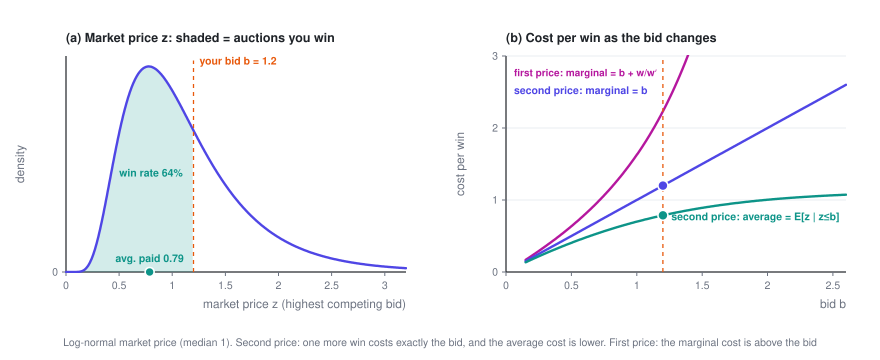
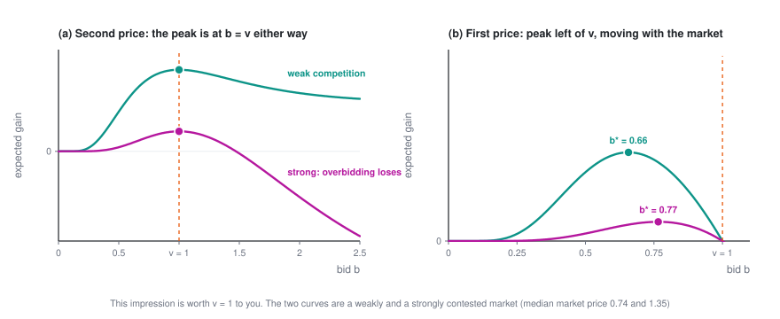

# Bidding in a Single Auction

> In an auction, all you do is name one number. To you, all your competitors combined are just one random "market price": from it you can work out your win rate and your spend, and see why you bid your true value under second price but shade your bid under first price. We'll also take the platform's side for a moment — setting a reserve price turns out to be a pricing problem.

> **Ad Bidding · Part 1 of 3** · 8 min read
>
> ← First part　·　[**Series index**](index.en.md)　·　[Bidding Under a Budget →](2-budget.en.md)

This is the first post in *A Primer on Ad Bidding*. It looks at a single auction and a single bid, and needs no background.

Symbols used in this post

| Symbol | Meaning |
|---|---|
| $b$ | Your bid, **the decision variable** |
| $z$ | Market price: the highest bid among all the other bidders, a random number from your point of view |
| $w(b)$ | Win-rate curve $P(z \le b)$, i.e. the distribution function of $z$ |
| $w'(b)$ | Slope of the win-rate curve, i.e. the probability density of $z$ |
| $c(b)$ | Expected spend on this opportunity (zero if you lose); $c_1$ for first price, $c_2$ for second price |
| $v$ | What this impression is worth to you |
| $r$ | The reserve price set by the platform |

The full notation table is in the [series index](index.en.md).

---

## 1. Setting up the problem

Each time a user scrolls their feed, an ad impression opportunity comes up, and the platform runs an auction for it. You're the bidding agent for an advertiser, and in this auction your only job is to name a price $b$.

**To you, all the other bidders combined boil down to a single number**: the highest bid among them, $z$, which we'll call the **market price**. You don't know $z$ in advance, but you can estimate its distribution from historical logs. The probability of winning is then

$$w(b) = P(z \le b)$$

This is the **win-rate curve** (in the industry, also called the bid landscape). It's simply the distribution function of the market price: it starts at 0, rises monotonically, and approaches 1. Its slope $w'(b)$ is the probability density of the market price.

What you pay when you win depends on the platform's pricing rule:

- **First price**: you pay your own bid $b$.
- **Second price**: you pay "just enough to win", which is the market price $z$.

Taking the expectation over this one opportunity (you spend nothing if you lose), the expected spend under the two rules is

$$c_1(b) = b\,w(b), \qquad c_2(b) = \int_0^b z\,w'(z)\,dz$$

Read the second-price formula as: take every market price you'd beat, $z \le b$, and add them up, each weighted by how likely it is.

**A note on units.** Ad platforms usually rank ads by eCPM (expected revenue per thousand impressions). If you bid $b_{\text{click}}$ per click, that works out to $b = b_{\text{click}} \times \text{pCTR}$ per impression. Throughout this series, $b$, $z$ and $v$ are all converted to per-impression amounts. In a single-slot GSP auction charged per click, the winner pays $z/\text{pCTR}$ per click, which is exactly $z$ per impression — so it's a second-price auction.

## 2. The key fact: under second price, one more win costs exactly your bid

There are two ways to measure "cost per win":

- **Average cost**: $c_2(b)/w(b) = E[z \mid z \le b]$, the average price of the auctions you win. It's always **less than** $b$.
- **Marginal cost**: raise your bid from $b$ to $b + db$, then divide the extra spend by the extra wins.

The marginal cost comes out remarkably simple. Differentiating $c_2$ with respect to its upper limit gives $c_2'(b) = b\,w'(b)$, so

$$\boxed{\ \frac{dc_2}{dw} = \frac{c_2'(b)}{w'(b)} = b\ }$$

The intuition: nudge your bid up a little, and the extra auctions you win are exactly the ones whose market price falls in $[b,\ b+db]$ — each of which costs you about $b$.

First price is a different story:

$$\frac{dc_1}{dw} = \frac{w(b) + b\,w'(b)}{w'(b)} = b + \frac{w(b)}{w'(b)} \;>\; b$$

The extra $w/w'$ is there because under first price, raising your bid doesn't just win new auctions — you also pay more **in every auction you would have won anyway**. Second price has no such term, because you pay $z$, not $b$.

A quick example with a uniform distribution: if $z$ is uniform on $[0, m]$, then $w = b/m$ and $c_2 = b^2/(2m)$. Under second price, the **average cost is exactly half your bid** and the marginal cost equals your bid; under first price, the marginal cost is $2b$.

## 3. How much to bid this time

This impression is worth $v$ to you (for example, $v = \text{pCTR} \times$ what a click is worth to you). When you win, you get the value and pay the price, so your expected gain is

$$\max_b\ \ v\,w(b) - c(b)$$

**Second price.** Differentiate:

$$\frac{d}{db}\Bigl[v\,w(b) - c_2(b)\Bigr] = v\,w'(b) - b\,w'(b) = (v - b)\,w'(b)$$

Since $w'(b) \ge 0$, the derivative is non-negative for $b < v$ and non-positive for $b > v$:

$$\boxed{\ b_2^\star = v\ }$$

This result **doesn't depend on any property of $w$**. Strong competition or weak, a distribution with one peak, two peaks or any other shape — under second price, bidding your true value is always optimal.

**First price.** Set the derivative to zero:

$$(v - b)\,w'(b) - w(b) = 0 \quad\Longrightarrow\quad \boxed{\ b_1^\star = v - \frac{w(b_1^\star)}{w'(b_1^\star)}\ }$$

Under first price you **shade** your bid, and how much depends on $w$ — you have to estimate the market first. With a uniform distribution, $b_1^\star = v/2$.

The takeaway: **second price completely separates "estimating the market" from "deciding the bid"; first price doesn't.** That's the fundamental reason second price is so convenient in engineering practice. Both formats are widely used: LinkedIn's published paper mentions that its own feed ads run GSP with a reserve price, while most of its off-site publisher inventory is sold through first-price auctions.

If you've read the pricing series: the first-price $b^\star = v - w/w'$ and [the pricing formula $p^\star = c + q/(-q')$](../pricing/1-single.en.md) are two sides of the same structure. The seller **marks up** from cost, the buyer **shades down** from value, and in both cases the size of the adjustment is "current volume ÷ how sensitive volume is to price".

## 4. The platform's view: a reserve price is a pricing problem

The platform can set a **reserve price** $r$: bids below $r$ don't count, and the winner pays at least $r$.

Take the simplest case: there's only one bidder, who under second price simply bids their value $X$, where $X$ has distribution function $F$ and density $f$. The platform's expected revenue is

$$\text{revenue}(r) = r \cdot P(X \ge r) = r\,\bigl(1 - F(r)\bigr)$$

This is exactly the problem from Part 1 of the pricing series: the price is $r$, the purchase probability is $q(r) = 1 - F(r)$, and the cost is 0. Applying the result from there:

$$\boxed{\ r^\star = \frac{1 - F(r^\star)}{f(r^\star)}\ }$$

If values are uniform on $[0, 1]$, then $r^\star = 1/2$.

A classic result (Myerson, 1981): when bidders' values are independent and identically distributed, and the distribution satisfies a mild condition called "regularity" (the uniform distribution does), **the optimal reserve price doesn't depend on how many bidders there are** — it's still the $r^\star$ above.

Back on the bidder's side, a reserve price just changes the market price: replace $z$ with $\max(z,\ r)$ and every formula above still applies.

## 5. Pitfalls in practice

- **You have to estimate the win-rate curve from logs, and the logs are censored.** Under second price you only see $z$ when you win; when you lose, you only know that $z > b$. Plot a histogram of clearing prices directly and every price in it is below your own bid, so you'll systematically underestimate the competition. It's a standard censored-data problem, and the tools of survival analysis apply. First price is even harder: you usually don't see $z$ even when you win — only that $z \le b$.
- **If $v$ is off, your bid is off.** Under second price $b = v$, so overpredicting pCTR by some percentage means overbidding by the same percentage; worse, the auctions you win are precisely the ones where you overpredicted (the winner's curse). For bidding, **calibration** of your predictions matters just as much as ranking quality (AUC).
- **With multiple ad slots, bidding your true value in GSP is no longer optimal.** The results in this post hold strictly for a single slot; for the multi-slot case, see Edelman, Ostrovsky and Schwarz (2007).

---

**Ad Bidding · Part 1 of 3**

← First part　·　[**Series index**](index.en.md)　·　[Bidding Under a Budget →](2-budget.en.md)
