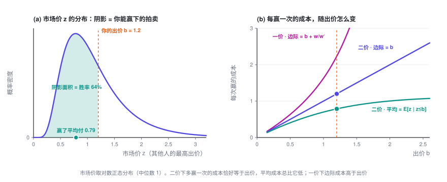
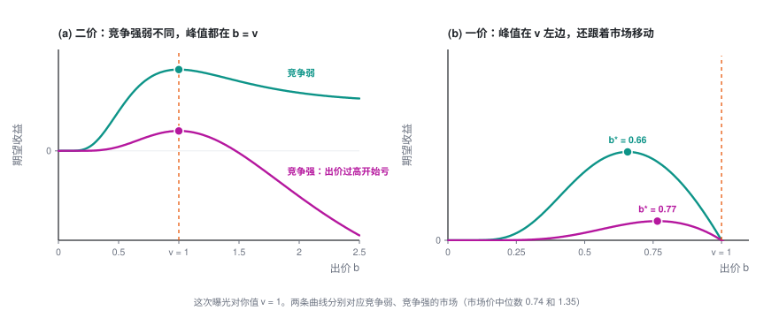

# 单次拍卖的出价

> 一场拍卖里，你只需要报一个数。对你来说，所有竞争对手加起来只是一个随机的「市场价」：由它推出胜率和花费，就能看清为什么二价下该如实报价、一价下要压价。顺带从平台一侧看一眼——底价其实就是一个定价问题。

> **出价专题 · 第 1 篇 / 共 3 篇** · 阅读约 8 分钟
>
> ← 已是第一篇　·　[**专题目录**](index.md)　·　[预算约束下的出价 →](2-budget.md)

这是「广告出价入门」的第一篇，只看一次拍卖、一个出价，不需要任何前置知识。

本篇会用到的符号

| 符号 | 含义 |
|---|---|
| $b$ | 你的出价，**决策变量** |
| $z$ | 市场价：其他所有竞争者里的最高出价，对你来说是个随机数 |
| $w(b)$ | 胜率曲线 $P(z \le b)$，也就是 $z$ 的分布函数 |
| $w'(b)$ | 胜率曲线的斜率，也就是 $z$ 的概率密度 |
| $c(b)$ | 这次机会的期望花费（输了算 0），$c_1$ 是一价，$c_2$ 是二价 |
| $v$ | 这次曝光对你值多少 |
| $r$ | 平台设的底价 |

完整符号表见[专题目录](index.md)。

---

## 1. 把问题写下来

用户刷一次信息流，就产生一次广告曝光机会，平台为它办一场拍卖。你是某个广告主的出价代理，这一次只做一件事：报一个价 $b$。

**对你来说，其他所有竞争者加在一起，只体现为一个数**：他们之中的最高出价 $z$，下文叫**市场价**。你事先不知道 $z$，但可以从历史日志里估计它的分布。于是赢的概率就是

$$w(b) = P(z \le b)$$

这条曲线叫**胜率曲线**（业内也叫 bid landscape）。它就是市场价的分布函数：从 0 出发，单调上升，趋向 1。它的斜率 $w'(b)$ 就是市场价的概率密度。

赢了之后付多少，取决于平台的计费规则：

- **一价**（first price）：付自己的出价 $b$。
- **二价**（second price）：付「刚好能赢的价格」，也就是市场价 $z$。

对这一次机会取期望（输了花 0），两种规则下的期望花费分别是

$$c_1(b) = b\,w(b), \qquad c_2(b) = \int_0^b z\,w'(z)\,dz$$

二价的式子读作：把所有你能赢下的市场价 $z \le b$，按出现的概率加权求和。

**关于单位。** 广告平台一般按 eCPM（每千次曝光的期望收入）排序。你按点击出价 $b_{\text{click}}$ 元，折算到每次曝光就是 $b = b_{\text{click}} \times \text{pCTR}$。本专题的 $b$、$z$、$v$ 一律换算到「每次曝光」上。单广告位的 GSP 按点击计费时，赢家每次点击付 $z/\text{pCTR}$，折回每次曝光正好是 $z$，所以它就是二价。

## 2. 关键事实：二价下，多赢一次的成本正好是你的出价

「每赢一次花多少」有两种算法：

- **平均成本**：$c_2(b)/w(b) = E[z \mid z \le b]$，即赢下的那些拍卖的平均成交价。它一定**小于** $b$。
- **边际成本**：出价从 $b$ 抬到 $b + db$，多花的钱除以多赢的次数。

边际成本的结果非常简洁。对 $c_2$ 的积分上限求导，$c_2'(b) = b\,w'(b)$，于是

$$\boxed{\ \frac{dc_2}{dw} = \frac{c_2'(b)}{w'(b)} = b\ }$$

直觉：出价抬高一点点，多赢下的恰好是市场价落在 $[b,\ b+db]$ 里的那些拍卖，每一场都付 $b$ 左右。

一价就不一样了：

$$\frac{dc_1}{dw} = \frac{w(b) + b\,w'(b)}{w'(b)} = b + \frac{w(b)}{w'(b)} \;>\; b$$

多出来的 $w/w'$，是因为一价下抬价不只多赢了新的拍卖，还让**本来就能赢的每一场**都多付了钱。二价没有这一项，因为你付的是 $z$，不是 $b$。

用均匀分布算一个简单的例子：若 $z$ 在 $[0, m]$ 上均匀，则 $w = b/m$，$c_2 = b^2/(2m)$。二价的**平均成本恰好是出价的一半**，边际成本等于出价；一价的边际成本则是 $2b$。

## 3. 这一次该出多少

这次曝光对你值 $v$（比如 $v = \text{pCTR} \times$ 一次点击对你值多少钱）。赢了拿到价值、同时付钱，期望收益是

$$\max_b\ \ v\,w(b) - c(b)$$

**二价。** 求导：

$$\frac{d}{db}\Bigl[v\,w(b) - c_2(b)\Bigr] = v\,w'(b) - b\,w'(b) = (v - b)\,w'(b)$$

$w'(b) \ge 0$，所以 $b < v$ 时导数不为负，$b > v$ 时导数不为正：

$$\boxed{\ b_2^\star = v\ }$$

这个结论**不依赖 $w$ 的任何性质**。竞争强也好弱也好，分布是单峰、双峰还是别的形状，二价下如实报价都是最优的。

**一价。** 令导数为零：

$$(v - b)\,w'(b) - w(b) = 0 \quad\Longrightarrow\quad \boxed{\ b_1^\star = v - \frac{w(b_1^\star)}{w'(b_1^\star)}\ }$$

一价要**压价**（bid shading），压多少取决于 $w$，也就是说你必须先估计市场。均匀分布下 $b_1^\star = v/2$。

读法：**二价把「估计市场」和「决定出价」彻底拆开了，一价没有。** 这是二价在工程上好用的根本原因。现实里两种都有：LinkedIn 的公开论文提到，它自己的信息流广告位用带底价的 GSP，而站外合作媒体的流量大多是一价。

如果你读过定价专题：一价的 $b^\star = v - w/w'$ 和[定价的 $p^\star = c + q/(-q')$](../pricing/1-single.md) 是同一个结构的两面。卖方在成本上**加价**，买方在价值上**压价**，幅度都是「当前的量 ÷ 量对价格的敏感度」。

## 4. 从平台看：底价就是一个定价问题

平台可以设一个**底价** $r$（reserve price）：低于 $r$ 的出价不算数，赢家至少付 $r$。

最简单的情形：只有一个出价者，二价下他报的就是自己的价值 $X$，$X$ 的分布函数是 $F$、密度是 $f$。平台的期望收入是

$$\text{收入}(r) = r \cdot P(X \ge r) = r\,\bigl(1 - F(r)\bigr)$$

这正是定价专题第一篇的原题：价格是 $r$，成交概率 $q(r) = 1 - F(r)$，成本为 0。套用那里的结论：

$$\boxed{\ r^\star = \frac{1 - F(r^\star)}{f(r^\star)}\ }$$

价值在 $[0, 1]$ 上均匀时，$r^\star = 1/2$。

一个经典结论（Myerson，1981）：各出价者的价值独立同分布、且分布满足一个叫「正则」的温和条件时（均匀分布就满足），**最优底价跟有几个出价者无关**，还是上面这个 $r^\star$。

站回出价者这边，底价只是改了一下市场价：把 $z$ 换成 $\max(z,\ r)$，前面所有公式照用。

## 5. 落地时会踩的坑

- **胜率曲线要从日志里估，而日志是删失的。** 二价下赢了才看到 $z$，输了只知道 $z > b$。直接拿成交价画直方图，看到的全是比你出价低的市场价，会系统性低估竞争。这是标准的删失数据问题，可以借用生存分析的工具。一价更麻烦，赢了通常也看不到 $z$，只知道 $z \le b$。
- **$v$ 估不准，出价就跟着偏。** 二价下 $b = v$，pCTR 高估多少，出价就高多少；而且你赢下的恰恰是被高估的那一批（赢家诅咒）。所以对出价来说，预估值的**校准**和排序能力（AUC）同样要紧。
- **多个广告位的 GSP 里，如实报价不再是最优。** 本篇结论只对单个广告位严格成立，多广告位的情况见 Edelman、Ostrovsky、Schwarz（2007）。

---

**出价专题 · 第 1 篇 / 共 3 篇**

← 已是第一篇　·　[**专题目录**](index.md)　·　[预算约束下的出价 →](2-budget.md)
