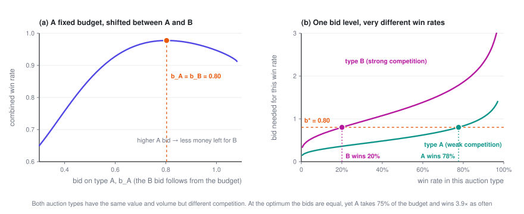
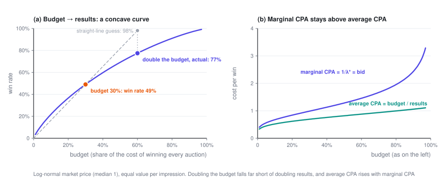

# Bidding Under a Budget

> There are thousands of auctions a day but only one budget. A Lagrange multiplier compresses that constraint into a single number $\lambda$, and every bid becomes "value ÷ $\lambda$". A few counterintuitive but very practical properties follow: equal values mean equal bids, and doubling the budget doesn't double the results.

> **Ad Bidding · Part 2 of 3** · 10 min read
>
> [← Bidding in a Single Auction](1-auction.en.md)　·　[**Series index**](index.en.md)　·　[Budget Pacing →](3-pacing.en.md)

**Previously**: Part 1 looked at a single auction. Under second price you bid your true value, $b^\star = v$, and the marginal cost of one more win is exactly your bid. This post adds a budget: many opportunities in a day, and only $B$ to spend in total.

Symbols used in this post

| Symbol | Meaning |
|---|---|
| $t = 1,\dots,T$ | The $t$-th auction (impression opportunity), $T$ in total |
| $v_t$ | What opportunity $t$ is worth to you, e.g. this impression's pCVR |
| $w_t(b),\ c_t(b)$ | Win-rate curve and expected spend of auction $t$; both can differ from auction to auction |
| $B$ | Total budget |
| $\lambda$ | Lagrange multiplier of the budget constraint, i.e. **the shadow price** |
| $\alpha = 1/\lambda$ | Bid multiplier |
| $V^\star(B)$ | The most total value you can get with budget $B$ |

The full notation table is in the [series index](index.en.md).

---

## 1. Setting up the problem

There are $T$ auctions in a day. Auction $t$ has value $v_t$, win-rate curve $w_t(b)$ and expected spend $c_t(b)$, and competition can be stronger or weaker from one auction to the next. You choose a bid for each one:

$$\max_{b_1,\dots,b_T}\ \sum_{t=1}^T v_t\,w_t(b_t) \qquad \text{s.t.}\quad \sum_{t=1}^T c_t(b_t) \le B$$

The objective counts value only; spend isn't subtracted. That matches the most common product setup: **"here's my budget — get me as many conversions as you can"**. Advertisers often can't say exactly what a conversion is worth, but they always know their budget.

Show: another common way to write it — integrating over a distribution

Suppose every auction is drawn from the same distribution — say $r$ is the impression's pCTR or pCVR, with distribution $p(r)$ and value $u(r)$, and the bid is a function of $r$, $b(r)$. Dividing both the objective and the constraint by $T$ gives the form common in ORTB-style papers (notation varies slightly):

$$\max_{b(\cdot)}\ \int u(r)\,w\bigl(b(r)\bigr)\,p(r)\,dr \qquad \text{s.t.}\quad \int c\bigl(b(r)\bigr)\,p(r)\,dr \le \frac{B}{T}$$

There are two distributions here, so don't mix them up: $p(r)$ is the distribution of **your own value**, while $w$ comes from the distribution of the **market price $z$**. The derivation below works the same way for both forms.

## 2. Solving it

**Step 1: attach the constraint to the objective with a multiplier.**

$$L = \sum_{t=1}^T \Bigl[v_t\,w_t(b_t) - \lambda\,c_t(b_t)\Bigr] + \lambda B, \qquad \lambda \ge 0$$

**Step 2: it splits apart.** For a fixed $\lambda$, $L$ is a sum of $T$ terms, each involving just one $b_t$, so you can maximize each term separately:

$$\max_b\ \ v_t\,w_t(b) - \lambda\,c_t(b) \;=\; \lambda \cdot \max_b\Bigl[\frac{v_t}{\lambda}\,w_t(b) - c_t(b)\Bigr]$$

The bracket is **exactly Part 1's single-auction problem**, except that the value $v_t$ has become $v_t/\lambda$. Under second price, the answer is to bid that value:

$$\boxed{\ b_t^\star = \frac{v_t}{\lambda}\ }$$

**Step 3: let the budget pin down $\lambda$.** Total spend $S(\lambda) = \sum_t c_t(v_t/\lambda)$ decreases monotonically in $\lambda$, so just bisect on $\lambda$ until $S(\lambda^\star) = B$. Section 2 of the LinkedIn bidding paper (Gao et al., 2022) uses the same derivation.

Show: why this gives the optimum of the original problem (two lines, no convexity needed)

Suppose $b^\star$ maximizes $L$ for some $\lambda \ge 0$ and spends exactly the budget, $\sum_t c_t(b_t^\star) = B$. Take any set of bids $b$ that stays within budget:

$$\begin{aligned} \sum_t v_t w_t(b_t) &\le \sum_t v_t w_t(b_t) - \lambda\Bigl(\sum_t c_t(b_t) - B\Bigr) \\ &\le \sum_t v_t w_t(b_t^\star) - \lambda\Bigl(\sum_t c_t(b_t^\star) - B\Bigr) \\ &= \sum_t v_t w_t(b_t^\star) \end{aligned}$$

The first inequality uses $\lambda \ge 0$ and the budget constraint, the second uses the fact that $b^\star$ maximizes $L$, and the final equality uses "spends exactly the budget". So no set of bids within budget can get more value than $b^\star$.

Nowhere does the argument rely on $w_t$ or $c_t$ being concave or convex. The term-by-term maximization uses Part 1's observation that the derivative is non-negative to the left of $b = v_t/\lambda$ and non-positive to the right — again, no concavity required.

## 3. Properties of the solution

### 3.1 Bids are proportional to value, and a single number sets them all

$$b_t^\star = \alpha\, v_t, \qquad \alpha = \frac{1}{\lambda}$$

The bids for millions of auctions collapse into **a single scalar** $\alpha$ (usually called the bid multiplier, or pacing multiplier). A tight budget means a large $\lambda$, with every bid scaled down in proportion; a loose budget scales every bid up.

### 3.2 Equal values mean equal bids — even when competition is completely different

If every opportunity is worth the same (say you only count impressions or clicks), $v_t \equiv v$, then $b_t^\star \equiv v/\lambda$: **you bid the same amount in every auction**, whether competition is strong or weak, at 9 a.m. or at midnight.

That feels wrong at first: shouldn't you bid less where competition is weak and more where it's strong? Part 1's key fact clears it up. Under second price, **the marginal cost of one more win equals your bid**. Suppose your bid $b_A$ in type-A auctions is higher than your bid $b_B$ in type-B auctions. One more win in A costs $b_A$ at the margin; in B it costs only $b_B$. Shift a little budget from A to B, and the same money buys more. As long as the two bids differ, you can keep doing this — **you only stop once the bids are equal**. Search advertising has a similar classic result: bidding the same amount on every keyword (uniform bidding) is a good strategy for maximizing clicks on a budget (Feldman et al., 2007).

When values differ, the same logic says: **the marginal price per unit of value, $b_t/v_t$, is the same everywhere**, and equals $1/\lambda$. This is how the "leveling" from [Part 3 of the pricing series](../pricing/3-substitution.en.md) shows up in bidding.

Look at panel (b): **the same bid doesn't mean the same win rate, or the same spend.** At the optimum, the weakly contested type A wins almost 4 times as often as type B and takes 75% of the budget. Differences in competition don't show up in the bids; they show up in where you win the most.

### 3.3 What $\lambda$ means: how much more value one more dollar of budget buys

$$\frac{dV^\star}{dB} = \lambda^\star$$

$\lambda^\star$ is the budget's **shadow price**: the most extra value you can get from one more dollar of budget. Flip it around, and $1/\lambda^\star$ is **the price of one more unit of value at the margin**. When value is counted in conversions ($v_t$ = pCVR), $1/\lambda^\star$ is your **marginal CPA**.

Show: deriving $dV^\star/dB = \lambda^\star$

When the budget goes from $B$ to $B + dB$, each bid moves by some $db_t$. The change in total spend has to equal $dB$; using Part 1's $c_t'(b) = b\,w_t'(b)$:

$$dB = \sum_t c_t'(b_t)\,db_t = \sum_t b_t\,w_t'(b_t)\,db_t$$

For the change in total value, substitute $v_t = \lambda^\star b_t$:

$$dV^\star = \sum_t v_t\,w_t'(b_t)\,db_t = \lambda^\star \sum_t b_t\,w_t'(b_t)\,db_t = \lambda^\star\,dB$$

### 3.4 Diminishing returns: double the budget, but not the results

The bigger the budget, the smaller $\lambda^\star$, and the smaller $dV^\star/dB$. So $V^\star(B)$ is a **concave curve**: marginal CPA rises steadily with the budget, and average CPA always stays below marginal CPA.

Under the simplest assumptions there's a closed form. Suppose every opportunity has the same value ($v_t \equiv 1$, so you simply count wins), market prices are uniform on $[0, m]$, there are $T$ auctions, and $N$ is the number you win:

$$b^\star = \sqrt{\frac{2mB}{T}}, \qquad N^\star = \sqrt{\frac{2TB}{m}}$$

A few immediate consequences:

- **Results grow with the square root of the budget**: double the budget and you get only 41% more.
- **Average CPA $= B/N^\star = b^\star/2$, while marginal CPA $= dB/dN^\star = b^\star$**: the marginal cost is exactly twice the average.
- **If market prices double across the board** ($m \to 2m$), the same budget gets you only $1/\sqrt{2}$ of the results, and your bid goes up by a factor of $\sqrt{2}$.

Show: where the closed form comes from

All values are equal, so the bid is a constant $b$. Each auction's win rate is $b/m$, and its expected spend is $b^2/(2m)$ (the uniform example from Part 1). Spend the whole budget:

$$T \cdot \frac{b^2}{2m} = B \quad\Longrightarrow\quad b^\star = \sqrt{\frac{2mB}{T}}$$

The number of wins is $N^\star = T\,b^\star/m$, which works out to $\sqrt{2TB/m}$. Conversely, $B = mN^2/(2T)$, so $dB/dN = mN/T = b^\star$.

The figure uses a more realistic log-normal market price: raising the budget from 30% to 60% lifts the win rate from 49% to 77% — not the 98% a straight-line extrapolation would suggest.

### 3.5 Several placements or campaigns sharing one budget: a single $\lambda$ splits it for you

Nothing in the derivation required the $T$ auctions to come from the same ad slot. They could come from two placements — say, the feed and off-site publishers — or from several campaigns in the same account. The conclusion is the same: **bid everywhere with the same $\lambda$**, and the marginal ROI of every placement and campaign equalizes on its own. The budget split comes out optimal without anyone dividing it by hand. Section 5 of the LinkedIn bidding paper (Gao et al., 2022) develops this point in full.

### 3.6 What about first price?

Each term becomes $\max_b\ (v_t/\lambda)\,w_t(b) - b\,w_t(b)$, and Part 1's first-price formula gives:

$$b_t^\star = \frac{v_t}{\lambda} - \frac{w_t(b_t^\star)}{w_t'(b_t^\star)}$$

**Scale by $\lambda$ first, then shade.** The structure stays the same, with a single global $\lambda$. But 3.1 and 3.2 generally no longer hold: how much you shade depends on each auction's $w_t$, so bids stop being proportional to value. What really gets leveled is the **marginal cost per unit of value**: $(b_t + w_t/w_t')/v_t = 1/\lambda$. Under second price the marginal cost is the bid itself, which is why the leveling shows up directly as $b_t/v_t$.

## 4. Pitfalls in practice

- **When the budget isn't binding, the formula says to bid infinitely high.** The objective has no money in it, so if the budget can't all be spent, $\lambda^\star = 0$ — unspent budget is simply wasted. In practice, always pair it with a bid cap or a cost constraint (Part 3).
- **Overpredicting pCVR across the board is harmless; overpredicting part of your traffic is not.** Multiply every $v_t$ by 1.3 and $\lambda^\star$ also goes up by a factor of 1.3, leaving the bids exactly where they were. But if only one kind of traffic is overpredicted, $\lambda$ can't absorb it, and budget gets misallocated toward that traffic.
- **"We raised the budget and average CPA got worse" doesn't necessarily mean something is broken.** As 3.4 shows, that's exactly what should happen. To judge whether things are healthy, look at marginal CPA — under second price it's simply bid ÷ pCVR — rather than only at average CPA.

---

**Ad Bidding · Part 2 of 3**

[← Bidding in a Single Auction](1-auction.en.md)　·　[**Series index**](index.en.md)　·　[Budget Pacing →](3-pacing.en.md)
