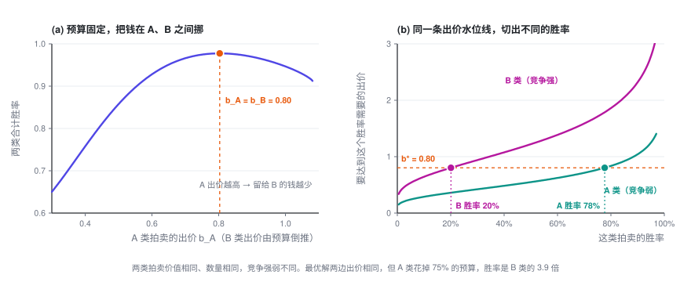
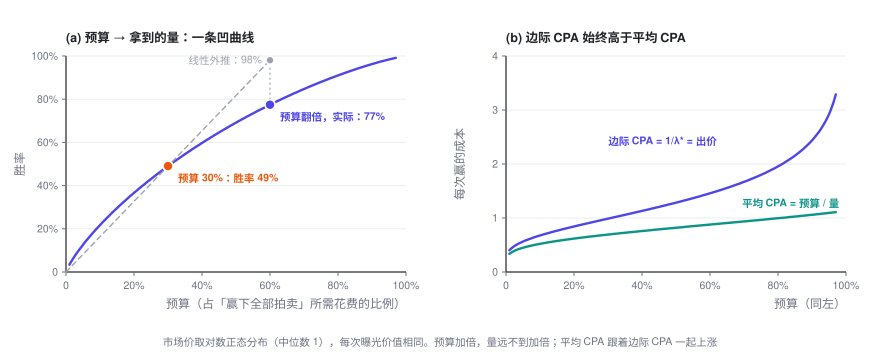

# 预算约束下的出价

> 一天有成千上万次拍卖，却只有一份预算。拉格朗日乘子把这条约束压缩成一个数 $\lambda$，每次的出价都是「价值 ÷ $\lambda$」。由它能推出几个反直觉、但很好用的性质：价值相同就出同一个价；预算翻倍，量却不会翻倍。

> **出价专题 · 第 2 篇 / 共 3 篇** · 阅读约 10 分钟
>
> [← 单次拍卖的出价](1-auction.md)　·　[**专题目录**](index.md)　·　[预算平滑（Pacing） →](3-pacing.md)

**前情提要**：上一篇只看一次拍卖，结论是二价下如实报价 $b^\star = v$，并且多赢一次的边际成本正好等于出价。这一篇加上预算：一天有很多次机会，总共只能花 $B$。

本篇会用到的符号

| 符号 | 含义 |
|---|---|
| $t = 1,\dots,T$ | 第 $t$ 次拍卖（一次曝光机会），一共 $T$ 次 |
| $v_t$ | 第 $t$ 次机会对你值多少，比如这次曝光的 pCVR |
| $w_t(b),\ c_t(b)$ | 第 $t$ 次拍卖的胜率曲线和期望花费，每次都可以不同 |
| $B$ | 总预算 |
| $\lambda$ | 预算约束的拉格朗日乘子，即**影子价格** |
| $\alpha = 1/\lambda$ | 出价系数 |
| $V^\star(B)$ | 预算为 $B$ 时最多能拿到的总价值 |

完整符号表见[专题目录](index.md)。

---

## 1. 把问题写下来

一天里有 $T$ 次拍卖。第 $t$ 次的价值是 $v_t$，胜率曲线是 $w_t(b)$，期望花费是 $c_t(b)$。每次拍卖的竞争强弱都可以不一样。你要给每一次定一个出价：

$$\max_{b_1,\dots,b_T}\ \sum_{t=1}^T v_t\,w_t(b_t) \qquad \text{s.t.}\quad \sum_{t=1}^T c_t(b_t) \le B$$

目标里只有价值，没有减去花费。这对应最常见的产品形态：**「预算给你，帮我拿尽可能多的转化」**。广告主往往说不清一次转化到底值多少钱，但预算是明确的。

展开：另一种常见写法——对分布积分

如果把每次拍卖看成从同一个分布里抽出来的，比如用 $r$ 表示这次曝光的 pCTR 或 pCVR，它的分布是 $p(r)$，价值是 $u(r)$，出价是 $r$ 的函数 $b(r)$，那么把目标和约束都除以 $T$，就得到 ORTB 一类文献里常见的写法（记号略有出入）：

$$\max_{b(\cdot)}\ \int u(r)\,w\bigl(b(r)\bigr)\,p(r)\,dr \qquad \text{s.t.}\quad \int c\bigl(b(r)\bigr)\,p(r)\,dr \le \frac{B}{T}$$

这里有两个分布，别混：$p(r)$ 是**你自己的价值**的分布，$w$ 背后是**市场价 $z$** 的分布。下面的推导对两种写法完全一样。

## 2. 求解

**第一步：把约束用一个乘子挂到目标上。**

$$L = \sum_{t=1}^T \Bigl[v_t\,w_t(b_t) - \lambda\,c_t(b_t)\Bigr] + \lambda B, \qquad \lambda \ge 0$$

**第二步：它拆开了。** 给定 $\lambda$，$L$ 是 $T$ 项之和，每一项只含一个 $b_t$，所以逐项最大化就行：

$$\max_b\ \ v_t\,w_t(b) - \lambda\,c_t(b) \;=\; \lambda \cdot \max_b\Bigl[\frac{v_t}{\lambda}\,w_t(b) - c_t(b)\Bigr]$$

方括号里**正是上一篇的单次拍卖问题**，只不过价值从 $v_t$ 换成了 $v_t/\lambda$。二价下的答案是如实报价：

$$\boxed{\ b_t^\star = \frac{v_t}{\lambda}\ }$$

**第三步：用预算定出 $\lambda$。** 总花费 $S(\lambda) = \sum_t c_t(v_t/\lambda)$ 随 $\lambda$ 单调递减，二分 $\lambda$ 让 $S(\lambda^\star) = B$ 即可。LinkedIn 出价论文（Gao 等，2022）的第 2 节用的也是这套推导。

展开：为什么这样得到的就是原问题的最优解（两行，不需要凸性）

设 $b^\star$ 在某个 $\lambda \ge 0$ 下最大化 $L$，并且恰好花完预算 $\sum_t c_t(b_t^\star) = B$。任取一组满足预算的出价 $b$：

$$\begin{aligned} \sum_t v_t w_t(b_t) &\le \sum_t v_t w_t(b_t) - \lambda\Bigl(\sum_t c_t(b_t) - B\Bigr) \\ &\le \sum_t v_t w_t(b_t^\star) - \lambda\Bigl(\sum_t c_t(b_t^\star) - B\Bigr) \\ &= \sum_t v_t w_t(b_t^\star) \end{aligned}$$

第一个不等号用了 $\lambda \ge 0$ 和预算约束，第二个用了 $b^\star$ 最大化 $L$，最后的等号用了「恰好花完」。所以没有任何满足预算的出价能拿到比 $b^\star$ 更多的价值。

整个论证没用到 $w_t$、$c_t$ 的凹凸性。逐项最大化那一步用的是上一篇的「导数在 $b = v_t/\lambda$ 左边不为负、右边不为正」，同样不需要凹性。

## 3. 这个公式的几个性质

### 3.1 出价和价值成正比，全局只需要一个数

$$b_t^\star = \alpha\, v_t, \qquad \alpha = \frac{1}{\lambda}$$

几百万次拍卖的出价，被压缩成了**一个标量** $\alpha$（业内常叫出价系数，或 pacing multiplier）。预算紧，$\lambda$ 就大，所有出价同比例压低；预算松，所有出价同比例抬高。

### 3.2 价值相同，出价就相同——哪怕竞争完全不同

如果每次机会的价值都一样（比如只按曝光数或点击数算），$v_t \equiv v$，那么 $b_t^\star \equiv v/\lambda$：**所有拍卖出同一个价**，不管这一场竞争强还是弱、是早上还是半夜。

这有点反直觉：竞争弱的地方难道不该少出点、竞争强的地方多出点？回到上一篇的关键事实就明白了。二价下，**多赢一次的边际成本等于出价**。假设 A 类拍卖的出价 $b_A$ 高于 B 类的 $b_B$：在 A 上边际多赢一次要花 $b_A$，在 B 上只要 $b_B$。把一点预算从 A 挪到 B，同样的钱就能多换来一些量。只要两边出价不等，就还能这样挪，**挪到出价相等才停**。搜索广告里早有类似的结论：给所有关键词出同一个价（uniform bidding），是预算约束下最大化点击的好策略（Feldman 等，2007）。

价值不同时，同样的道理变成：**边际上每单位价值的价格 $b_t/v_t$ 处处相等**，都等于 $1/\lambda$。这就是定价专题第三篇里[「边际拉平」](../pricing/3-substitution.md)在出价问题里的样子。

注意图 (b)：**出价相同，不等于胜率相同，也不等于花费相同。** 最优解里，竞争弱的 A 类胜率是 B 类的近 4 倍，花掉了 75% 的预算。竞争的差异不体现在出价上，而是体现在「在哪里赢得多」上。

### 3.3 $\lambda$ 是什么：多给一块钱预算，能多换来多少价值

$$\frac{dV^\star}{dB} = \lambda^\star$$

$\lambda^\star$ 是预算的**影子价格**：每多给 1 元预算，最多能多换来多少价值。反过来，$1/\lambda^\star$ 就是**边际上买一单位价值的价格**。当价值按转化计（$v_t$ = pCVR）时，$1/\lambda^\star$ 就是**边际 CPA**。

展开：$dV^\star/dB = \lambda^\star$ 的推导

预算从 $B$ 变到 $B + dB$，每个出价跟着变 $db_t$。总花费的变化必须等于 $dB$，再用上一篇的 $c_t'(b) = b\,w_t'(b)$：

$$dB = \sum_t c_t'(b_t)\,db_t = \sum_t b_t\,w_t'(b_t)\,db_t$$

总价值的变化，用 $v_t = \lambda^\star b_t$ 代换：

$$dV^\star = \sum_t v_t\,w_t'(b_t)\,db_t = \lambda^\star \sum_t b_t\,w_t'(b_t)\,db_t = \lambda^\star\,dB$$

### 3.4 边际递减：预算翻倍，量不会翻倍

预算越多，$\lambda^\star$ 越小，$dV^\star/dB$ 也就越小。所以 $V^\star(B)$ 是一条**凹曲线**：边际 CPA 随预算单调上涨，平均 CPA 总是低于边际 CPA。

最简单的假设下有闭式解。设每次机会价值相同（$v_t \equiv 1$，只数赢了几次），市场价在 $[0, m]$ 上均匀，一共 $T$ 次拍卖，赢下的次数为 $N$：

$$b^\star = \sqrt{\frac{2mB}{T}}, \qquad N^\star = \sqrt{\frac{2TB}{m}}$$

几个直接的推论：

- **量和预算的平方根成正比**：预算翻倍，量只多 41%。
- **平均 CPA $= B/N^\star = b^\star/2$，边际 CPA $= dB/dN^\star = b^\star$**：边际是平均的整整 2 倍。
- **市场价整体涨一倍**（$m \to 2m$），同样的预算下量掉到原来的 $1/\sqrt{2}$，出价则涨到 $\sqrt{2}$ 倍。

展开：闭式解怎么来的

价值相同，所以出价是一个常数 $b$。每次拍卖的胜率是 $b/m$，期望花费是 $b^2/(2m)$（上一篇的均匀分布例子）。花完预算：

$$T \cdot \frac{b^2}{2m} = B \quad\Longrightarrow\quad b^\star = \sqrt{\frac{2mB}{T}}$$

量 $N^\star = T\,b^\star/m$，代入即得 $\sqrt{2TB/m}$。反过来 $B = mN^2/(2T)$，求导 $dB/dN = mN/T = b^\star$。

图里用的是更贴近真实的对数正态市场价：预算从 30% 加到 60%，胜率从 49% 涨到 77%，而不是线性外推的 98%。

### 3.5 多个版位、多个计划共用预算：同一个 $\lambda$ 自动分好

上面的推导从头到尾没要求 $T$ 次拍卖来自同一个广告位。它们可以来自信息流和站外媒体两个版位，也可以来自同一个账户下的几个计划。结论不变：**全部用同一个 $\lambda$ 出价**，各版位、各计划的边际 ROI 自动相等，预算分配自动最优，不需要人工拆预算。LinkedIn 出价论文（Gao 等，2022）第 5 节对这一点有完整的讨论。

### 3.6 一价呢？

逐项问题变成 $\max_b\ (v_t/\lambda)\,w_t(b) - b\,w_t(b)$，套用上一篇的一价公式：

$$b_t^\star = \frac{v_t}{\lambda} - \frac{w_t(b_t^\star)}{w_t'(b_t^\star)}$$

**先按 $\lambda$ 缩放，再在上面压价。** 结构不变，仍然只有一个全局的 $\lambda$。但 3.1 和 3.2 一般不再成立：压价幅度跟着每次拍卖的 $w_t$ 走，出价不再和价值成正比。真正被拉平的是**每单位价值的边际成本**：$(b_t + w_t/w_t')/v_t = 1/\lambda$。二价里边际成本正好等于出价，所以才表现为 $b_t/v_t$ 被拉平。

## 4. 落地时会踩的坑

- **预算不紧时，公式会说出价无穷大。** 目标里没有「钱」，预算花不完时 $\lambda^\star = 0$，不花白不花。实践中一定要配上出价上限或成本约束（第三篇）。
- **pCVR 整体高估不要紧，局部高估才要命。** 所有 $v_t$ 统一乘以 1.3，$\lambda^\star$ 也跟着乘以 1.3，出价纹丝不动。但如果只有某一类流量被高估，$\lambda$ 吸收不掉，预算会被错配到这一类上。
- **「加了预算，平均 CPA 变差」不一定是出了问题。** 3.4 说了，这本来就该发生。判断健康与否要看边际 CPA，二价下它就是「出价 ÷ pCVR」，不要只看平均 CPA。

---

**出价专题 · 第 2 篇 / 共 3 篇**

[← 单次拍卖的出价](1-auction.md)　·　[**专题目录**](index.md)　·　[预算平滑（Pacing） →](3-pacing.md)
