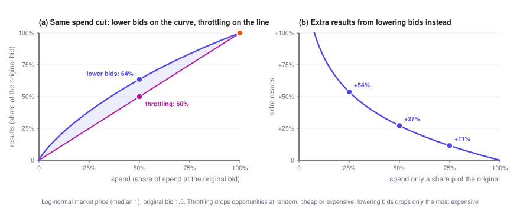
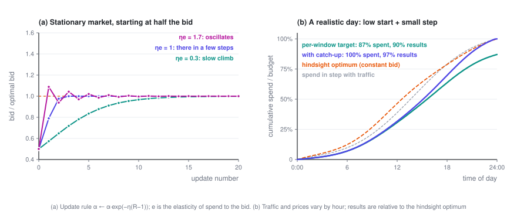

# Budget Pacing

> The optimal $\lambda$ can't be computed in advance: at 9 a.m. you have no idea what tonight's market will look like, so you have to adjust as you spend. This post covers the control logic of budget pacing: why lowering bids beats throttling, when the update rule converges and when it oscillates, and how to recover from a bad start.

> **Ad Bidding · Part 3 of 3** · 10 min read
>
> [← Bidding Under a Budget](2-budget.en.md)　·　[**Series index**](index.en.md)　·　Last part →


**Previously**: in Part 2 the optimal bid is $b_t = v_t/\lambda^\star$, with $\lambda^\star$ set by "total spend = budget" — but computing it means knowing every auction's $v_t$ and $w_t$ for the whole day in advance. This post covers how to find $\lambda$ while the campaign is running, and the dynamics that come with it.

<details>
<summary>Symbols used in this post</summary>

| Symbol | Meaning |
|---|---|
| $\alpha = 1/\lambda$ | Bid multiplier; the bid is $b = \alpha\,v$ |
| $k$ | The $k$-th time window (e.g. one every 15 minutes) |
| $R_k$ | Actual spend ÷ planned spend in window $k$ |
| $\eta$ | Update step size |
| $e$ | Elasticity of spend with respect to the bid: raise the bid by 1% and spend rises by $e$% |
| $p$ | Probability of entering each auction under throttling |
| $C,\ \mu$ | Cost cap (target CPA) and its multiplier |

The full notation table is in the [series index](index.en.md).

</details>

---

## 1. Ruling out the obvious approach: throttling

The most intuitive way to keep a budget from running out too fast is **throttling**: leave the bid alone, but enter each auction only with probability $p$. The budget pacing system LinkedIn published in 2014 took this approach.

But the concavity proven in Part 2 settles the question directly: **for the same spend, lowering bids is never worse than throttling.**

<details>
<summary>Show: a one-line proof</summary>

Let $N(S)$ be the most results you can get for a spend of $S$ by adjusting only your bids. Part 2 (Section 3.4) showed that it's concave, with $N(0) = 0$.

At the original bids you spend $S_0$ and get $N_0$, and clearly $N_0 \le N(S_0)$. Throttling with probability $p$ spends $pS_0$ and gets $pN_0$ — a point on the line from the origin to $(S_0, N_0)$. Lowering bids to spend the same $pS_0$ gets $N(pS_0)$. Because the function is concave and passes through the origin,

$$N(pS_0) = N\bigl(p\,S_0 + (1-p)\cdot 0\bigr) \;\ge\; p\,N(S_0) + (1-p)\,N(0) \;\ge\; p\,N_0$$

</details>

The intuition: throttling drops opportunities at random, expensive and cheap alike; lowering bids drops **only the most expensive ones**.



## 2. Online updates: a thermostat

Offline, you can bisect on $\lambda$. Online, you split the day into many short time windows, and at the end of each one check whether you're spending too fast or too slowly:

$$R_k = \frac{\text{actual spend in window } k}{\text{planned spend in window } k}, \qquad \boxed{\ \alpha \leftarrow \alpha \cdot e^{-\eta\,(R_k - 1)}\ }$$

Spending too fast ($R_k > 1$) shrinks $\alpha$ and lowers bids; spending too slowly raises them. "Planned spend" is usually the budget × this window's forecast share of traffic.

```
α = α₀                         # cold start: bisect on past auction logs
at the end of each time window:
    R = actual spend / planned spend
    α ← α · exp(−η · (R − 1))  # too fast → bid lower; too slow → higher
in the next window, bid b = α · v on every opportunity
```

This isn't an ad hoc rule of thumb. It's online gradient descent on the dual problem (Balseiro and Gur, 2019): $R_k - 1$ is proportional to the gradient of the dual objective at the current $\lambda$. The multiplicative form corresponds to mirror descent, which keeps $\alpha$ positive and makes every adjustment proportional.

## 3. Step size: one product decides between convergence and oscillation

Suppose the market doesn't change, and the optimal multiplier is $\alpha^\star$. Let $x = \ln(\alpha/\alpha^\star)$ be the log error of the bid. Near $\alpha^\star$, spend has elasticity $e$ with respect to the bid, so $R \approx 1 + e\,x$. Plugging this into the update rule (after taking logs of both sides):

$$x_{k+1} = x_k - \eta\,(R_k - 1) \;\approx\; (1 - \eta e)\,x_k$$

Each step multiplies the error by $(1 - \eta e)$:

- $0 < \eta e < 1$: monotone convergence; the smaller $\eta e$, the slower.
- $\eta e = 1$: straight to the target in one step (in the linear approximation).
- $1 < \eta e < 2$: oscillation that dies down.
- $\eta e > 2$: oscillation that grows.

**What drives the dynamics isn't $\eta$ on its own, but the product $\eta e$.** The elasticity $e$ is a market statistic: with a single type of auction, $e = b^2 w'(b)/c(b)$, and with uniformly distributed market prices it's always exactly 2. The same $\eta$ can behave completely differently for advertisers or traffic with different elasticities. The LinkedIn paper notes that a normalization constant that's too large causes oscillation, while one that's too small slows convergence — it's the same phenomenon, since the constant changes the effective $\eta e$.



Real systems also have noise: conversions are sparse, and spend jumps around from window to window. A large $\eta$ tracks quickly but pushes that noise straight into your bids; a small $\eta$ keeps bids steady but reacts slowly. It's the classic bias–variance trade-off.

## 4. Catching up: don't let the morning's mistake carry into the evening

Panel (b) simulates a day in which both traffic and market prices change by the hour, the starting bid is only half the optimum, and the step size is on the small side. The version that only chases each window's own spending target never makes up for the morning's shortfall, and spends just 87% of the budget by the end of the day.

A single change fixes it: **recompute the planned spend each time as remaining budget × this window's share of the remaining traffic.** If you underspend in the morning, the afternoon's targets rise automatically. The LinkedIn paper calls this the MPC (model predictive control) variant. With the same start and the same step size, it spends the whole budget and gets 97% of the hindsight-optimal results.

Two things are worth noting:

- **The hindsight optimum doesn't spread spend evenly with traffic.** With a constant bid all day, spend naturally tilts toward the cheaper hours: in panel (b), by noon the hindsight optimum has already spent 46% of the budget, while spending in line with traffic would have used only 39%. Smooth spending is a means, not the goal; what really needs to be leveled is **marginal ROI**.
- **The starting value matters.** The LinkedIn paper replayed real auction logs: the catch-up version always spent the full budget, but starting at half the optimal bid raised cost per impression by about 4%, and starting 50% too high raised it by more than 10% (Figure 3 of the paper). Starting high hurts more, because money spent early at high prices can't be won back.

## 5. Every extra constraint adds another knob

The framework composes; this section and the formulas in the table follow Section 4 of the LinkedIn bidding paper (Gao et al., 2022). Each constraint you add brings another multiplier into the Lagrangian and another parameter into the bidding formula. The new multipliers are updated the same way as $\lambda$: up when their constraint is violated, down when there's slack.

| Constraint | Second-price bid | What the new multiplier means |
|---|---|---|
| Budget only | $b = \dfrac{v}{\lambda}$ | $\lambda$: the budget's shadow price |
| Budget + cost cap (total spend $\le C \times$ total conversions) | $b = \dfrac{1 + \mu C}{\lambda + \mu}\,v$ | $\mu$: how tight the cost constraint is |
| A separate budget cap for time period $k$ | $b = \dfrac{v}{\lambda + \lambda_k}$ | $\lambda_k$: lowers bids only during period $k$ |
| Minimum conversions in time period $k$ | $b = \dfrac{1 + \mu_k}{\lambda}\,v$ | $\mu_k$: raises bids only during period $k$ |

The cost-cap row hides a consequence worth pausing on. When the budget is loose ($\lambda = 0$), the bid is

$$b = \Bigl(C + \frac{1}{\mu}\Bigr)\,v \;>\; C\,v$$

**The optimal bid is higher than "target CPA × pCVR".** The reason is again Part 1's key fact: the constraint caps your **average** cost, while your bid sets your **marginal** cost, and the marginal cost is higher than the average. With uniformly distributed market prices, the optimal bid is exactly $2C \cdot v$.

## 6. Zooming out: everyone is adjusting

The last dynamic is the easiest one to overlook. The win-rate curve $w(b)$ you face is made up of **other advertisers' bids**, and they're adjusting their own $\alpha$ the same way you are. When a big advertiser runs out of budget at 3 p.m. and drops out, market prices fall, everyone's spending speed changes, everyone's $\alpha$ adjusts — and those adjustments in turn change the market prices everyone faces.

- **A steady state exists.** When every bidder uses a bid multiplier and each one either spends exactly their budget or isn't budget-constrained at all, the market is in what's called a pacing equilibrium. In second-price markets, one always exists (Conitzer et al., 2022).
- **Be careful with experiments.** When you A/B test a bidding algorithm online, ads in the treatment and control groups bid against each other in the same auctions, so ordinary randomization is biased by interference. LinkedIn's approach splits users randomly into two halves and splits every campaign's budget in the same proportion, creating two mini-markets that don't interfere with each other (budget-split, Liu et al., 2021).

## 7. What this series leaves out

- **How to estimate the win-rate curve and values.** Censored data, segmenting by hour and audience, calibrating predictions — this is the most "statistical" part of a bidding system, and the easiest to get wrong.
- **Equilibria in multi-slot GSP**, and how to learn bid shading online under first price.
- **Mechanism design on the platform side**: when most bidders are automated value maximizers, how should auction rules and reserve prices be set?
- **Multi-day budget planning**, errors in traffic forecasts, and reinforcement-learning approaches to bidding.

To go further, start with the survey by Aggarwal et al. (2024); the full reference list is in the [series index](index.en.md#references).

---

**Ad Bidding · Part 3 of 3**

[← Bidding Under a Budget](2-budget.en.md)　·　[**Series index**](index.en.md)　·　Last part →
