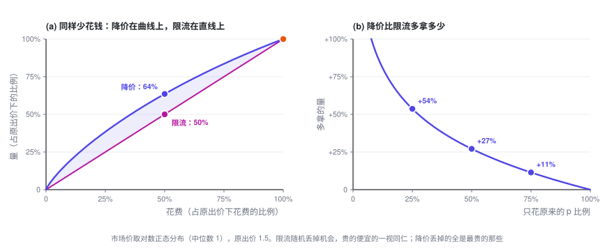
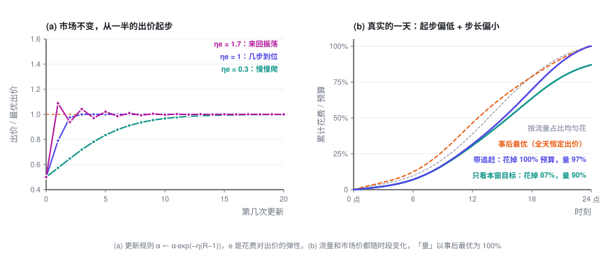

# 预算平滑（Pacing）

> 最优的 $\lambda$ 没法事先算出来：早上 9 点，你不知道今晚的市场长什么样，只能边花边调。这一篇讲预算平滑的控制逻辑：为什么降价比限流好，更新规则什么时候收敛、什么时候振荡，起步偏了怎么追回来。

> **出价专题 · 第 3 篇 / 共 3 篇** · 阅读约 10 分钟
>
> [← 预算约束下的出价](2-budget.md)　·　[**专题目录**](index.md)　·　已是最后一篇 →


**前情提要**：上一篇的最优解是 $b_t = v_t/\lambda^\star$，$\lambda^\star$ 由「总花费 = 预算」定出来，但算它需要事先知道一整天所有拍卖的 $v_t$ 和 $w_t$。这一篇讲 $\lambda$ 怎么边投边找，以及随之而来的几个动态现象。

<details>
<summary>本篇会用到的符号</summary>

| 符号 | 含义 |
|---|---|
| $\alpha = 1/\lambda$ | 出价系数，出价 $b = \alpha\,v$ |
| $k$ | 第 $k$ 个时间窗（比如每 15 分钟一个） |
| $R_k$ | 第 $k$ 窗的「实际花费 ÷ 计划花费」 |
| $\eta$ | 更新步长 |
| $e$ | 花费对出价的弹性：出价涨 1%，花费涨 $e$% |
| $p$ | 限流时参加拍卖的概率 |
| $C,\ \mu$ | 成本上限（目标 CPA）及其乘子 |

完整符号表见[专题目录](index.md)。

</details>

---

## 1. 先排除一个直觉做法：限流

防止预算花得太快，最直觉的做法是**限流**（throttling）：出价不变，每次机会以概率 $p$ 参加。LinkedIn 2014 年发表的预算平滑系统就是这个思路。

但上一篇证明过的凹性，直接给出一个结论：**花同样多的钱，降价永远不比限流差。**

<details>
<summary>展开：一行证明</summary>

记 $N(S)$ 为「只调出价、花 $S$ 这么多钱，最多能拿到的量」。上一篇 3.4 说明它是凹函数，且 $N(0) = 0$。

原出价下花 $S_0$、拿 $N_0$，显然 $N_0 \le N(S_0)$。以概率 $p$ 限流，花 $pS_0$、拿 $pN_0$，落在原点和 $(S_0, N_0)$ 的连线上。改成降价、同样只花 $pS_0$，能拿 $N(pS_0)$。凹函数过原点，所以

$$N(pS_0) = N\bigl(p\,S_0 + (1-p)\cdot 0\bigr) \;\ge\; p\,N(S_0) + (1-p)\,N(0) \;\ge\; p\,N_0$$

</details>

直觉：限流随机丢掉机会，贵的便宜的一视同仁；降价丢掉的**全是最贵的那些**。



## 2. 在线更新：一个恒温器

离线时可以二分 $\lambda$。在线时，把一天切成很多小时间窗，每个窗结束后看一眼花快了还是慢了：

$$R_k = \frac{\text{第 } k \text{ 窗实际花费}}{\text{第 } k \text{ 窗计划花费}}, \qquad \boxed{\ \alpha \leftarrow \alpha \cdot e^{-\eta\,(R_k - 1)}\ }$$

花快了（$R_k > 1$），$\alpha$ 变小，出价降；花慢了，出价升。「计划花费」通常取「预算 × 这个窗的预测流量占比」。

```
初始化 α = α₀                        # 冷启动：拿历史拍卖日志回放，二分出一个初值
每个时间窗结束时：
    R = 这一窗实际花费 / 这一窗计划花费
    α ← α · exp(−η · (R − 1))       # 花多了压价，花少了提价
下一个时间窗里，每次机会出价 b = α · v
```

这不是拍脑袋想出来的经验规则。它是对偶问题上的在线梯度下降（Balseiro、Gur，2019）：$R_k - 1$ 正比于对偶目标在当前 $\lambda$ 处的梯度；写成乘法形式对应镜像下降（mirror descent），好处是 $\alpha$ 永远为正，调整幅度按比例计。

## 3. 步长：一个乘积决定收敛还是振荡

假设市场不变，最优出价系数是 $\alpha^\star$。记 $x = \ln(\alpha/\alpha^\star)$ 为出价的对数偏差。在 $\alpha^\star$ 附近，花费对出价的弹性是 $e$，也就是 $R \approx 1 + e\,x$。代入更新规则（两边取对数）：

$$x_{k+1} = x_k - \eta\,(R_k - 1) \;\approx\; (1 - \eta e)\,x_k$$

偏差每一步乘以 $(1 - \eta e)$：

- $0 < \eta e < 1$：单调收敛，$\eta e$ 越小越慢。
- $\eta e = 1$：线性近似下一步到位。
- $1 < \eta e < 2$：来回振荡，振幅逐步缩小。
- $\eta e > 2$：振荡发散。

**决定动态的不是 $\eta$ 本身，而是乘积 $\eta e$。** 弹性 $e$ 是个市场统计量，只有一类拍卖时 $e = b^2 w'(b)/c(b)$，市场价均匀分布时恒等于 2。同一个 $\eta$，放到弹性不同的广告主或流量上，行为可能完全不同。LinkedIn 论文里提到，归一化常数取大了会振荡、取小了收敛慢，本质上是同一件事：它改变的是等效的 $\eta e$。



真实环境里还有噪声：转化稀疏，单窗花费抖得厉害。$\eta$ 大，追得快，但把噪声也放大进了出价；$\eta$ 小，出价平稳，但追得慢。这是标准的偏差—方差权衡。

## 4. 追赶：别让上午的错误延续到晚上

图 (b) 模拟了一天：流量和市场价都随时段变化，起步出价只有最优值的一半，步长偏小。只盯着「本窗计划花费」的版本，上午少花的钱就永远少花了，一天只花掉 87% 的预算。

改一处就好：**每次都用「剩余预算 × 本窗占剩余流量的比例」重算计划花费。** 上午少花了，下午的目标自动抬高。LinkedIn 论文把这种做法称为 MPC（模型预测控制）版本。同样的起步和步长，它花完了预算，量是事后最优的 97%。

两点值得注意：

- **事后最优不是「按流量均匀花」。** 全天恒定出价时，花费会自然往便宜的时段倾斜：图 (b) 里，中午 12 点事后最优已经花掉 46%，按流量占比只该花 39%。「平滑花费」只是手段，真正该被拉平的是**边际 ROI**。
- **起步值很重要。** LinkedIn 论文拿真实拍卖日志回放过：带追赶的版本最终都能花完预算，但起步出价偏低一半时，单次曝光成本比最优高约 4%；偏高一半时高出 10% 以上（论文图 3）。偏高更伤，因为早早以高价花掉的钱追不回来。

## 5. 多一个约束，就多一个旋钮

这套框架可以组合，这一节的做法和下表的公式出自 LinkedIn 出价论文（Gao 等，2022）的第 4 节。每加一个约束，拉格朗日函数里就多一个乘子，出价公式里就多一个参数。新乘子的更新方式和 $\lambda$ 一样：约束被违反就加大，有富余就减小。

| 约束 | 二价下的出价 | 新乘子的含义 |
|---|---|---|
| 只有预算 | $b = \dfrac{v}{\lambda}$ | $\lambda$：预算的影子价格 |
| 预算 + 成本上限（总花费 $\le C \times$ 总转化） | $b = \dfrac{1 + \mu C}{\lambda + \mu}\,v$ | $\mu$：成本约束有多紧 |
| 时段 $k$ 另有预算上限 | $b = \dfrac{v}{\lambda + \lambda_k}$ | $\lambda_k$：只在时段 $k$ 里压价 |
| 时段 $k$ 有保量要求（按转化计） | $b = \dfrac{1 + \mu_k}{\lambda}\,v$ | $\mu_k$：只在时段 $k$ 里加价 |

成本上限这一行有个值得停下来看的推论。预算很宽松时（$\lambda = 0$），出价是

$$b = \Bigl(C + \frac{1}{\mu}\Bigr)\,v \;>\; C\,v$$

**最优出价高于「目标 CPA × pCVR」。** 原因还是第一篇那个事实：约束管的是**平均**成本，出价决定的是**边际**成本，而边际高于平均。市场价均匀分布时，最优出价恰好是 $2C \cdot v$。

## 6. 退一步看：大家都在调

最后一个动态最容易被忽略。你面对的胜率曲线 $w(b)$，就是**其他广告主的出价**，而他们也在用同样的方式调自己的 $\alpha$。一个大广告主下午三点预算花完退场，市场价下降，所有人的花费速度随之变化，所有人的 $\alpha$ 随之调整，这些调整又反过来改变彼此面对的市场价。

- **稳态存在。** 每个人都用出价系数、并且各自要么恰好花完预算、要么预算根本不紧，这样的状态叫出价系数均衡（pacing equilibrium）。二价市场里它一定存在（Conitzer 等，2022）。
- **做实验要小心。** 线上 A/B 测一个出价算法时，实验组和对照组的广告在同一场拍卖里互相竞价，普通分流会有干扰偏差。LinkedIn 的做法是把用户随机分成两半，同时把每个广告计划的预算也按比例劈开，形成两个互不干扰的小市场（budget-split，Liu 等，2021）。

## 7. 这个专题没有覆盖的东西

- **胜率曲线和价值怎么估。** 删失数据、分时段分人群、预估校准，这是整个出价系统里最「统计」、也最容易翻车的部分。
- **多广告位 GSP 的均衡**，以及一价下怎么在线学压价。
- **平台一侧的机制设计**：当大部分出价者都是自动出价的价值最大化者时，拍卖规则和底价该怎么定。
- **跨天的预算规划**、流量预测的误差、强化学习类的出价方法。

想往下读，推荐从 Aggarwal 等人的综述（2024）开始，完整文献列表见[专题目录](index.md#参考文献)。

---

**出价专题 · 第 3 篇 / 共 3 篇**

[← 预算约束下的出价](2-budget.md)　·　[**专题目录**](index.md)　·　已是最后一篇 →
