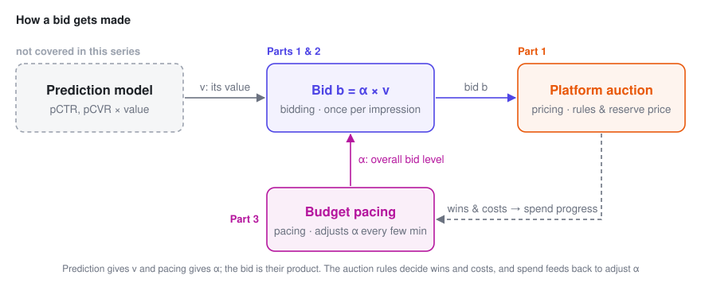

# A Primer on Ad Bidding

> Three short posts, written from the seat of an advertiser's bidding agent, that lay out the basic math of "how much should I bid?" in ad auctions: from **a single auction**, to **a day of auctions sharing one budget**, to **pacing that budget in real time**.

Each post is built around one core formula, with derivations, figures, and notes on how to read the formula in business terms and what goes wrong in production. The posts build on each other, but **each one stands on its own**. If you just want the big picture, the two sections below — "Three words to tell apart" and "What the three posts cover" — are all you need.

---

## Three words to tell apart: pricing, bidding, pacing

In one sentence: **pricing is the seller setting the rules, bidding is the buyer deciding how much to offer each time, and pacing is the buyer controlling how fast the money goes.**

An analogy. An auction house is selling 1,000 lots today, and you walk in with a budget of 100,000:

- **Pricing**: the auction house's rules. Does the winner pay the highest bid or the second-highest? What's the starting price (the reserve)?
- **Bidding**: how high you raise your paddle for the lot in front of you, based on what that lot is worth to you.
- **Pacing**: you don't want to blow the whole budget in the morning, so you keep an eye on your wallet as you go — spending too fast, you hold back across the board; too slow, you loosen up.

In online advertising, all three happen every day:

| | Who does it | How often | What it looks like in ads | Covered in |
|---|---|---|---|---|
| **Pricing** | The platform | The rules rarely change; reserve prices can adjust dynamically | First-price, second-price, GSP; reserve prices; charging per impression, click or conversion | Part 1 |
| **Bidding** | The advertiser, or an autobidder acting for them | Once per impression, in milliseconds | Manual bids, or automated strategies such as "maximize conversions" and "target CPA" | Parts 1 & 2 |
| **Pacing** | Same as above | Every few minutes | Throttling, or scaling all bids up or down | Part 3 |

One formula ties the three together: **bid $b = \alpha \times v$**.

- **$v$ answers "what is this impression worth?"** It comes from prediction models and decides whether to bid more or less here than on other opportunities. This is the bidding part.
- **$\alpha$ answers "how high should we bid overall?"** Pacing adjusts it based on how fast the money is going. Part 2 works out its optimal value; Part 3 shows how to reach it online.
- **The pricing rules decide how to use the formula.** Under second price, bidding exactly this amount is optimal; under first price, you shade it down a bit further. That's Part 1.

Show: a few terms that often get mixed up

- In advertising, "pricing" usually means the platform's charging rules and reserve prices, not advertisers setting prices. The pricing series on this site is about sellers setting prices; its counterpart in ads is the platform setting reserve prices.
- Early pacing systems often simply throttled traffic. Part 3 shows why adjusting bids beats throttling, which is why pacing today is essentially part of the bidding system.
- CPC and CPM describe what you're charged for, so they belong to pricing; how you bid is a separate question. oCPC, for instance, bids toward a conversion goal but charges per click.

---

## What the three posts cover

### [1 · Bidding in a Single Auction](1-auction.en.md)　`8 min`

**The question**: with just one auction, how much should you bid? And does it matter whether the platform runs a first-price or a second-price auction?

To a bidder, the market is just one random number: the highest bid among everyone else. From it we get the win-rate curve and the cost curve, and see why you bid your true value under second price but shade your bid under first price. Finally, we take the platform's side for a moment: setting the reserve price turns out to be exactly the problem from Part 1 of the pricing series.

**Takeaway**: under second price, the marginal cost of one more win is exactly your bid. Everything in the next two posts grows out of this one fact.

### [2 · Bidding Under a Budget](2-budget.en.md)　`10 min`

**The question**: thousands of auctions a day share one budget — how much should you bid in each?

Add the budget constraint. Once the Lagrangian splits apart, every auction turns back into Part 1's problem, except that each value is divided by the same number $\lambda$ — the $\alpha = 1/\lambda$ in the formula above.

**Takeaways**: $b = v/\lambda$; equal values mean equal bids, however strong or weak the competition; and the precise version of "doubling the budget doesn't double the results".

### [3 · Budget Pacing](3-pacing.en.md)　`10 min`

**The question**: the optimal $\lambda$ can't be computed in advance — so how do you adjust it while the campaign runs?

Why lowering bids beats throttling, when the update rule converges and when it oscillates, how to recover from a bad start, and what happens when cost caps come in or when every advertiser is adjusting at once.

**Takeaways**: an update rule that fits in a few lines of code, and a single product, $\eta e$, that tells you whether it will oscillate.

---

## How this relates to the pricing series

The [pricing series](../pricing/index.en.md) takes the **seller's** side: facing a demand curve $q(p)$ that falls as the price rises, decide what to charge. This series takes the **buyer's** side: facing a win-rate curve $w(b)$ that rises with the bid, decide what to offer. The two frameworks line up almost one to one:

| | Pricing (seller) | Bidding (buyer) |
|---|---|---|
| The curve you face | Demand $q(p)$, decreasing | Win rate $w(b)$, increasing |
| Optimum for a single decision | $p^\star = c + q/(-q')$: mark up from cost | First-price $b^\star = v - w/w'$: shade down from value |
| Knob created by a coupling constraint | Shadow price $\lambda$ | Shadow price $\lambda$, bid multiplier $1/\lambda$ |
| What the optimum looks like | Marginal unit economics leveled | Marginal ROI leveled |

---

## Notation

Shared by all three posts. Each post also opens with a collapsible table of the symbols it uses.

| Symbol | Meaning | In your business, this might be |
|---|---|---|
| $b$ | Bid, **the decision variable**, always converted to a per-impression amount | CPC bid × pCTR |
| $z$ | Market price: the highest bid among everyone else | The highest competing eCPM in auction logs |
| $w(b)$ | Win-rate curve, $P(z \le b)$ | Bid landscape, win-rate model |
| $c(b)$ | Expected spend per opportunity; $c_1$ first price, $c_2$ second price | Expected cost per ad request |
| $v$ | What an impression opportunity is worth to you | pCVR, or pCTR × value per click |
| $r$ | Reserve price | Reserve price, floor price |
| $B,\ T$ | Total budget; number of auctions (opportunities) | Daily budget; daily request volume |
| $\lambda$ | Multiplier of the budget constraint, the shadow price | How many more conversions one more dollar of budget buys |
| $\alpha = 1/\lambda$ | Bid multiplier | Pacing multiplier |
| $R_k$ | Actual ÷ planned spend in time window $k$ | Intraday spend progress |
| $\eta,\ e$ | Update step size; elasticity of spend with respect to the bid | Controller gain; % change in spend per 1% change in bid |
| $C,\ \mu$ | Cost cap and its multiplier | Target CPA |

---

## Formula cheat sheet

| Setting | Result |
|---|---|
| Win rate | $w(b) = P(z \le b)$ |
| Expected spend | First price $c_1 = b\,w(b)$; second price $c_2 = \int_0^b z\,w'(z)\,dz$ |
| Cost of one more win | Second price $b$; first price $b + w/w'$ |
| Optimal bid in a single auction | Second price $b^\star = v$; first price $b^\star = v - w/w'$ |
| Reserve price (one bidder) | $r^\star = \bigl(1 - F(r^\star)\bigr)/f(r^\star)$ |
| Under a budget, second price | $b_t^\star = v_t/\lambda$, with $\lambda^\star$ satisfying $\sum_t c_t(v_t/\lambda^\star) = B$ |
| Under a budget, first price | $b_t^\star = v_t/\lambda - w_t/w_t'$ |
| Shadow price of the budget | $dV^\star/dB = \lambda^\star$ |
| Uniform market price on $[0, m]$, equal values | $b^\star = \sqrt{2mB/T}$, $N^\star = \sqrt{2TB/m}$, marginal CPA = 2 × average CPA |
| Throttling vs. lowering bids | $N(pS_0) \ge p\,N(S_0)$ |
| Online update | $\alpha \leftarrow \alpha\,e^{-\eta(R_k - 1)}$, log error $x_{k+1} \approx (1 - \eta e)\,x_k$ |
| Budget + cost cap | $b = \dfrac{1 + \mu C}{\lambda + \mu}\,v$ |

---

## What this series doesn't cover

All three posts assume **you already have calibrated value predictions $v$ and a reliable win-rate curve $w(b)$**, and ask how to bid once you have them.

**Getting** those two is actually the hardest, most "statistical" part of any bidding system (censored data, selection bias, non-stationarity). That, along with multi-slot GSP, mechanism design on the platform side, and multi-day budget planning, is listed in [the last section of Part 3](3-pacing.en.md#7-what-this-series-leaves-out).

---

## References

1. Yuan Gao, Kaiyu Yang, Yuanlong Chen, Min Liu, Noureddine El Karoui. [Bidding Agent Design in the LinkedIn Ad Marketplace](http://papers.adkdd.org/2022/papers/adkdd22-gao-bidding.pdf). AdKDD 2022.
2. Weinan Zhang, Shuai Yuan, Jun Wang. Optimal Real-Time Bidding for Display Advertising. KDD 2014.
3. Weinan Zhang, Kan Ren, Jun Wang. [Optimal Real-Time Bidding Frameworks Discussion](https://arxiv.org/abs/1602.01007). arXiv:1602.01007, 2016.
4. Jon Feldman, S. Muthukrishnan, Martin Pál, Cliff Stein. Budget Optimization in Search-Based Advertising Auctions. EC 2007.
5. Deepak Agarwal, Souvik Ghosh, Kai Wei, Siyu You. Budget Pacing for Targeted Online Advertisements at LinkedIn. KDD 2014.
6. Santiago Balseiro, Yonatan Gur. Learning in Repeated Auctions with Budgets: Regret Minimization and Equilibrium. Management Science, 2019.
7. Roger Myerson. Optimal Auction Design. Mathematics of Operations Research, 1981.
8. Benjamin Edelman, Michael Ostrovsky, Michael Schwarz. Internet Advertising and the Generalized Second-Price Auction. American Economic Review, 2007.
9. Wush Chi-Hsuan Wu, Mi-Yen Yeh, Ming-Syan Chen. Predicting Winning Price in Real Time Bidding with Censored Data. KDD 2015.
10. Vincent Conitzer, Christian Kroer, Eric Sodomka, Nicolás Stier-Moses. [Multiplicative Pacing Equilibria in Auction Markets](https://arxiv.org/abs/1706.07151). Operations Research, 2022.
11. Min Liu, Jialiang Mao, Kang Kang. [Trustworthy and Powerful Online Marketplace Experimentation with Budget-split Design](https://arxiv.org/abs/2012.08724). KDD 2021.
12. Gagan Aggarwal et al. [Auto-bidding and Auctions in Online Advertising: A Survey](https://arxiv.org/abs/2408.07685). ACM SIGecom Exchanges, 2024.

---

*Every figure in this series is computed directly from the models in the text; none of them are sketches. Every derivation has been checked numerically (finite differences for derivatives, brute-force search for optima, Monte Carlo for expectations). If you spot a mistake, please let me know.*
