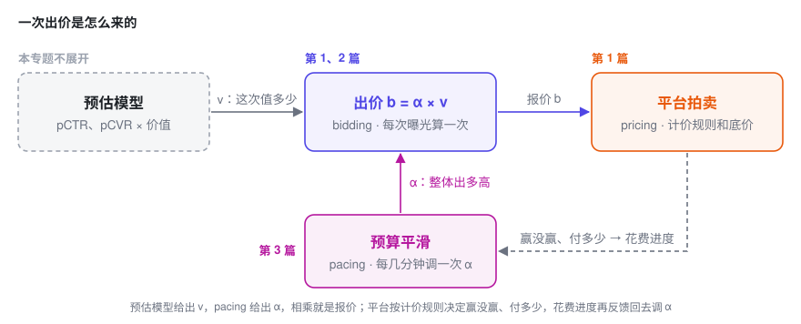

# 广告出价入门

> 三篇短文，站在广告主出价代理的位置，把广告拍卖里「该出多少钱」的基本数学讲清楚：从**一次拍卖**，到**一整天共用一份预算**，再到**边投边调的预算平滑（pacing）**。

每篇只围绕一个核心公式展开，配推导、配图，也说明这个公式在业务里怎么读、上线时会踩什么坑。三篇是递进的，但**每一篇都能单独读**。只想快速了解全貌的话，读完下面「先分清三个词」和「三篇讲什么」两节就够了。

---

## 先分清三个词：pricing、bidding、pacing

一句话：**pricing 是卖方定规则，bidding 是买方每一次出多少，pacing 是买方控制钱花多快。**

打个比方。拍卖行一天要拍 1000 件货，你带着 10 万块进场：

- **Pricing（计价）**：拍卖行定的规则。按最高价成交还是按第二高的价成交，起拍价（底价）是多少。
- **Bidding（出价）**：你对眼前这一件举多高的牌，依据是这件货对你值多少。
- **Pacing（预算平滑）**：你不想上午就把钱花光，于是边拍边看钱包，花快了就整体收着点，花慢了就放开一点。

放到广告里，三件事每天都在发生：

| | 谁来做 | 多久做一次 | 在广告里是什么 | 在哪篇讲 |
|---|---|---|---|---|
| **Pricing** | 平台 | 规则很少变，底价可以动态调 | 一价、二价、GSP；底价；按曝光、点击还是转化扣费 | 第 1 篇 |
| **Bidding** | 广告主，或替它出价的自动出价系统 | 每个曝光机会出一次价，毫秒级 | 手动出价，或「最大化转化」「目标 CPA」这类自动出价 | 第 1、2 篇 |
| **Pacing** | 同上 | 每几分钟一次 | 限流，或整体调高、调低出价 | 第 3 篇 |

三件事靠一个公式串起来：**出价 $b = \alpha \times v$**。

- **$v$ 管「这一次值多少」**：来自预估模型，决定这次曝光和别的机会比，该多出还是少出。这是 bidding 的部分。
- **$\alpha$ 管「整体出多高」**：由 pacing 根据花钱快慢来调。它最优应该是多少，第 2 篇算；怎么在线调到位，第 3 篇讲。
- **pricing 规则决定这个公式怎么用**：二价下直接按它出价就是最优；一价下还要在它的基础上再压一点价。这是第 1 篇的内容。

展开：几个容易混的说法

- 广告里说的 pricing，多数时候指平台侧的计价规则和底价，不是广告主在定价。本站定价专题讲的是卖方定价，对应到广告里，就是平台怎么定底价。
- 早期的 pacing 系统常常就是限流。第 3 篇会说明，调出价比限流更好，所以现在的 pacing 本质上是出价系统的一部分。
- CPC、CPM 说的是按什么扣费，属于 pricing；怎么出价是另一回事。比如 oCPC 就是按转化目标出价、按点击扣费。

---

## 三篇讲什么

### [一 · 单次拍卖的出价](1-auction.md)　`8 分钟`

**回答的问题**：只有一次拍卖，该出多少？平台用一价还是二价，对出价有什么影响？

对出价者来说，市场只是一个随机数：其他人的最高出价。由它得到胜率曲线和花费曲线，推出二价下「如实报价」、一价下「压价」。最后从平台一侧看一眼底价，它其实就是定价专题第一篇的原题。

**读完能带走**：二价下，多赢一次的边际成本正好等于你的出价。后两篇的结论都从这一句长出来。

### [二 · 预算约束下的出价](2-budget.md)　`10 分钟`

**回答的问题**：一整天成千上万次拍卖共用一份预算，每一次该出多少？

加上预算约束。拉格朗日函数一拆开，每一次拍卖又变回第一篇的问题，只是价值都除以了同一个数 $\lambda$，相当于上面公式里的 $\alpha = 1/\lambda$。

**读完能带走**：$b = v/\lambda$；价值相同就出同一个价，不管竞争强弱；以及「预算翻倍，量不会翻倍」的精确版本。

### [三 · 预算平滑（Pacing）](3-pacing.md)　`10 分钟`

**回答的问题**：最优的 $\lambda$ 事先算不出来，边投边该怎么调？

为什么降价比限流好，更新规则什么时候收敛、什么时候振荡，起步偏了怎么追回来，以及加上成本约束、所有广告主都在调时会发生什么。

**读完能带走**：一条几行代码的更新规则，和一个判断它会不会振荡的乘积 $\eta e$。

---

## 和定价专题的关系

[定价专题](../pricing/index.md)站在**卖方**：面对一条随价格下降的需求曲线 $q(p)$，决定卖多少钱。这个专题站在**买方**：面对一条随出价上升的胜率曲线 $w(b)$，决定出多少钱。两边的骨架几乎一一对应：

| | 定价（卖方） | 出价（买方） |
|---|---|---|
| 面对的曲线 | 需求 $q(p)$，递减 | 胜率 $w(b)$，递增 |
| 单点最优 | $p^\star = c + q/(-q')$，在成本上加价 | 一价 $b^\star = v - w/w'$，在价值上压价 |
| 耦合约束带来的旋钮 | 影子价格 $\lambda$ | 影子价格 $\lambda$，出价系数 $1/\lambda$ |
| 最优解的样子 | 边际 UE 拉平 | 边际 ROI 拉平 |

---

## 完整符号表

三篇通用。每篇开头还有一个「本篇会用到的符号」的折叠小表。

| 符号 | 含义 | 在你的业务里可能是 |
|---|---|---|
| $b$ | 出价，**决策变量**，统一换算到每次曝光 | CPC 出价 × pCTR |
| $z$ | 市场价：除你之外的最高出价 | 拍卖日志里其他广告的最高 eCPM |
| $w(b)$ | 胜率曲线，$P(z \le b)$ | bid landscape、胜率预估 |
| $c(b)$ | 一次机会的期望花费，$c_1$ 一价、$c_2$ 二价 | 每次请求的期望消耗 |
| $v$ | 一次曝光机会对你的价值 | pCVR，或 pCTR × 点击价值 |
| $r$ | 底价 | reserve price、floor price |
| $B,\ T$ | 总预算；拍卖（机会）总数 | 日预算；日请求量 |
| $\lambda$ | 预算约束的乘子，影子价格 | 多给 1 元预算能多拿多少转化 |
| $\alpha = 1/\lambda$ | 出价系数 | pacing multiplier |
| $R_k$ | 第 $k$ 个时间窗的「实际 ÷ 计划」花费 | 分时消耗进度 |
| $\eta,\ e$ | 更新步长；花费对出价的弹性 | 控制器增益；出价涨 1% 花费涨几 % |
| $C,\ \mu$ | 成本上限及其乘子 | 目标 CPA |

---

## 公式速查

| 场景 | 结论 |
|---|---|
| 胜率 | $w(b) = P(z \le b)$ |
| 期望花费 | 一价 $c_1 = b\,w(b)$；二价 $c_2 = \int_0^b z\,w'(z)\,dz$ |
| 每多赢一次的成本 | 二价 $b$；一价 $b + w/w'$ |
| 单次拍卖的最优出价 | 二价 $b^\star = v$；一价 $b^\star = v - w/w'$ |
| 底价（单个出价者） | $r^\star = \bigl(1 - F(r^\star)\bigr)/f(r^\star)$ |
| 预算约束下，二价 | $b_t^\star = v_t/\lambda$，$\lambda^\star$ 满足 $\sum_t c_t(v_t/\lambda^\star) = B$ |
| 预算约束下，一价 | $b_t^\star = v_t/\lambda - w_t/w_t'$ |
| 预算的影子价格 | $dV^\star/dB = \lambda^\star$ |
| 均匀市场价 $[0, m]$，价值相同 | $b^\star = \sqrt{2mB/T}$，$N^\star = \sqrt{2TB/m}$，边际 CPA = 2 × 平均 CPA |
| 限流 vs 降价 | $N(pS_0) \ge p\,N(S_0)$ |
| 在线更新 | $\alpha \leftarrow \alpha\,e^{-\eta(R_k - 1)}$，对数偏差 $x_{k+1} \approx (1 - \eta e)\,x_k$ |
| 预算 + 成本上限 | $b = \dfrac{1 + \mu C}{\lambda + \mu}\,v$ |

---

## 这个专题不讲什么

三篇都假设**你已经有了校准好的价值预估 $v$ 和靠谱的胜率曲线 $w(b)$**，讨论的是「拿到这两样之后，该怎么出价」。

这两样东西怎么**得到**，其实是整个出价系统里最难、最「统计」的部分（删失数据、选择偏差、非平稳）。这部分连同多广告位 GSP、平台一侧的机制设计、跨天预算规划，都在[第三篇的最后一节](3-pacing.md#7-这个专题没有覆盖的东西)里列了出来。

---

## 参考文献

1. Yuan Gao, Kaiyu Yang, Yuanlong Chen, Min Liu, Noureddine El Karoui. [Bidding Agent Design in the LinkedIn Ad Marketplace](http://papers.adkdd.org/2022/papers/adkdd22-gao-bidding.pdf). AdKDD 2022.
2. Weinan Zhang, Shuai Yuan, Jun Wang. Optimal Real-Time Bidding for Display Advertising. KDD 2014.
3. Weinan Zhang, Kan Ren, Jun Wang. [Optimal Real-Time Bidding Frameworks Discussion](https://arxiv.org/abs/1602.01007). arXiv:1602.01007, 2016.
4. Jon Feldman, S. Muthukrishnan, Martin Pál, Cliff Stein. Budget Optimization in Search-Based Advertising Auctions. EC 2007.
5. Deepak Agarwal, Souvik Ghosh, Kai Wei, Siyu You. Budget Pacing for Targeted Online Advertisements at LinkedIn. KDD 2014.
6. Santiago Balseiro, Yonatan Gur. Learning in Repeated Auctions with Budgets: Regret Minimization and Equilibrium. Management Science, 2019.
7. Roger Myerson. Optimal Auction Design. Mathematics of Operations Research, 1981.
8. Benjamin Edelman, Michael Ostrovsky, Michael Schwarz. Internet Advertising and the Generalized Second-Price Auction. American Economic Review, 2007.
9. Wush Chi-Hsuan Wu, Mi-Yen Yeh, Ming-Syan Chen. Predicting Winning Price in Real Time Bidding with Censored Data. KDD 2015.
10. Vincent Conitzer, Christian Kroer, Eric Sodomka, Nicolás Stier-Moses. [Multiplicative Pacing Equilibria in Auction Markets](https://arxiv.org/abs/1706.07151). Operations Research, 2022.
11. Min Liu, Jialiang Mao, Kang Kang. [Trustworthy and Powerful Online Marketplace Experimentation with Budget-split Design](https://arxiv.org/abs/2012.08724). KDD 2021.
12. Gagan Aggarwal et al. [Auto-bidding and Auctions in Online Advertising: A Survey](https://arxiv.org/abs/2408.07685). ACM SIGecom Exchanges, 2024.

---

*专题里所有图均由代码根据文中模型直接计算生成，非示意图。所有推导都做了数值验证（有限差分对拍导数，暴力搜索对拍最优解，蒙特卡洛对拍期望）。如果你发现哪一步有问题，欢迎指出。*
