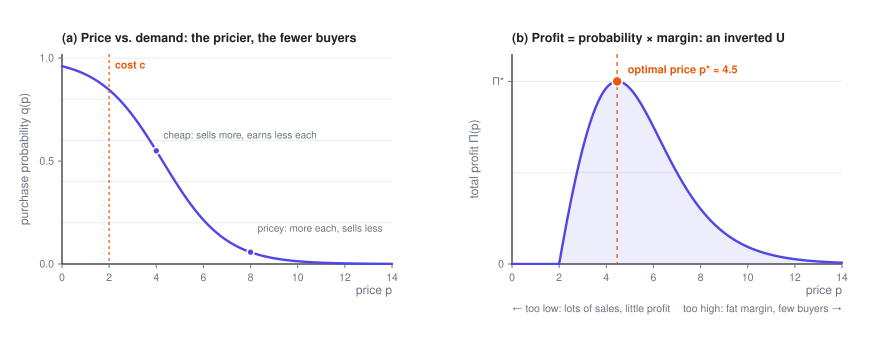
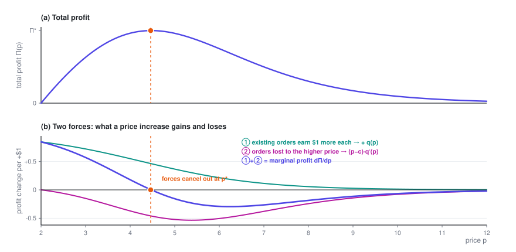

# Pricing a Single Product

> One number to set. Raise the price and you make more on each sale, but fewer people buy — so profit traces an inverted U. This post finds the top of that curve and gives you a benchmark you can estimate without a calculator.

> **Price Optimization · Part 1 of 4** · 12 min read
>
> ← First part　·　[**Series index**](index.en.md)　·　[Pricing Many Items Under Constraints →](2-constraints.en.md)

This is the first post in *A Primer on Price Optimization*. No background is needed — just the fact that the more something costs, the fewer people buy it.

Symbols used in this post

| Symbol | Meaning |
|---|---|
| $p$ | Price, **the decision variable** |
| $c$ | Unit cost, a known constant |
| $q(p)$ | Purchase probability / conversion rate, decreasing in $p$ |
| $k$ | Price coefficient: the larger it is, the faster conversion drops when the price moves |
| $\Pi$ | Total profit (gross margin throughout this series, not revenue) |
| $q_0 = 1-q$ | Probability of no purchase |

The full notation table is in the [series index](index.en.md).

---

## 1. Setting up the problem

There's a single pricing unit, with its own price–demand curve: the higher the price, the lower the chance of a sale.

$$q = q(p), \qquad q'(p) < 0$$

With a fixed unit cost $c$, total profit is

$$\boxed{\ \Pi(p) = \underbrace{q(p)}_{\text{purchase probability}} \times \underbrace{(p - c)}_{\text{margin per order}}\ }$$

There's a built-in tension in this formula:

- Raise the price → you make more on each order ($p-c$ grows)
- Raise the price → fewer people buy ($q$ shrinks)

Multiply the two and you usually get an **inverted U**: too cheap and you don't make money, too expensive and nobody buys, with a peak somewhere in between.

## 2. Finding the optimum

Differentiate with respect to $p$ and set the derivative to zero:

$$\frac{d\Pi}{dp} = \underbrace{q(p)}_{\text{①}} + \underbrace{(p-c)\,q'(p)}_{\text{②}} = 0$$

Each term has a clear meaning:

- **① $q(p)$**: each extra dollar of price earns one more dollar on **the orders you were already getting** — $q$ in total. This is the **gain**, and it's always positive.
- **② $(p-c)q'(p)$**: each extra dollar of price **loses** $|q'(p)|$ orders, each of which was worth a margin of $(p-c)$. This is the **loss**, and it's negative whenever the price is above cost.

The optimal price is the point where these two forces **exactly cancel out**.

Rearranging gives the general condition the optimal price has to satisfy:

$$\boxed{\ p^\star = c + \frac{q(p^\star)}{-\,q'(p^\star)}\ }$$

In words: **optimal price = cost + a markup**, where

$$\text{markup} \;=\; \frac{\text{current conversion rate}}{\text{rate at which conversion falls}}$$

This matches intuition: the more slowly conversion falls (the less customers care about price), the more room you have to mark up.

The same formula shows up twice in ad auctions. A platform setting a reserve price faces exactly this problem, with a cost of zero; and a buyer's optimal first-price bid, $b^\star = v - w/w'$, is its mirror image, shading down from value instead of marking up from cost. See [Part 1 of the ad bidding series](../bidding/1-auction.en.md).

## 3. Two worked examples

That was the general form. Plug in a specific demand function and you get a formula you can actually compute.

### Example 1: linear demand

$$q(p) = a - b\,p \qquad (a, b > 0)$$

Substitute into the objective:

$$\Pi(p) = (a - bp)(p - c) = -bp^2 + (a + bc)\,p - ac$$

This is a downward-opening parabola. Differentiate:

$$\frac{d\Pi}{dp} = -2bp + (a + bc) = 0$$

$$\boxed{\ p^\star = \frac{a + bc}{2b} = \frac{a}{2b} + \frac{c}{2}\ }$$

The second derivative is $\frac{d^2\Pi}{dp^2} = -2b < 0$, so this is indeed a maximum.

There's a neat way to put this. Let $p_{\max} = a/b$ be the "zero-demand price" (at this price, nobody buys at all). Then

$$p^\star = \frac{p_{\max} + c}{2}$$

**The optimal price is exactly halfway between your cost and the zero-demand price.** That makes a very handy mental benchmark: if you can estimate the price at which nothing sells anymore, the optimal price is roughly midway between that and your cost.

### Example 2: logit demand (closer to reality)

Linear demand has a flaw: push the price a little higher and $q$ goes negative. In practice, the logit form is more common:

$$q(p) = \frac{1}{1 + e^{-(b_0 - k p)}} = \sigma(b_0 - kp)$$

Here $\sigma(\cdot)$ is the sigmoid function, $b_0$ sets the baseline appeal, and $k > 0$ is the price coefficient. It naturally stays within $(0,1)$ and decreases with price.

It has a very convenient derivative:

$$q'(p) = \frac{dq}{dp} = -k\,q\,(1-q)$$

Show: where this comes from

Let $z = b_0 - kp$, so that $q = \sigma(z) = \frac{1}{1+e^{-z}}$.

The sigmoid has the classic property $\sigma'(z) = \sigma(z)\bigl(1-\sigma(z)\bigr)$:

$$\sigma'(z) = \frac{e^{-z}}{(1+e^{-z})^2} = \frac{1}{1+e^{-z}} \cdot \frac{e^{-z}}{1+e^{-z}} = \sigma(z)\bigl(1-\sigma(z)\bigr)$$

Then apply the chain rule, with $\frac{dz}{dp} = -k$:

$$\frac{dq}{dp} = \sigma'(z)\cdot\frac{dz}{dp} = q(1-q)\cdot(-k) = -k\,q(1-q)$$

Plug this into the first-order condition $q + (p-c)q' = 0$:

$$q - (p-c)\,k\,q\,(1-q) = 0$$

Divide both sides by $q$ (fine, since $q > 0$):

$$1 - k\,(p-c)(1-q) = 0$$

$$\boxed{\ p^\star - c = \frac{1}{k\,\bigl(1 - q(p^\star)\bigr)} = \frac{1}{k\,q_0}\ }$$

where $q_0 = 1 - q$ is the **probability of no purchase**.

This is an **implicit equation** (the right-hand side still depends on $p^\star$), but it has a single unknown and is monotone, so bisection or Newton's method converges in a few steps. In practice, it's a non-issue.

## 4. Reading the formulas in business terms

**Reading 1: the larger $k$, the smaller the markup.**

$k$ is the price coefficient. A large $k$ means price-sensitive customers, a steep curve, and a big drop in volume from even a small price increase — so the formula tells you to keep the markup modest. Conversely, when customers don't much care about price (must-haves, no alternatives, urgent needs), $1/k$ is large and so is the room to mark up.

**Reading 2: $q_0$ sits in the denominator, so how well you're selling right now feeds back into what you should charge.**

This one is easy to misread, so it's worth spelling out. Suppose almost everyone buys at your current price ($q \to 1$, $q_0 \to 0$). The formula then calls for an almost infinite markup. It isn't broken — it's telling you that **your price is too low**. Once you raise the price, $q$ falls, $q_0$ rises, and the markup the formula asks for shrinks; the optimum is where the two meet. So don't treat it as a one-shot formula: the right-hand side depends on $p^\star$, and you solve it with bisection or Newton's method, as in the previous section.

**Reading 3: the answer is sensitive to how you count cost.**

What goes into $c$? Only variable costs, or allocated fixed costs too? That choice moves the optimal price directly. As a rule, for short-term pricing decisions $c$ should include only **marginal cost** — the extra cost of making one more sale. Folding fixed costs in before optimizing systematically pushes prices too high and volume too low.

## 5. Pitfalls in practice

- **The curve doesn't fall from the sky.** Every derivation above assumes you know $q(p)$. That's much harder than it looks; Part 4 goes into it.
- **$c$ may not be constant.** In many businesses cost changes with volume (economies of scale, tiered capacity, inventory tiers). Then $\Pi = q\cdot(p - c(q))$, and you need to redo the derivative, but the framework stays the same.
- **Don't forget the second-order condition.** A zero first derivative only gives you a stationary point. Under logit demand, $\Pi(p)$ is **not necessarily** concave in $p$ everywhere, but it is unimodal, so the solution of the first-order condition is the global optimum.

Show: a trick that makes every later algorithm simpler — change the variable and the problem becomes concave

$\Pi(p)$ isn't necessarily concave in $p$, which makes optimization algorithms awkward to write. But if you **switch the decision variable from price to conversion rate**, the problem becomes strictly concave right away.

Invert $q = \sigma(b_0 - kp)$ to get the price:

$$p = \frac{1}{k}\left(b_0 - \ln\frac{q}{1-q}\right)$$

Substitute back into the objective:

$$\Pi(q) = q\left(\frac{b_0}{k} - c\right) - \frac{1}{k}\underbrace{\left(q\ln q - q\ln(1-q)\right)}_{\;\equiv\, f(q)}$$

The first term is linear in $q$, so if $f(q)$ is convex, $\Pi(q)$ is concave:

$$f'(q) = \ln q + 1 - \ln(1-q) + \frac{q}{1-q}$$

$$f''(q) = \frac{1}{q} + \frac{1}{1-q} + \frac{1}{(1-q)^2} \;>\; 0 \quad \text{(for all } 0<q<1 \text{)}$$

So $\Pi''(q) = -f''(q)/k < 0$: **strictly concave**.

Why this matters in practice: once the problem is concave in $q$, you can hand it straight to a convex optimization solver, with a guaranteed global optimum and no worries about starting points or local optima. It's also, at heart, why the Lagrangian derivation in Part 3 comes out so clean.

---

**Price Optimization · Part 1 of 4**

← First part　·　[**Series index**](index.en.md)　·　[Pricing Many Items Under Constraints →](2-constraints.en.md)
