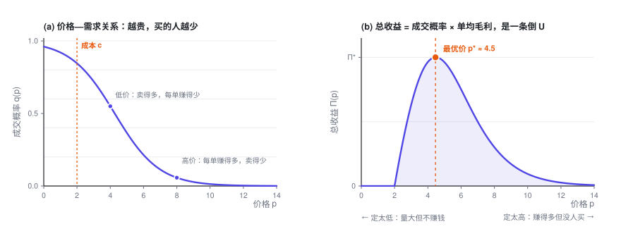
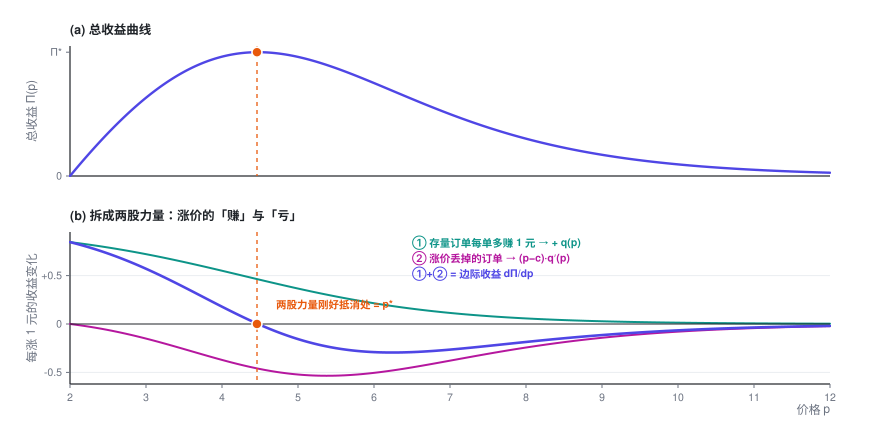

# 单对象定价优化

> 只有一个数要定。价格往上抬，每一单赚得更多，买的人却更少——利润走出一条倒 U 曲线。这一篇把顶点的位置算出来，并给出一个不用计算器也能估的基准。

> **定价专题 · 第 1 篇 / 共 4 篇** · 阅读约 12 分钟
>
> ← 已是第一篇　·　[**专题目录**](index.md)　·　[多对象定价与业务约束 →](2-constraints.md)

这是「定价优化入门」的第一篇。不需要任何前置知识，只要你接受「东西越贵，买的人越少」这个事实。

本篇会用到的符号

| 符号 | 含义 |
|---|---|
| $p$ | 价格，**决策变量** |
| $c$ | 单位成本，已知常数 |
| $q(p)$ | 成交概率 / 转化率，随 $p$ 单调递减 |
| $k$ | 价格系数，越大表示价格一动、转化率掉得越快 |
| $\Pi$ | 总收益（本专题统一指毛利，不是流水） |
| $q_0 = 1-q$ | 不成交概率 |

完整符号表见[专题目录](index.md)。

---

## 1. 把问题写下来

只有一个定价单元。它有一条自己的价格—需求关系：价格越高，成交概率越低。

$$q = q(p), \qquad q'(p) < 0$$

成本 $c$ 固定。那么总收益是

$$\boxed{\ \Pi(p) = \underbrace{q(p)}_{\text{成交概率}} \times \underbrace{(p - c)}_{\text{单均毛利}}\ }$$

这个式子里有一对天然的矛盾：

- 涨价 → 每单赚得多（$p-c$ 变大）
- 涨价 → 成交的人变少（$q$ 变小）

两者相乘，通常是一条**倒 U 曲线**：太便宜不赚钱，太贵没人买，中间某处有个最高点。

## 2. 求最优解

对 $p$ 求导，令导数为零：

$$\frac{d\Pi}{dp} = \underbrace{q(p)}_{\text{①}} + \underbrace{(p-c)\,q'(p)}_{\text{②}} = 0$$

这两项各有清楚的含义：

- **① $q(p)$**：价格每涨 1 元，**已经成交的那部分订单**每单多赚 1 元，总共多赚 $q$。这是**好处**，恒为正。
- **② $(p-c)q'(p)$**：价格每涨 1 元，**丢掉** $|q'(p)|$ 那么多订单，每丢一单损失一份毛利 $(p-c)$。这是**代价**，只要价格高于成本，它就是负的。

最优价，就是这两股力量**恰好抵消**的那个点。

整理一下，就得到最优价满足的一般条件：

$$\boxed{\ p^\star = c + \frac{q(p^\star)}{-\,q'(p^\star)}\ }$$

读作：**最优价 = 成本 + 一个加价项**，而

$$\text{加价项} \;=\; \frac{\text{当前转化率}}{\text{转化率下降的速度}}$$

这很符合直觉：转化率下降得越慢（客户越不在乎价格），加价空间就越大。

同一个式子在广告拍卖里出现过两次：平台定底价，就是成本为 0 时的这个问题；买方在一价拍卖里的最优出价 $b^\star = v - w/w'$ 则是它的镜像，在价值上压价，而不是在成本上加价。见[出价专题第 1 篇](../bidding/1-auction.md)。

## 3. 两个具体例子

上面是一般形式。代入具体的需求函数，就能得到真正能算的公式。

### 例 1：线性需求

$$q(p) = a - b\,p \qquad (a, b > 0)$$

代入目标函数：

$$\Pi(p) = (a - bp)(p - c) = -bp^2 + (a + bc)\,p - ac$$

这是开口向下的抛物线，求导：

$$\frac{d\Pi}{dp} = -2bp + (a + bc) = 0$$

$$\boxed{\ p^\star = \frac{a + bc}{2b} = \frac{a}{2b} + \frac{c}{2}\ }$$

二阶导 $\frac{d^2\Pi}{dp^2} = -2b < 0$，确实是极大值。

这个结果有个漂亮的说法。记 $p_{\max} = a/b$ 为「零需求价」（价格涨到这里，就完全没人买了），则

$$p^\star = \frac{p_{\max} + c}{2}$$

**最优价恰好是「成本」和「零需求价」的中点。** 这是一个非常好用的心算基准：如果你能估出「多贵就完全卖不动了」，最优价大约就在它和成本的正中间。

### 例 2：Logit 需求（更接近真实）

线性需求有个毛病：价格再高一点，$q$ 会变成负数。实践中更常用 Logit 形式：

$$q(p) = \frac{1}{1 + e^{-(b_0 - k p)}} = \sigma(b_0 - kp)$$

其中 $\sigma(\cdot)$ 是 sigmoid 函数，$b_0$ 决定基础吸引力，$k > 0$ 是价格系数。它天然落在 $(0,1)$ 内，且单调递减。

它有一个极好用的导数性质：

$$q'(p) = \frac{dq}{dp} = -k\,q\,(1-q)$$

展开：这一步怎么来的

令 $z = b_0 - kp$，则 $q = \sigma(z) = \frac{1}{1+e^{-z}}$。

sigmoid 的经典性质是 $\sigma'(z) = \sigma(z)\bigl(1-\sigma(z)\bigr)$：

$$\sigma'(z) = \frac{e^{-z}}{(1+e^{-z})^2} = \frac{1}{1+e^{-z}} \cdot \frac{e^{-z}}{1+e^{-z}} = \sigma(z)\bigl(1-\sigma(z)\bigr)$$

再用链式法则，$\frac{dz}{dp} = -k$：

$$\frac{dq}{dp} = \sigma'(z)\cdot\frac{dz}{dp} = q(1-q)\cdot(-k) = -k\,q(1-q)$$

代入一阶条件 $q + (p-c)q' = 0$：

$$q - (p-c)\,k\,q\,(1-q) = 0$$

两边除以 $q$（$q > 0$，可以除）：

$$1 - k\,(p-c)(1-q) = 0$$

$$\boxed{\ p^\star - c = \frac{1}{k\,\bigl(1 - q(p^\star)\bigr)} = \frac{1}{k\,q_0}\ }$$

其中 $q_0 = 1 - q$ 是**不成交概率**。

这是个**隐式方程**（右边还含着 $p^\star$），不过它只有一个未知数、而且单调，二分法或牛顿法几步就能收敛，工程上完全不是问题。

## 4. 这几个公式在业务里怎么读

**读法一：$k$ 越大，加价越小。**

$k$ 是价格系数。$k$ 大 = 客户对价格敏感 = 曲线陡 = 稍微涨一点就掉一大片量。这时候公式告诉你老老实实少加价。反过来，对价格不敏感的场景（刚需、无替代、紧急需求），$1/k$ 大，加价空间就大。

**读法二：$q_0$ 出现在分母，说明「当前卖得怎么样」会反过来影响该定多少钱。**

这里容易读岔，多说一句。假如你现在的价格下几乎人人都买（$q \to 1$，$q_0 \to 0$），公式给出的加价趋于无穷大 —— 这不是公式坏了，而是它在喊：**你价格定得太低了**。涨价之后 $q$ 会掉下来、$q_0$ 会涨上去，加价项随之变小，最优价落在两者平衡的地方。所以别把它当成一步到位的公式：右边含着 $p^\star$，要用上一节说的二分法或牛顿法去解。

**读法三：结果对「成本」怎么算很敏感。**

$c$ 到底算哪些？只算变动成本，还是要分摊固定成本？这个选择会直接改变最优价。一般来说，做短期定价决策时 $c$ 应该只包含**边际成本**（多成交一单额外多花的钱）。把固定成本摊进去再去优化，会系统性地把价格定高、把量做小。

## 5. 落地时会踩的坑

- **曲线不是天上掉下来的。** 上面所有推导都建立在「你知道 $q(p)$」这个前提上。这个前提比看上去难得多，本专题第四篇会展开说。
- **$c$ 可能不是常数。** 很多业务里成本随量变化（规模效应、阶梯运力、库存分档）。这时 $\Pi = q\cdot(p - c(q))$，要重新求导，但框架不变。
- **别忘了检查二阶条件。** 一阶导为零只说明是驻点。Logit 需求下 $\Pi(p)$ 对 $p$ **未必**处处是凹的，但它是单峰的，所以一阶条件的解就是全局最优。

展开：一个能让后面所有算法都变简单的技巧 —— 换个变量，问题就凹了

$\Pi(p)$ 对 $p$ 不一定凹，这会让优化算法不好写。但如果**把决策变量从「价格」换成「转化率」**，问题立刻变成严格凹的。

从 $q = \sigma(b_0 - kp)$ 反解出价格：

$$p = \frac{1}{k}\left(b_0 - \ln\frac{q}{1-q}\right)$$

代回目标函数：

$$\Pi(q) = q\left(\frac{b_0}{k} - c\right) - \frac{1}{k}\underbrace{\left(q\ln q - q\ln(1-q)\right)}_{\;\equiv\, f(q)}$$

第一项是 $q$ 的线性函数。只要证明 $f(q)$ 是凸的，$\Pi(q)$ 就是凹的：

$$f'(q) = \ln q + 1 - \ln(1-q) + \frac{q}{1-q}$$

$$f''(q) = \frac{1}{q} + \frac{1}{1-q} + \frac{1}{(1-q)^2} \;>\; 0 \quad \text{(在 } 0<q<1 \text{ 上恒成立)}$$

所以 $\Pi''(q) = -f''(q)/k < 0$，**严格凹**。

这个变换的实际价值：一旦问题在 $q$ 空间是凹的，就可以直接上凸优化求解器，全局最优有保证，也不用担心初值和局部解。第三篇的拉格朗日推导之所以那么干净，本质上也是因为这个结构。

---

**定价专题 · 第 1 篇 / 共 4 篇**

← 已是第一篇　·　[**专题目录**](index.md)　·　[多对象定价与业务约束 →](2-constraints.md)
