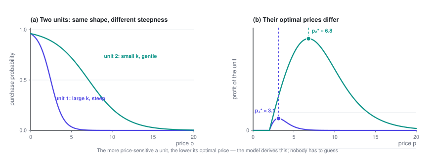
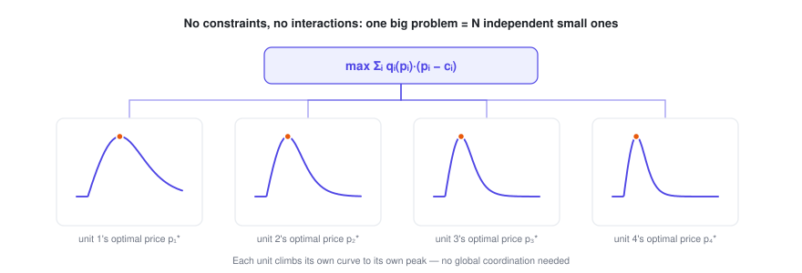
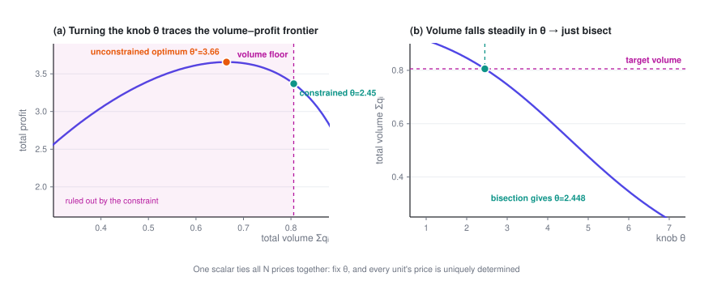

# Pricing Many Items Under Constraints

> Going from one item to N doesn't make the problem harder — it splits cleanly into N independent small problems. What makes it hard is the business red line that ties all the prices back together; and once they're tied, **a single scalar** decides all N prices.

> **Price Optimization · Part 2 of 4** · 15 min read
>
> [← Pricing a Single Product](1-single.en.md)　·　[**Series index**](index.en.md)　·　[Pricing Substitutable Products →](3-substitution.en.md)


**Previously**: Part 1 handled the case with a single price and derived the condition the optimum satisfies, $p^\star = c + \dfrac{q}{-q'}$. This post scales up to $N$ units and adds the constraints no real business can avoid.

<details>
<summary>Symbols used in this post</summary>

| Symbol | Meaning |
|---|---|
| $i, j$ | Index of a pricing unit |
| $N$ | Number of pricing units |
| $p_i,\ c_i,\ q_i,\ k_i$ | Price / cost / conversion rate / price coefficient of unit $i$ |
| $Q$ | Floor on total volume (the business red line) |
| $\alpha$ | Share of volume you need to keep, $Q = \alpha\,q^{(0)}$ |
| $\lambda$ | Lagrange multiplier of the constraint, i.e. **the shadow price** |

The full notation table is in the [series index](index.en.md).

</details>

---

## 1. Two pricing units

### 1.1 The problem

Now there are two units. They **behave the same way** (both follow the same family of price–demand curves) but have **different parameters**: unit 1 might be more price-sensitive, unit 2 less so, and their costs may differ too.

Total profit is simply the sum of the two:

$$\Pi(p_1, p_2) = q_1(p_1)\,(p_1 - c_1) \;+\; q_2(p_2)\,(p_2 - c_2)$$

### 1.2 Solving it

Take the partial derivative with respect to each variable:

$$\frac{\partial \Pi}{\partial p_1} = q_1(p_1) + (p_1 - c_1)\,q_1'(p_1) = 0$$

$$\frac{\partial \Pi}{\partial p_2} = q_2(p_2) + (p_2 - c_2)\,q_2'(p_2) = 0$$

**The key point**: $p_2$ **doesn't appear at all** in the first equation, and $p_1$ doesn't appear in the second.

The Hessian is diagonal:

$$H = \begin{pmatrix} \dfrac{\partial^2\Pi}{\partial p_1^2} & 0 \\[6pt] 0 & \dfrac{\partial^2\Pi}{\partial p_2^2}\end{pmatrix}$$

Zero off-diagonal entries mean **the two decisions aren't coupled at all**.

So the optimum is just Part 1's result applied twice:

$$p_1^\star = c_1 + \frac{q_1}{-q_1'}, \qquad p_2^\star = c_2 + \frac{q_2}{-q_2'}$$

Under logit demand:

$$p_1^\star - c_1 = \frac{1}{k_1 q_{0,1}}, \qquad p_2^\star - c_2 = \frac{1}{k_2 q_{0,2}}$$



### 1.3 What it means for the business

"Price each one separately" sounds too obvious to be worth saying, but it's actually the turning point of the whole series.

**The result is useful in its own right**: the model concludes, by itself, that the more price-sensitive a unit is, the lower its price should be. Nobody has to guess; it falls out of the data. In the figure above, the two units' curves have exactly the same shape and differ only in steepness, yet their optimal prices differ by more than a factor of two.

**Even more important are the conditions behind it.** Pricing each unit separately only works when all three of these hold:

1. The objective is **additive** (total profit = the sum of each unit's profit)
2. No constraint **spans several units** (nothing like "all units together must satisfy…")
3. Demand isn't **cross-linked** (changing unit 1's price doesn't affect unit 2's conversion rate)

Every layer of complexity added in this post and the next two breaks one of them.

---

## 2. N pricing units: is there a "knob"?

### 2.1 The bottom line first

Generalize to $N$ units:

$$\max_{p_1,\dots,p_N} \ \Pi = \sum_{i=1}^{N} q_i(p_i)\,(p_i - c_i)$$

If the three conditions still hold (additive, no cross-unit constraints, no cross effects), then:

$$\frac{\partial \Pi}{\partial p_i} = q_i(p_i) + (p_i - c_i)q_i'(p_i) = 0, \qquad i = 1,\dots,N$$

**The Hessian is an $N \times N$ diagonal matrix**, and the problem breaks down completely into $N$ unrelated one-dimensional problems.

$$\boxed{\ p_i^\star = c_i + \frac{q_i(p_i^\star)}{-\,q_i'(p_i^\star)}, \qquad i = 1,\dots,N\ }$$



**So can you solve it for N units? Yes — and it stays easy no matter how large $N$ gets.** A million pricing units means a million independent one-dimensional root-finding problems: trivially parallel, done in seconds.

### 2.2 About that "knob"

A common question is: is there one key control variable such that, if you adjust prices according to it, you're guaranteed to reach the optimum?

**In this unconstrained, uncoupled setting, you don't need one** — each unit just climbs its own curve to its own peak, and nothing needs coordinating globally. If you force a global knob here anyway (say, "raise every price by x%"), you actually **break** optimality: different units' optimal prices shouldn't move by the same proportion.

**But this solution can rarely ship as is**, for very practical reasons:

- It's the **pure profit-maximizing** solution, which usually means prices on the high side and volume on the low side. In the example behind the figure in Section 3.4, the unconstrained optimum keeps only **80%** of the volume you had before changing any price — a 20% drop that the business will very likely reject.
- It ignores every business red line.

**As soon as you add anything that ties the N units together — a constraint across units (Section 3 of this post) or interactions between units (Part 3) — a knob appears.**

And it takes a very simple form: **it's a single scalar**. Fix that one number and all $N$ prices are uniquely determined.

We'll derive it later on. Here's the punchline up front, so you know what to look for:

> **The knob is a common water level that brings every unit's "marginal contribution" to the same height.**
>
> Mathematically, it's the **Lagrange multiplier** of the coupling constraint (also known as the shadow price).
> When items substitute for each other, it even has a particularly elegant explicit form — see Part 3.

---

## 3. Adding business constraints

### 3.1 Where constraints come from

In a real business, prices are never set freely. Common sources of constraints:

| Type | Example | Mathematical form |
|---|---|---|
| **Volume floor** | Total orders / GMV / engagement can't fall below X% of today's level | $\sum_i q_i \ge Q$ |
| **Budget cap** | Subsidies or total discounts have a budget | $\sum_i q_i\,s_i \le B$ |
| **Competition & market share** | Key items can't be priced above competitors | $p_i \le p_i^{\text{comp}}$ |
| **Price bands** | Regulation, platform rules, minimum margins | $l_i \le p_i \le h_i$ |
| **Change limits** | No more than ±X% vs. last period (customer perception, PR risk) | $\lvert p_i - p_i^{\text{old}}\rvert \le \Delta_i$ |
| **Consistency / fairness** | Similar items can't be priced too far apart | $\lvert p_i - p_j\rvert \le \varepsilon$ |
| **Internal logic** | A higher-cost item can't end up cheaper | $p_i \ge p_j$ (when $c_i > c_j$) |
| **Feasibility** | Prices must be multiples of 0.5 / fall on fixed price points | $p_i \in \{v_1, v_2, \dots\}$ |
| **Supply capacity** | Capacity, inventory or delivery capacity is limited, so volume can't exceed it | $\sum_i q_i \le C$ |
| **Contract lock-ins** | Some prices are fixed by agreement | $p_i = \bar p_i$ |

### 3.2 The key distinction: two kinds of constraints

This distinction determines how hard the problem is, so make it first.

**Type 1: per-unit constraints (box constraints).** They involve a single $p_i$: bounds, change limits, contract prices.

These **don't break the decomposition**. Solve the unconstrained problem first, then simply **clip** each price to its feasible range:

$$p_i^{\text{feasible}} = \min\bigl(\max(p_i^\star,\ l_i),\ h_i\bigr)$$

Because each unit's objective is unimodal, the clipped value is the optimum within that range. The $N$ units are still solved one by one.

**Type 2: cross-unit constraints (coupling constraints).** They look like $\sum_i(\cdots) \ge$ some number — a floor on total volume, a total budget.

These **tie all the units together**: to hit the total, you have to decide which units give up profit to buy volume. This is where you need the knob.

### 3.3 Solving with a cross-unit constraint

Take the most common one, "total volume can't drop too much":

$$\max_{p_1,\dots,p_N}\ \sum_i q_i(p_i)(p_i - c_i) \qquad \text{s.t.}\quad \sum_i q_i(p_i) \ \ge\ Q$$

where $Q = \alpha \cdot q^{(0)}$, $q^{(0)}$ is total volume at current prices, and $\alpha$ is the share of volume you insist on keeping (for example 0.97, meaning "volume may drop by at most 3%").

**Step 1: write the Lagrangian.** Attach the constraint to the objective with a multiplier $\lambda$:

$$L(\mathbf{p}, \lambda) = \sum_i q_i(p_i)(p_i - c_i) \;+\; \lambda\Bigl(\sum_i q_i(p_i) - Q\Bigr)$$

**Step 2: differentiate with respect to each $p_i$.**

$$\frac{\partial L}{\partial p_i} = \underbrace{q_i + (p_i - c_i)q_i'}_{\text{original first-order condition}} \;+\; \lambda\,q_i' \;=\; 0$$

Collect the terms in $q_i'$:

$$q_i + \bigl(p_i - c_i + \lambda\bigr)\,q_i' = 0$$

**Step 3: solve.**

$$\boxed{\ p_i^\star \;=\; \underbrace{c_i - \lambda}_{\text{adjusted cost}} \;+\; \frac{q_i}{-q_i'}\ }$$

Compared with the unconstrained solution of Section 2, $p_i^\star = c_i + \frac{q_i}{-q_i'}$, the only change is that **$\lambda$ gets subtracted from the cost**.

Under logit demand, this reads even more clearly:

$$p_i^\star - c_i + \lambda \;=\; \frac{1}{k_i\,q_{0,i}}$$

### 3.4 Enter the knob

This $\lambda$ is **the same number for all $N$ units**.

That's the knob. It works like this:

$$\lambda \uparrow \;\Longrightarrow\; \text{all } p_i \downarrow \;\Longrightarrow\; \text{all } q_i \uparrow \;\Longrightarrow\; \sum_i q_i \uparrow$$

Total volume **increases monotonically** in $\lambda$, so the algorithm is extremely simple:

```
given λ:
    for i in 1..N:                       # fully parallel
        solve a one-dimensional equation for p_i(λ)
    return volume(λ) = Σ q_i(p_i(λ))

bisect on λ until volume(λ) == Q
```

**Bisecting on one scalar solves for all N prices, and the result is guaranteed to be optimal.** That's the knob that gets you to the optimum on its own.

For completeness, the KKT conditions: $\lambda \ge 0$, together with complementary slackness, $\lambda\bigl(\sum_i q_i - Q\bigr) = 0$. In plain terms: if the unconstrained optimum already meets the volume requirement, then $\lambda = 0$, the constraint doesn't bind, and you're back at the unconstrained solution of Section 2.



The knob in this figure is labeled $\theta$: it's the "common water level" introduced in Part 3, and the example comes from Part 3's list model. Lowering the water level $\theta$ does the same thing as raising $\lambda$ here: prices come down across the board, and volume goes up.

### 3.5 What $\lambda$ means for the business: a number you can act on

$\lambda$ isn't just an intermediate step in the math; it has a very concrete economic meaning:

> $\lambda$ = **shadow price** = how much profit you're willing (and forced) to give up for one more order.

It's measured in dollars per order.

Once you have this number, you can compare it against other options right away:

- If $\lambda = 0.8$ dollars per order, and your ad channels can buy incremental orders of the same quality at 0.5 dollars each — **don't buy volume with price cuts; buy ads instead**.
- If $\lambda$ varies a lot across regions or categories, **your volume targets are poorly allocated**: shift part of the volume target from high-$\lambda$ areas to low-$\lambda$ areas, and you'll reach the same total volume while giving up less profit.
- How $\lambda$ moves over time is a good health metric: if it keeps rising, your volume is getting more and more expensive.

Panel (a) of the figure above has one more use: **its curve is the achievable volume–profit frontier**. Showing the whole curve to the business is far more productive than arguing over whether volume should drop 3% or 5% — everyone can see directly how much profit each additional point of volume costs.

### 3.6 What about multiple constraints?

Give each cross-unit constraint its own multiplier. For example, with both a volume floor and a budget cap:

$$L = \sum_i q_i u_i + \lambda_1\Bigl(\sum_i q_i - Q\Bigr) + \lambda_2\Bigl(B - \sum_i q_i s_i\Bigr)$$

Now the knob is a low-dimensional vector $(\lambda_1, \lambda_2)$ rather than a scalar. Bisection no longer applies, but the **dual subgradient method** does:

```
initialize λ = 0
repeat:
    given λ, solve every p_i(λ) in parallel   # still fully decoupled
    compute each constraint's violation g_k(λ)
    λ_k ← max(0, λ_k + step · g_k(λ))        # violated → raise λ_k
until converged
```

The key point: **no matter how many cross-unit constraints there are, the inner problem is always decoupled.** All of the coupling gets squeezed into those few multipliers. That's the fundamental reason Lagrangian methods work so well for large-scale pricing — they turn an $N$-dimensional coupled problem into "a low-dimensional search plus $N$ independent subproblems".

### 3.7 Pitfalls in practice

- **Don't add every constraint at once.** Throw a dozen constraints in from the start and the problem may well come out infeasible, with no way to tell which one caused it. Add them one at a time, and each time check how the feasible region and the objective change.
- **Soft constraints often beat hard ones.** Written as a hard constraint, "volume can't drop more than 3%" can make the whole problem infeasible in edge cases. A soft constraint (penalize any overshoot in the objective) is more robust, and closer to what the business actually means.
- **Watch out for negative prices.** A demanding volume target means a large $\lambda$. Once $\lambda$ exceeds the markup $q_i/(-q_i')$, the price comes out below cost; push further and it goes negative (mathematically, a subsidy). If the business doesn't allow that, add explicit price floors, or the solution won't be usable.
- **Discretize last.** Requirements like "prices must be multiples of 0.5" are integer constraints and make the problem much harder. In practice you optimize with continuous prices first, then round and do a local repair at the end, rather than starting with integer programming.
- **Give bisection sensible bounds and an iteration cap.** Pick a reasonable search range for $\lambda$, or the search can get stuck at an endpoint and appear to converge. (I ran into this myself while verifying: I had the bisection direction backwards, and it went straight to the edge of the interval.)

---

**Price Optimization · Part 2 of 4**

[← Pricing a Single Product](1-single.en.md)　·　[**Series index**](index.en.md)　·　[Pricing Substitutable Products →](3-substitution.en.md)
