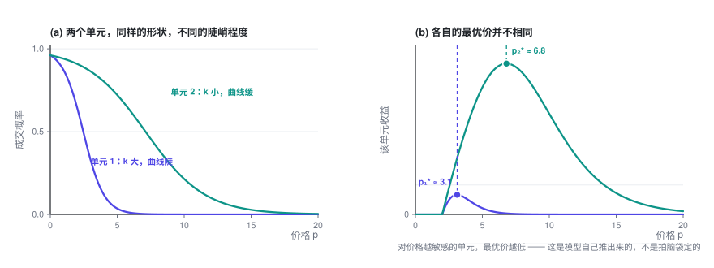
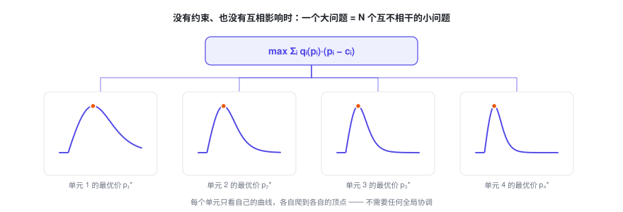
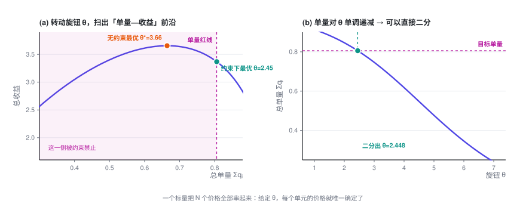

# 多对象定价与业务约束

> 从一个对象变成 N 个，问题并没有变难——它会干净地拆成 N 个互不相干的小问题。真正让它变难的，是那条把所有价格重新绑回一起的业务红线；而一旦绑上，N 个价格就由**一个标量**说了算。

> **定价专题 · 第 2 篇 / 共 4 篇** · 阅读约 15 分钟
>
> [← 单对象定价优化](1-single.md)　·　[**专题目录**](index.md)　·　[替代品的定价优化 →](3-substitution.md)


**前情提要**：上一篇解决了「只有一个价格要定」的情况，得到最优价满足的条件 $p^\star = c + \dfrac{q}{-q'}$。这一篇把单元数量推到 $N$ 个，并加上真实业务里躲不掉的约束。

<details>
<summary>本篇会用到的符号</summary>

| 符号 | 含义 |
|---|---|
| $i, j$ | 定价单元的编号 |
| $N$ | 定价单元的总数 |
| $p_i,\ c_i,\ q_i,\ k_i$ | 单元 $i$ 各自的价格 / 成本 / 转化率 / 价格系数 |
| $Q$ | 总成交量的下限（业务红线） |
| $\alpha$ | 要保住的量的比例，$Q = \alpha\,q^{(0)}$ |
| $\lambda$ | 约束的拉格朗日乘子，即**影子价格** |

完整符号表见[专题目录](index.md)。

</details>

---

## 1. 两个定价单元

### 1.1 问题

现在有两个单元。它们**行为规律相同**（都服从同一族的价格—需求关系），只是**参数不同**：单元 1 可能更敏感，单元 2 可能更迟钝；成本也可能不一样。

总收益就是两份相加：

$$\Pi(p_1, p_2) = q_1(p_1)\,(p_1 - c_1) \;+\; q_2(p_2)\,(p_2 - c_2)$$

### 1.2 求解

分别对两个变量求偏导：

$$\frac{\partial \Pi}{\partial p_1} = q_1(p_1) + (p_1 - c_1)\,q_1'(p_1) = 0$$

$$\frac{\partial \Pi}{\partial p_2} = q_2(p_2) + (p_2 - c_2)\,q_2'(p_2) = 0$$

**关键的一点**：第一个方程里**完全没有出现 $p_2$**，第二个方程里也完全没有 $p_1$。

海森矩阵是对角的：

$$H = \begin{pmatrix} \dfrac{\partial^2\Pi}{\partial p_1^2} & 0 \\[6pt] 0 & \dfrac{\partial^2\Pi}{\partial p_2^2}\end{pmatrix}$$

非对角项为零，意味着**两个决策之间没有任何耦合**。

所以最优解就是把第一篇的结论各用一次：

$$p_1^\star = c_1 + \frac{q_1}{-q_1'}, \qquad p_2^\star = c_2 + \frac{q_2}{-q_2'}$$

Logit 需求下：

$$p_1^\star - c_1 = \frac{1}{k_1 q_{0,1}}, \qquad p_2^\star - c_2 = \frac{1}{k_2 q_{0,2}}$$



### 1.3 业务解读

这一节的结论听起来像废话（「各算各的」），但它其实是整个专题的分水岭。

**结论本身有价值**：模型会自动推出「对价格越敏感的单元，价格应该定得越低」。这个结论不需要你拍脑袋，是从数据里长出来的。上图里两个单元的曲线形状一模一样，只是陡峭程度不同，最优价就差了一倍多。

**更重要的是它成立的条件**。「各算各的」需要同时满足三件事：

1. 目标函数是**可加的**（总收益 = 各单元收益之和）
2. 约束**不跨单元**（没有「所有单元加起来要满足什么」这类要求）
3. 需求**不交叉**（改单元 1 的价格，不影响单元 2 的转化率）

本篇和后面两篇，每一次加复杂度，都是在破坏其中一条。

---

## 2. N 个定价单元：有没有一个「旋钮」？

### 2.1 先把结论说清楚

推广到 $N$ 个单元：

$$\max_{p_1,\dots,p_N} \ \Pi = \sum_{i=1}^{N} q_i(p_i)\,(p_i - c_i)$$

如果三个条件仍然成立（可加、无跨单元约束、无交叉影响），那么：

$$\frac{\partial \Pi}{\partial p_i} = q_i(p_i) + (p_i - c_i)q_i'(p_i) = 0, \qquad i = 1,\dots,N$$

**海森矩阵是 $N \times N$ 的对角阵**，问题彻底分解成 $N$ 个互不相干的一维问题。

$$\boxed{\ p_i^\star = c_i + \frac{q_i(p_i^\star)}{-\,q_i'(p_i^\star)}, \qquad i = 1,\dots,N\ }$$



**所以「N 个单元能不能解」这个问题，答案是：能，而且 $N$ 多大都不难。** 一百万个定价单元就是一百万个独立的一维求根，天然可并行，几秒钟的事。

### 2.2 关于那个「旋钮」

一个常见的问题是：有没有一个关键的调控量，只要按它来调价，就能保证达到最优？

**在上面这个无约束、无耦合的设定下，答案是「不需要」** —— 每个单元只看自己的曲线爬到自己的顶点就行，没有任何需要全局协调的东西。这时候如果硬要找一个全局旋钮（比如「所有价格统一上浮 x%」），反而会**破坏**最优性：不同单元的最优价本来就不该按同一比例移动。

**但是，这个解基本上不能直接上线。** 原因很实在：

- 它是**纯利润最优**的解。纯利润最优往往意味着价格偏高、量偏小。在第 3.4 节配图的算例里，无约束最优解的总成交量只有不调价时的 **80%** —— 少了两成的量，业务方大概率不会接受。
- 它完全不看任何业务红线。

**一旦你往里加任何一个「把 N 个单元捆在一起」的东西 —— 一条跨单元的约束（本篇第 3 节），或者单元之间的互相影响（第三篇）—— 旋钮就出现了。**

而且它的形式非常简单：**它是一个标量**。给定这一个数，$N$ 个价格全部唯一确定。

后面会把它推出来。先把结论放在这里，方便你带着问题往下看：

> **旋钮 = 一个把所有单元的「边际贡献」拉平到同一高度的公共水位。**
>
> 数学上，它就是耦合约束的**拉格朗日乘子**（也叫影子价格）。
> 在有替代效应的场景里，它还有一个特别漂亮的显式形式，见第三篇。

---

## 3. 加上业务约束

### 3.1 约束都是从哪来的

真实业务里价格从来不是随便定的。常见的约束来源：

| 类型 | 例子 | 数学形式 |
|---|---|---|
| **量的底线** | 总成交量 / GMV / 活跃度不能低于当前的 X% | $\sum_i q_i \ge Q$ |
| **预算上限** | 补贴、折扣总额有预算 | $\sum_i q_i\,s_i \le B$ |
| **竞争与市占** | 关键对象的价格不能高于竞品 | $p_i \le p_i^{\text{comp}}$ |
| **价格带** | 监管要求、平台规则、最低毛利线 | $l_i \le p_i \le h_i$ |
| **变动幅度** | 相比上期涨跌不超过 ±X%（用户感知、舆情风险） | $\lvert p_i - p_i^{\text{old}}\rvert \le \Delta_i$ |
| **一致性 / 公平性** | 条件相近的对象，价格不能差太多 | $\lvert p_i - p_j\rvert \le \varepsilon$ |
| **业务逻辑自洽** | 成本更高的对象，价格不能反而更便宜 | $p_i \ge p_j$（当 $c_i > c_j$） |
| **可落地性** | 价格必须是 0.5 的整数倍 / 必须落在固定档位上 | $p_i \in \{v_1, v_2, \dots\}$ |
| **供给侧承载** | 产能、库存、运力有限，量不能超 | $\sum_i q_i \le C$ |
| **合同锁定** | 部分对象价格被协议固定 | $p_i = \bar p_i$ |

### 3.2 关键区分：约束分两类

这个区分决定了求解难度，一定要先做。

**第一类：单元内约束（box constraint）。** 只涉及单个 $p_i$，比如上下限、变动幅度、合同价。

这类约束**不破坏解耦**。做法：先算无约束最优解，然后直接**截断**到可行区间：

$$p_i^{\text{可行}} = \min\bigl(\max(p_i^\star,\ l_i),\ h_i\bigr)$$

因为每个单元的目标函数是单峰的，截断到边界就是该区间上的最优。$N$ 个单元依然各算各的。

**第二类：跨单元约束（coupling constraint）。** 形如 $\sum_i(\cdots) \ge$ 某个数，比如总量底线、总预算。

这类约束**会把所有单元绑在一起**：为了满足总量，你必须决定「牺牲哪些单元的利润去换量」。这才是需要旋钮的地方。

### 3.3 跨单元约束怎么解

以最常见的「总量不能跌太多」为例：

$$\max_{p_1,\dots,p_N}\ \sum_i q_i(p_i)(p_i - c_i) \qquad \text{s.t.}\quad \sum_i q_i(p_i) \ \ge\ Q$$

其中 $Q = \alpha \cdot q^{(0)}$，$q^{(0)}$ 是不调价时的总量，$\alpha$ 是你要求保住的量的比例（比如 0.97，表示「量最多掉 3%」）。

**第一步：写拉格朗日函数。** 把约束用一个乘子 $\lambda$ 挂到目标上：

$$L(\mathbf{p}, \lambda) = \sum_i q_i(p_i)(p_i - c_i) \;+\; \lambda\Bigl(\sum_i q_i(p_i) - Q\Bigr)$$

**第二步：对每个 $p_i$ 求偏导。**

$$\frac{\partial L}{\partial p_i} = \underbrace{q_i + (p_i - c_i)q_i'}_{\text{原来的一阶条件}} \;+\; \lambda\,q_i' \;=\; 0$$

把含 $q_i'$ 的项合并：

$$q_i + \bigl(p_i - c_i + \lambda\bigr)\,q_i' = 0$$

**第三步：解出来。**

$$\boxed{\ p_i^\star \;=\; \underbrace{c_i - \lambda}_{\text{被修正过的成本}} \;+\; \frac{q_i}{-q_i'}\ }$$

对比第 2 节的无约束解 $p_i^\star = c_i + \frac{q_i}{-q_i'}$，唯一的变化是**成本被减掉了一个 $\lambda$**。

Logit 需求下形式更清楚：

$$p_i^\star - c_i + \lambda \;=\; \frac{1}{k_i\,q_{0,i}}$$

### 3.4 旋钮登场

上面这个 $\lambda$，**对所有 $N$ 个单元是同一个数**。

这就是旋钮。它的作用机制是：

$$\lambda \uparrow \;\Longrightarrow\; \text{所有 } p_i \downarrow \;\Longrightarrow\; \text{所有 } q_i \uparrow \;\Longrightarrow\; \sum_i q_i \uparrow$$

总量对 $\lambda$ **单调递增**。所以求解算法极其简单：

```
给定 λ：
    for i in 1..N:                       # 完全并行
        解一维方程得到 p_i(λ)
    返回 总量(λ) = Σ q_i(p_i(λ))

二分 λ，直到 总量(λ) == Q
```

**二分一个标量，就解出了 N 个价格，并且保证是最优的。** 这就是那个「只需要按它调控就能达到最优」的旋钮。

为了完整，补上 KKT 条件：$\lambda \ge 0$，且满足互补松弛 $\lambda\bigl(\sum_i q_i - Q\bigr) = 0$。意思是：如果无约束最优解本来就满足量的要求，那么 $\lambda = 0$，约束不起作用，结果就退回第 2 节的无约束解。



图里的旋钮记作 $\theta$，它是第三篇要讲的「公共水位」，算例也取自第三篇的清单模型。把水位 $\theta$ 调低，作用和这里把 $\lambda$ 调高一样：价格整体下降，量随之上升。

### 3.5 $\lambda$ 的业务含义：它是一个可以直接拿去做决策的数

$\lambda$ 不只是个数学中间量，它有非常实在的经济含义：

> $\lambda$ = **影子价格** = 为了多换来一单，你愿意（也必须）付出多少利润。

单位是「元 / 单」。

这个数一旦算出来，可以立刻拿去横向比较：

- 如果 $\lambda = 0.8$ 元/单，而你的投放渠道能用 0.5 元/单买到同样质量的增量 —— **那就别靠降价买量，去投放**。
- 如果不同区域 / 不同品类跑出来的 $\lambda$ 差异很大，说明**量的目标分配得不合理**：应该把一部分量的目标从 $\lambda$ 高的地方挪到 $\lambda$ 低的地方，达成同样的总量，付出的利润会更少。
- $\lambda$ 随时间的变化，是一个很好的健康度指标：它持续上升，说明你的量越来越贵了。

上面那张图 (a) 里的曲线还有个用法：**它就是「量—利润」的可达前沿**。把整条曲线画给业务方看，比争论「量到底掉 3% 还是 5%」有用得多——大家能直接看到每多保一个点的量，要让出多少利润。

### 3.6 多个约束怎么办

每个跨单元约束配一个乘子。比如同时有量的底线和预算上限：

$$L = \sum_i q_i u_i + \lambda_1\Bigl(\sum_i q_i - Q\Bigr) + \lambda_2\Bigl(B - \sum_i q_i s_i\Bigr)$$

这时旋钮从一个标量变成一个低维向量 $(\lambda_1, \lambda_2)$。二分法用不上了，但可以用**对偶次梯度法**：

```
初始化 λ = 0
重复：
    给定 λ，并行解出所有 p_i(λ)          # 内层依然完全解耦
    计算每个约束的违反量 g_k(λ)
    λ_k ← max(0, λ_k + 步长 · g_k(λ))    # 违反了就加大乘子
直到收敛
```

关键在于：**不管有几个跨单元约束，内层永远是解耦的**。耦合被完全压缩进了那几个乘子里。这就是拉格朗日方法在大规模定价问题上好用的根本原因 —— 它把一个 $N$ 维的耦合问题，变成了「低维搜索 + $N$ 个独立子问题」。

### 3.7 落地时会踩的坑

- **约束别一次加满。** 一上来就把十几条约束全塞进去，很可能直接无解，而且你无从判断是哪条造成的。建议一条条加，每加一条看一眼可行域和目标值掉了多少。
- **软约束往往比硬约束好。** 「量不能掉超过 3%」写成硬约束，遇到一些边角情况，可能让整个问题无解。写成软约束（超出的部分在目标里扣分）更稳，也更符合业务的真实意图。
- **注意负价格。** 量的要求一高，$\lambda$ 就大。$\lambda$ 一旦超过加价项 $q_i/(-q_i')$，解出来的价格就会低于成本，再大还会变成负数（数学上就是补贴）。如果业务不允许，一定要显式加价格下限，否则解出来没法用。
- **离散化放最后做。** 价格必须是 0.5 的整数倍这类要求，是整数约束，会让问题难很多。实践中通常先按连续解优化，最后再取整并做一次局部修补，而不是一开始就上整数规划。
- **二分要设好边界和迭代上限。** $\lambda$ 的搜索区间要给一个合理的范围，否则容易停在区间端点上「假收敛」（我自己验证时就踩过一次：二分方向写反，结果直接跑到了端点）。

---

**定价专题 · 第 2 篇 / 共 4 篇**

[← 单对象定价优化](1-single.md)　·　[**专题目录**](index.md)　·　[替代品的定价优化 →](3-substitution.md)
