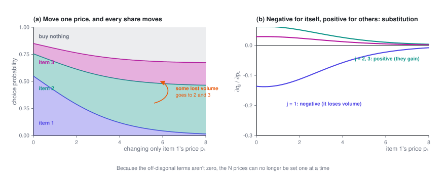
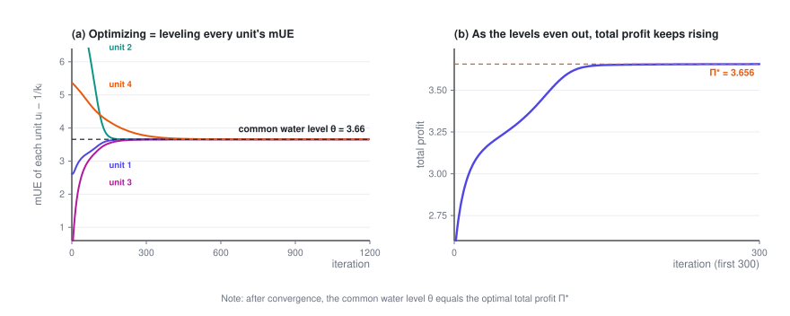

# Pricing Substitutable Products

> Raise the price of one product and another one sells more — they're competing for the same demand. Once prices are linked like this, you can no longer set them one at a time. Yet the optimum turns out to be surprisingly clean: every product's marginal unit economics, what one more sale of it nets you, has to sit at the same water level.

> **Price Optimization · Part 3 of 4** · 13 min read
>
> [← Pricing Many Items Under Constraints](2-constraints.en.md)　·　[**Series index**](index.en.md)　·　[Pricing at Scale →](4-scale.en.md)

**Previously**: the first two posts assumed that changing one unit's price doesn't affect any other unit. This post drops that assumption — when users face a whole list of options, those options take volume from each other.

Symbols used in this post

| Symbol | Meaning |
|---|---|
| $u_j = p_j - c_j$ | Margin per order of option $j$ |
| $b_j$ | Appeal that has nothing to do with price (brand, word of mouth, ratings…) |
| $D$ | Logit denominator, $D = 1 + \sum_m e^{\,b_m - k_m p_m}$ |
| $q_j = e^{\,b_j-k_jp_j}/D$ | Probability of choosing option $j$ |
| $q_0 = 1/D$ | Probability of **buying nothing** |
| $\mathrm{mUE}_j$ | Marginal unit economics: how much more you net if $j$ sells one more unit, $u_j - 1/k_j$ (the *adjusted markup* in the literature) |

The full notation table is in the [series index](index.en.md).

---

## 1. What changes

Everything in the first two posts rests on one assumption: **changing one unit's price doesn't change any other unit's conversion rate**.

Real life often isn't like that. A user rarely faces a single option; they face **a whole list of candidates** (a screen of products, a set of plans, a lineup of car models, a menu of insurance policies). And then:

> Raise the price of the first item on the list, and the user doesn't necessarily walk away — they may simply buy the second item instead.

So **change one price, and the conversion rate of every item on the list moves**.

**This effect goes by different names in different fields:**

- In economics, it's the **cross-price effect**, and the options are **substitutes**
- In retail and revenue management, it's **cannibalization**: your own products taking volume from each other
- Mathematically, **the off-diagonal entries of the Hessian (or the demand Jacobian) are no longer zero**

Of the three decoupling conditions from the beginning of Part 2, this is the third one breaking.

## 2. Modeling it with a discrete choice model

The standard tool is the **multinomial logit model (MNL)**.

The user faces $N$ options plus a "buy nothing" option. The probability of choosing option $j$ is:

$$\boxed{\ q_j \;=\; \frac{e^{\,b_j - k_j p_j}}{\underbrace{1}_{\text{buy nothing}} + \sum_{m=1}^{N} e^{\,b_m - k_m p_m}}\ }$$

- Numerator: option $j$'s own appeal, which shrinks as its price rises
- The lone **1** in the denominator: the **outside option** (not buying). It anchors the whole model. Without it, a price increase could only push users from one option to another, total volume would never fall, and the model would be unrealistic
- $b_j$: appeal that has nothing to do with price (brand, word of mouth, ratings, delivery speed…)
- $k_j$: option $j$'s price coefficient

To keep the notation short, write:

$$D = 1 + \sum_m e^{\,b_m - k_m p_m}, \qquad e_j = e^{\,b_j - k_j p_j}, \qquad q_j = \frac{e_j}{D}, \qquad q_0 = \frac{1}{D}$$

$q_0$ is the probability of buying nothing, and clearly $q_0 + \sum_j q_j = 1$.

## 3. The derivatives: what substitution looks like

Everything later builds on these, so let's go step by step.

**Own-price derivative** (how changing $p_j$ affects $q_j$ itself):

$$\frac{\partial q_j}{\partial p_j} = \frac{\partial}{\partial p_j}\left(\frac{e_j}{D}\right) = \frac{\frac{\partial e_j}{\partial p_j}\cdot D - e_j\cdot\frac{\partial D}{\partial p_j}}{D^2}$$

Here $\frac{\partial e_j}{\partial p_j} = -k_j e_j$, and $\frac{\partial D}{\partial p_j} = -k_j e_j$ (only the $j$-th term of $D$ contains $p_j$). Substituting:

$$= \frac{-k_je_jD + k_je_j^2}{D^2} = -k_j\frac{e_j}{D}\left(1 - \frac{e_j}{D}\right)$$

$$\boxed{\ \frac{\partial q_j}{\partial p_j} = -k_j\,q_j\,(1 - q_j) \;<\; 0\ }$$

**Cross-price derivative** (how changing $p_j$ affects **another** option's $q_m$, with $m \ne j$):

The numerator $e_m$ doesn't depend on $p_j$; only the denominator moves:

$$\frac{\partial q_m}{\partial p_j} = e_m\cdot\frac{\partial}{\partial p_j}\left(\frac{1}{D}\right) = -\frac{e_m}{D^2}\cdot\frac{\partial D}{\partial p_j} = -\frac{e_m}{D^2}\cdot(-k_je_j)$$

$$\boxed{\ \frac{\partial q_m}{\partial p_j} = k_j\,q_j\,q_m \;>\; 0\ }$$

**These two formulas are substitution written in math: raise your own price and you lose volume (negative); everyone else gains (positive).**

One more quantity we'll need later — the effect of raising $p_j$ on **total volume**:

$$\sum_{m}\frac{\partial q_m}{\partial p_j} = \underbrace{-k_jq_j(1-q_j)}_{m=j} + \underbrace{\sum_{m\ne j}k_jq_jq_m}_{m \ne j} = -k_jq_j\Bigl(1 - \sum_m q_m\Bigr)$$

$$\boxed{\ \sum_m \frac{\partial q_m}{\partial p_j} = -\,k_j\,q_j\,q_0\ }$$

A lovely result: of the volume that walks away after a price increase, **only the part that leaks into "buy nothing" is really lost**; moves between options don't count as losses.

## 4. Finding the optimum: the knob in explicit form

The objective (with margin per order $u_j = p_j - c_j$):

$$\Pi = \sum_j q_j\,u_j$$

Differentiate with respect to $p_j$. Note that $p_j$ acts through two channels: directly, on its own margin $u_j$; and through the shares, on **every** $q_m$:

$$\frac{\partial \Pi}{\partial p_j} = \underbrace{q_j}_{\text{margin effect}} + \underbrace{\sum_m u_m\frac{\partial q_m}{\partial p_j}}_{\text{share effect}}$$

Plug in the derivatives:

$$= q_j + u_j\bigl(-k_jq_j(1-q_j)\bigr) + \sum_{m\ne j}u_m\,k_jq_jq_m$$

Factor out $q_j$:

$$= q_j\left[1 - k_ju_j(1-q_j) + k_j\sum_{m\ne j}u_mq_m\right]$$

Expand $(1-q_j)$:

$$= q_j\left[1 - k_ju_j + k_ju_jq_j + k_j\sum_{m\ne j}u_mq_m\right]$$

The two middle terms combine — $u_jq_j$ is exactly what's missing to turn the sum into a sum over **all** $m$:

$$= q_j\Bigl[\,1 - k_ju_j + k_j\underbrace{\textstyle\sum_{m}u_mq_m}_{\text{this is }\Pi\text{ itself}}\Bigr]$$

$$\boxed{\ \frac{\partial \Pi}{\partial p_j} = q_j\bigl[1 - k_ju_j + k_j\Pi\bigr]\ }$$

Set it to zero. Since $q_j > 0$, the bracket has to vanish:

$$1 - k_ju_j + k_j\Pi = 0$$

Divide by $k_j$ and rearrange:

$$\boxed{\ u_j - \frac{1}{k_j} \;=\; \Pi \qquad \text{for every } j\ }$$

**That's the knob.**

The right-hand side, $\Pi$, is total profit — **it doesn't depend on $j$ at all**. In other words:

> **At the optimum, $u_j - \frac{1}{k_j}$ takes the same value for every option.**

I call this quantity the option's **mUE**, short for **marginal unit economics**:

$$\mathrm{mUE}_j \;\equiv\; u_j - \frac{1}{k_j} \;=\; (p_j - c_j) - \frac{1}{k_j}$$

Unit economics is the everyday business question of whether a single sale makes money, and "marginal" means **the next sale**. Put together, mUE answers a very practical question: **if option $j$ sells one more unit, how much more do you net?** The two terms of the formula are the two sides of that ledger:

- **In: $u_j = p_j - c_j$**, the margin on the extra sale itself.
- **Out: $1/k_j$**, what it costs to win that sale. To sell one more of $j$, you have to cut $j$'s price a little, and that cut applies to **every sale of $j$ you were already making**; in total it gives up exactly $1/k_j$. The more users care about price (the larger $k_j$), the more a small cut sells, and the cheaper the extra sale.

In minus out is marginal revenue minus marginal cost (MR − MC), the most basic idea in economics. Strictly, there is also a shared cost that is the same for every product and cancels out in any comparison; see below.

**What characterizes the optimum: every option's mUE is brought to the same water level, and that water level equals total profit $\Pi$.** Read through the ledger above, the reason is plain: if one more sale of A nets more than one more sale of B, shift volume from B to A; as long as any two options differ you can keep shifting, and **you stop only when they're all equal**. This is the equimarginal principle of economics.

Show: why mUE is the net gain from one more sale

Look at it from another angle. Instead of prices, take each option's share $q_j$ as the decision variable, with its price backed out of the logit formula, $p_j = \bigl(b_j - \ln(q_j/q_0)\bigr)/k_j$. Differentiate with respect to $q_j$, holding the other options' shares fixed:

$$\frac{\partial \Pi}{\partial q_j} = \underbrace{\Bigl(u_j - \frac{1}{k_j}\Bigr)}_{\mathrm{mUE}_j} \;-\; \underbrace{\frac{1}{q_0}\sum_m \frac{q_m}{k_m}}_{\text{same for every } j}$$

- The first term is mUE: $u_j$ is the margin on the extra sale, and each unit of extra share for $j$ takes a price cut of $1/(k_jq_j)$, applied to the $q_j$ sales you already had, for a total of $1/k_j$.
- The second term is a shared cost of winning a new customer. The extra sale comes from someone who would otherwise have bought nothing, and pulling them in while keeping every other option's sales unchanged means every price (including $j$'s) has to come down a little more. It's the same for every $j$, so it cancels out in any comparison.

At the optimum every $\partial\Pi/\partial q_j$ is zero, so every mUE equals the same number, which is the leveling; comparing with the price-based derivation above, that number is $\Pi$.

> **What the literature calls it.** In academic work, this quantity is called the **adjusted markup**: price minus cost minus the reciprocal of price sensitivity. [Gallego and Wang (2014)](https://pubsonline.informs.org/doi/10.1287/opre.2013.1249) prove, under the more general nested logit model, that at the optimum every product in the same nest has the same adjusted markup. MNL is a special case of nested logit, and applied to MNL, their result is exactly the one above. [Li and Huh (2011)](https://pubsonline.informs.org/doi/10.1287/msom.1110.0344) prove that under MNL, even when products have different price coefficients, total profit is concave once you write it as a function of market shares. So the solution of the first-order conditions is the global optimum, not a local one. This series uses the name mUE because it says directly what the quantity means economically: the net gain from one more sale.

Call the common water level $\theta^\star$. Every price then follows immediately:

$$\boxed{\ p_j^\star \;=\; c_j + \theta^\star + \frac{1}{k_j}\ }$$

**$N$ prices, but only one degree of freedom left.** Given $\theta^\star$, every price comes out in a single pass, with no iterative root-finding.

And $\theta^\star$ satisfies a one-dimensional fixed-point equation, $\theta = \Pi(\theta)$, where $\Pi(\theta)$ is total profit when prices are set at water level $\theta$ — bisection does the job.

The figure above records a full run of gradient ascent: four options start from wildly wrong prices, and their mUEs converge from every direction onto the same water level while total profit climbs steadily. After convergence I checked, and **the common water level equals the optimal total profit** (to within $10^{-14}$), exactly as the formula says.

**Add a volume constraint and the structure stays the same.** This matters — it shows how robust the knob is:

$$L = \sum_j q_ju_j + \lambda\Bigl(\sum_j q_j - Q\Bigr)$$

Using the last result of Section 3, $\sum_m \partial q_m/\partial p_j = -k_jq_jq_0$:

$$\frac{\partial L}{\partial p_j} = q_j\bigl[1 - k_ju_j + k_j\Pi\bigr] - \lambda\,k_jq_jq_0 = 0$$

$$\Rightarrow\ \boxed{\ u_j - \frac{1}{k_j} \;=\; \Pi - \lambda\,q_0\ }$$

The right-hand side **still doesn't depend on $j$**. The constraint doesn't change the "level every mUE" structure; it just lowers the water level a little.

## 5. How to read the result

**$1/k_j$ is the markup an option naturally has room for.**

It's measured in money. The smaller the price coefficient $k_j$ (the less users care about this option's price), the larger $1/k_j$, and the more markup the option should carry. It's the ledger from the previous section seen from the other side: when users care little about price, winning one more sale means giving up a lot, so it pays to sell a bit less at a higher price.

**Optimal price = common water level + the option's own natural markup + its own cost.**

You can say this sentence to a business audience as is, and it's easy to accept: everyone shares one "baseline level of profitability", and each option shifts away from it according to how little its customers care about price and how much it costs.

**It gives you a diagnostic you can use right away.**

Take your current live prices, compute each option's $\mathrm{mUE}_j = (p_j - c_j) - 1/k_j$, and sort:

- mUE **clearly above** the rest → the option is **overpriced**: one more sale of it nets more than one more sale of anything else, so cut its price and sell more
- mUE **clearly below** the rest → the option is **underpriced**: one more sale of it is worth less than elsewhere, so raise its price and let the volume go to others
- The wider the spread, the farther you are from the optimum, and the more there is to gain

This check doesn't require re-solving the optimization problem. A single SQL query does it, which makes it a great fit for a daily monitoring dashboard.

**It also explains why blanket discounts are a bad idea.** A storewide 20% discount cuts each price by an amount proportional to its original price — expensive items drop a lot, cheap ones only a little — while $1/k_j$ stays put. The mUEs that were level get scattered, and you end up farther from the optimum. The right move is to shift the **water level**: **add the same amount of money to every $p_j$, or take the same amount off**, instead of multiplying them all by the same discount.

> A counterintuitive but useful result: **in this model, moving every price by the same amount keeps the optimal structure intact (it only shifts the water level); applying the same percentage discount doesn't.**

---

**Price Optimization · Part 3 of 4**

[← Pricing Many Items Under Constraints](2-constraints.en.md)　·　[**Series index**](index.en.md)　·　[Pricing at Scale →](4-scale.en.md)
