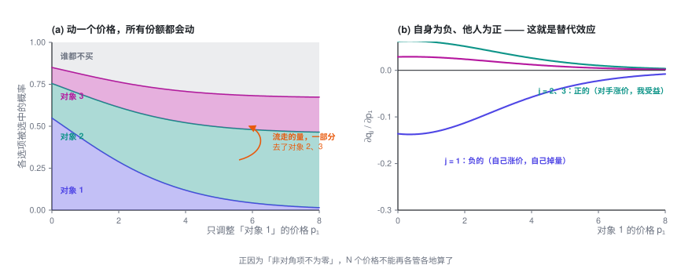
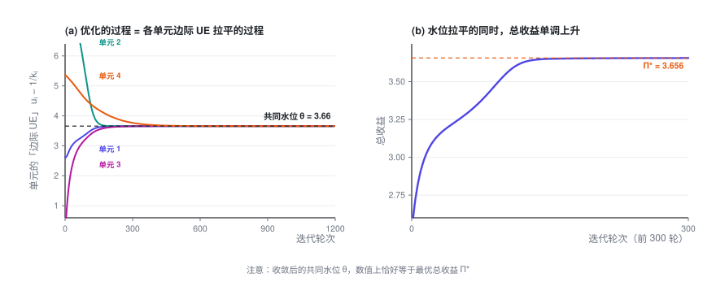

# 替代品的定价优化

> 把一个产品的价格抬上去，另一个的销量反而涨了——它们在抢同一批需求。一旦有了这种牵连，价格就不能再一个一个单独定。而最优解的形式意外地干净：所有产品的「边际 UE」，也就是多卖一单净赚多少，必须落在同一条水位线上。

> **定价专题 · 第 3 篇 / 共 4 篇** · 阅读约 13 分钟
>
> [← 多对象定价与业务约束](2-constraints.md)　·　[**专题目录**](index.md)　·　[大规模定价优化 →](4-scale.md)

**前情提要**：前两篇都假设「改一个单元的价格，不影响别的单元」。这一篇打破这个假设 —— 当用户面对的是一整张候选清单，这些候选会互相抢量。

本篇会用到的符号

| 符号 | 含义 |
|---|---|
| $u_j = p_j - c_j$ | 候选项 $j$ 的单均毛利 |
| $b_j$ | 与价格无关的吸引力（品牌、口碑、评分……） |
| $D$ | Logit 分母，$D = 1 + \sum_m e^{\,b_m - k_m p_m}$ |
| $q_j = e^{\,b_j-k_jp_j}/D$ | 选中候选项 $j$ 的概率 |
| $q_0 = 1/D$ | **什么都不买**的概率 |
| $\mathrm{mUE}_j$ | 边际 UE（marginal unit economics）：让 $j$ 多卖一单净多赚多少，$u_j - 1/k_j$；文献里叫 adjusted markup |

完整符号表见[专题目录](index.md)。

---

## 1. 问题出在哪

前两篇所有内容都建立在一个假设上：**改一个单元的价格，不影响别的单元的转化率**。

真实场景往往不是这样。一个用户面前摆着的不是一个选项，而是**一整张候选清单**（一屏商品、一列套餐、一组车型、一批保险方案）。这时候：

> 你把清单里第 1 项的价格调高了，用户不一定就不买了——可能转头去买了第 2 项。

于是**改一个价格，整张清单的转化率全都会变**。

**这个现象在不同领域有不同的叫法：**

- 经济学里叫 **交叉价格效应（cross-price effect）**，这些选项互为 **替代品（substitutes）**
- 零售 / 收益管理里叫 **蚕食效应（cannibalization）**，即自家产品互相抢量
- 数学上，就是**海森矩阵（或需求雅可比矩阵）的非对角项不再为零**

第二篇开头说的三个解耦条件，这次破坏的是第三条。

## 2. 用离散选择模型描述它

标准工具是 **多项 Logit 模型（Multinomial Logit, MNL）**。

用户面对 $N$ 个候选，外加一个「什么都不买」的选项。选中第 $j$ 项的概率是：

$$\boxed{\ q_j \;=\; \frac{e^{\,b_j - k_j p_j}}{\underbrace{1}_{\text{什么都不买}} + \sum_{m=1}^{N} e^{\,b_m - k_m p_m}}\ }$$

- 分子：第 $j$ 项自身的吸引力，价格越高越小
- 分母里那个孤零零的 **1**：**外部选项**（不购买）。它是整个模型的锚，没有它，涨价就只会导致用户在内部转移、总量永不下降，模型会失真
- $b_j$：与价格无关的吸引力（品牌、口碑、评分、交付速度……）
- $k_j$：第 $j$ 项的价格系数

为书写方便，记：

$$D = 1 + \sum_m e^{\,b_m - k_m p_m}, \qquad e_j = e^{\,b_j - k_j p_j}, \qquad q_j = \frac{e_j}{D}, \qquad q_0 = \frac{1}{D}$$

$q_0$ 就是「什么都没买」的概率，且显然 $q_0 + \sum_j q_j = 1$。

## 3. 先算导数：替代效应长什么样

这是后面所有推导的基础，一步步来。

**自身导数**（改 $p_j$ 对 $q_j$ 自己的影响）：

$$\frac{\partial q_j}{\partial p_j} = \frac{\partial}{\partial p_j}\left(\frac{e_j}{D}\right) = \frac{\frac{\partial e_j}{\partial p_j}\cdot D - e_j\cdot\frac{\partial D}{\partial p_j}}{D^2}$$

其中 $\frac{\partial e_j}{\partial p_j} = -k_j e_j$，而 $\frac{\partial D}{\partial p_j} = -k_j e_j$（$D$ 里只有第 $j$ 项含 $p_j$）。代入：

$$= \frac{-k_je_jD + k_je_j^2}{D^2} = -k_j\frac{e_j}{D}\left(1 - \frac{e_j}{D}\right)$$

$$\boxed{\ \frac{\partial q_j}{\partial p_j} = -k_j\,q_j\,(1 - q_j) \;<\; 0\ }$$

**交叉导数**（改 $p_j$ 对**别人** $q_m$ 的影响，$m \ne j$）：

此时分子 $e_m$ 与 $p_j$ 无关，只有分母在变：

$$\frac{\partial q_m}{\partial p_j} = e_m\cdot\frac{\partial}{\partial p_j}\left(\frac{1}{D}\right) = -\frac{e_m}{D^2}\cdot\frac{\partial D}{\partial p_j} = -\frac{e_m}{D^2}\cdot(-k_je_j)$$

$$\boxed{\ \frac{\partial q_m}{\partial p_j} = k_j\,q_j\,q_m \;>\; 0\ }$$

**这两个式子就是「替代效应」的数学表达：自己涨价，自己掉量（负），别人受益（正）。**

还有一个后面要用的量 —— 涨 $p_j$ 对**总成交量**的影响：

$$\sum_{m}\frac{\partial q_m}{\partial p_j} = \underbrace{-k_jq_j(1-q_j)}_{m=j} + \underbrace{\sum_{m\ne j}k_jq_jq_m}_{m \ne j} = -k_jq_j\Bigl(1 - \sum_m q_m\Bigr)$$

$$\boxed{\ \sum_m \frac{\partial q_m}{\partial p_j} = -\,k_j\,q_j\,q_0\ }$$

很漂亮：涨价流失的量，最终**只有漏到「什么都不买」那一档的部分才是真的丢了**，内部转移不算损失。

## 4. 求最优解：旋钮的显式形式

目标函数（记单均毛利 $u_j = p_j - c_j$）：

$$\Pi = \sum_j q_j\,u_j$$

对 $p_j$ 求导。注意 $p_j$ 有两条影响路径：直接影响自己的毛利 $u_j$，以及通过份额影响**所有** $q_m$：

$$\frac{\partial \Pi}{\partial p_j} = \underbrace{q_j}_{\text{毛利变化}} + \underbrace{\sum_m u_m\frac{\partial q_m}{\partial p_j}}_{\text{份额变化}}$$

把导数代进去：

$$= q_j + u_j\bigl(-k_jq_j(1-q_j)\bigr) + \sum_{m\ne j}u_m\,k_jq_jq_m$$

提出公因子 $q_j$：

$$= q_j\left[1 - k_ju_j(1-q_j) + k_j\sum_{m\ne j}u_mq_m\right]$$

把 $(1-q_j)$ 展开：

$$= q_j\left[1 - k_ju_j + k_ju_jq_j + k_j\sum_{m\ne j}u_mq_m\right]$$

注意中间两项可以合并 —— $u_jq_j$ 正好把求和补成对**所有** $m$ 的求和：

$$= q_j\Bigl[\,1 - k_ju_j + k_j\underbrace{\textstyle\sum_{m}u_mq_m}_{\text{这就是 }\Pi\text{ 本身}}\Bigr]$$

$$\boxed{\ \frac{\partial \Pi}{\partial p_j} = q_j\bigl[1 - k_ju_j + k_j\Pi\bigr]\ }$$

令导数为零。因为 $q_j > 0$，方括号必须为零：

$$1 - k_ju_j + k_j\Pi = 0$$

两边除以 $k_j$，整理：

$$\boxed{\ u_j - \frac{1}{k_j} \;=\; \Pi \qquad \text{对每一个 } j \text{ 都成立}\ }$$

**这就是那个旋钮。**

等式右边 $\Pi$ 是总收益 —— **它跟 $j$ 完全无关**。也就是说：

> **在最优解处，所有候选项的 $u_j - \frac{1}{k_j}$ 都相等，等于同一个常数。**

我把这个量叫做该候选项的 **mUE**，全称 **marginal unit economics**，中文叫**边际 UE**：

$$\mathrm{mUE}_j \;\equiv\; u_j - \frac{1}{k_j} \;=\; (p_j - c_j) - \frac{1}{k_j}$$

UE（unit economics，单位经济）是业务里常说的「一单生意赚不赚钱」，「边际」指的是**多卖的那一单**。合起来，mUE 回答一个很实际的问题：**让 $j$ 多卖一单，净多赚多少钱？** 公式里的两项正好是这笔账的一收一支：

- **收：$u_j = p_j - c_j$**，多卖的这一单本身的毛利。
- **支：$1/k_j$**，为多卖这一单付出的代价。想让 $j$ 多卖一单，就得把 $j$ 的价格降一点，而这点降价会落到 $j$ **已有的每一单**上，合计让掉的钱正好是 $1/k_j$。用户越在意价格（$k_j$ 越大），降一点价就能多卖不少，代价也就越小。

收减支，就是经济学里最基本的「边际收益减边际成本」（MR − MC）。严格说还有一笔对所有产品都一样的公共成本，比较时互相抵消，见下面的展开。

**最优解的特征：所有候选项的 mUE 被拉平到同一条水位线上，而且这条水位线正好等于总收益 $\Pi$。** 用上面这笔账来读，道理很直白：如果多卖 A 一单比多卖 B 一单更赚，就该把量从 B 挪给 A；只要各项之间还有高低，就还能这样挪，**挪到各项相等才停**。这就是经济学里的等边际原则。

展开：为什么说 mUE 就是「多卖一单的净收益」

换个角度：不把价格当决策变量，而把各候选项的份额 $q_j$ 当决策变量，价格由 Logit 公式反解出来，$p_j = \bigl(b_j - \ln(q_j/q_0)\bigr)/k_j$。对 $q_j$ 求导（其他候选项的份额不变）：

$$\frac{\partial \Pi}{\partial q_j} = \underbrace{\Bigl(u_j - \frac{1}{k_j}\Bigr)}_{\mathrm{mUE}_j} \;-\; \underbrace{\frac{1}{q_0}\sum_m \frac{q_m}{k_m}}_{\text{对所有 } j \text{ 都一样}}$$

- 第一项就是 mUE：$u_j$ 是多出来那一单的毛利；$q_j$ 每提高一个单位，$j$ 要降价 $1/(k_jq_j)$，作用在已有的 $q_j$ 上，合计让掉 $1/k_j$。
- 第二项是「拉新」的公共成本：多卖的这一单来自原本什么都不买的人，要在其他候选项销量不变的前提下把他拉进来，所有价格（包括 $j$ 自己）都得再降一点。这一项对每个 $j$ 都一样，比较时互相抵消。

最优时每个 $\partial\Pi/\partial q_j$ 都为零，所以所有 mUE 都等于同一个数，这就是拉平；和上面按价格求导的结果对照，这个数正是 $\Pi$。

> **文献里怎么叫。** 这个量在学术文献里叫 **adjusted markup**（按价格敏感度调整后的加价），定义就是「价格 − 成本 − 价格敏感度的倒数」。[Gallego 和 Wang（2014）](https://pubsonline.informs.org/doi/10.1287/opre.2013.1249)在更一般的嵌套 Logit 模型下证明：最优时，同一个嵌套里所有产品的 adjusted markup 都相等。MNL 是嵌套 Logit 的特例，放到 MNL 下就是上面这条结论。[Li 和 Huh（2011）](https://pubsonline.informs.org/doi/10.1287/msom.1110.0344)则证明：在 MNL 下，即使各产品的价格系数不同，把总利润写成市场份额的函数后，它也是凹函数。所以一阶条件解出来的就是全局最优，不会停在局部极值上。本专题用 mUE 这个名字，因为它直接说出了这个量在经济上是什么：多卖一单的净收益。

记这个公共水位为 $\theta^\star$，那么每个价格立刻确定：

$$\boxed{\ p_j^\star \;=\; c_j + \theta^\star + \frac{1}{k_j}\ }$$

**$N$ 个价格，只剩下一个自由度。** 给定 $\theta^\star$，全部价格一次算完，不需要任何迭代求根。

而 $\theta^\star$ 满足一个一维不动点方程 $\theta = \Pi(\theta)$，其中 $\Pi(\theta)$ 是按水位 $\theta$ 定价时的总收益 —— 二分即可。

上图记录的是梯度上升的全过程：四个候选项从很离谱的初始价格出发，它们的 mUE 从四面八方收敛到同一条水位线上；与此同时总收益单调上升。收敛后我验证了一下，**公共水位的数值恰好等于最优总收益**（吻合到 $10^{-14}$ 量级），正如公式所说。

**加上量约束，结构不变。** 这一点很重要，说明这个旋钮很稳健：

$$L = \sum_j q_ju_j + \lambda\Bigl(\sum_j q_j - Q\Bigr)$$

用第 3 节最后那个结论 $\sum_m \partial q_m/\partial p_j = -k_jq_jq_0$：

$$\frac{\partial L}{\partial p_j} = q_j\bigl[1 - k_ju_j + k_j\Pi\bigr] - \lambda\,k_jq_jq_0 = 0$$

$$\Rightarrow\ \boxed{\ u_j - \frac{1}{k_j} \;=\; \Pi - \lambda\,q_0\ }$$

右边**仍然与 $j$ 无关**。约束没有改变「mUE 必须拉平」这个结构，只是把水位整体压低了一点。

## 5. 怎么读这个结果

**$1/k_j$ 是「这个候选项天然该有的加价空间」。**

它的单位就是钱。价格系数 $k_j$ 越小（用户对这一项的价格越不在意），$1/k_j$ 越大，这一项就该加更多的价。这和上一节那笔账是同一件事：用户越不在意价格，想多卖一单要让的钱就越多，不如少卖一点、把价定高。

**最优定价 = 统一水位 + 各自的天然加价空间 + 各自的成本。**

这句话可以直接讲给业务方听，而且很好接受：大家共享一个「基准盈利水平」，然后各自按「客户有多不在意价格」和「成本有多高」做偏移。

**它给了一个可以直接用的诊断工具。**

拿你现在线上的价格，算一遍每个候选项的 $\mathrm{mUE}_j = (p_j - c_j) - 1/k_j$，然后排序：

- mUE **明显高于**其他项的 → 这一项**定价偏高**：多卖它一单比多卖别的更赚，该降价多卖
- mUE **明显低于**其他项的 → 这一项**定价偏低**：多卖它一单不如别的划算，该提价，把量让给别人
- 极差越大，说明离最优越远，可优化空间越大

这个诊断不需要重新求解整个优化问题，一个 SQL 就能跑出来，非常适合做日常监控看板。

**它也解释了「为什么不能一刀切地打折」。** 全场统一打八折，每一项降掉的钱和它的原价成正比，贵的降得多、便宜的降得少；而 $1/k_j$ 不会跟着变——原本拉平的 mUE 会被打散，离最优更远。正确的做法是移动**水位**，也就是所有 $p_j$ 同时**加减同样多的钱**，而不是乘同一个折扣。

> 这是一个很反直觉、但很有用的结论：**在这个模型下，「统一加减多少钱」不会破坏最优结构（只是移动了水位），「统一打几折」会。**

---

**定价专题 · 第 3 篇 / 共 4 篇**

[← 多对象定价与业务约束](2-constraints.md)　·　[**专题目录**](index.md)　·　[大规模定价优化 →](4-scale.md)
