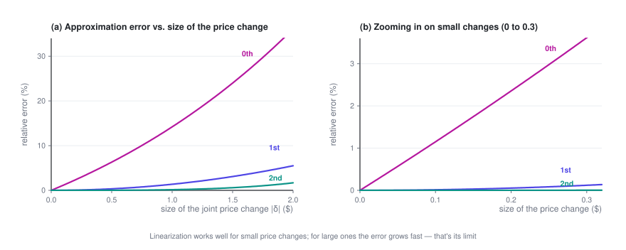

# Pricing at Scale

> At scale, closed-form solutions stop working. This post trades a little accuracy for tractability — linearize the demand model and hand it to a solver — and, just as important, shows where that approximation quietly breaks down.

> **Price Optimization · Part 4 of 4** · 10 min read
>
> [← Pricing Substitutable Products](3-substitution.en.md)　·　[**Series index**](index.en.md)　·　Last part →


**Previously**: Part 3 gave an explicit form of the optimum under substitution, but it only holds at the scale of "one user segment × one list". This post takes on real-world scale, and is upfront about what the series leaves out.

<details>
<summary>Symbols used in this post</summary>

| Symbol | Meaning |
|---|---|
| $\boldsymbol\delta$ | Vector of price changes; $\delta_j$ is the change for option $j$ |
| $Q(\mathbf p)$ | Total conversion rate (buying at least one option), $= 1 - q_0$ |
| $H$ | Hessian matrix, $H_{ij} = \partial^2 Q/\partial p_i\partial p_j$ |
| $\delta_{ij}$ | Kronecker delta: 1 if $i=j$, 0 otherwise |

The full notation table is in the [series index](index.en.md).

</details>

---

## 1. Linearizing with a Taylor expansion

Part 3's explicit solution is elegant, but it comes with conditions: **one user segment × one list**, and only simple constraints such as a volume floor.

Real problems usually look like $M$ user segments × $N$ options — $M \times N$ decision variables — plus a pile of constraints across rows, columns and categories. The explicit solution no longer applies, and you need an optimization solver. Solvers are good at linear and quadratic problems, not at logit's exponentials-inside-a-fraction structure.

**The standard approach: expand around the current prices with a Taylor series, and linearize conversion.**

Let the current prices be $\mathbf{p}^{(0)}$ and the price change be $\boldsymbol\delta$. Total conversion (buying at least one option) is:

$$Q(\mathbf{p}) = 1 - q_0(\mathbf{p}) = 1 - \frac{1}{1+\sum_m e^{\,b_m - k_mp_m}}$$

Expand it:

$$Q(\mathbf{p}^{(0)} + \boldsymbol\delta) \;=\; \underbrace{Q^{(0)}}_{\text{zeroth order}} \;+\; \underbrace{\nabla Q^{\top}\boldsymbol\delta}_{\text{first order}} \;+\; \underbrace{\tfrac12\,\boldsymbol\delta^{\top}H\,\boldsymbol\delta}_{\text{second order}} \;+\; O(\lVert\boldsymbol\delta\rVert^3)$$

**Zeroth-order term** (the current value):

$$Q^{(0)} = 1 - \frac{1}{1 + \sum_m e^{\,b_m - k_m p_m^{(0)}}}$$

**First-order term (the gradient)**: from Section 3 of Part 3, $\frac{\partial Q}{\partial p_j} = -\frac{\partial q_0}{\partial p_j}$, and

$$\frac{\partial q_0}{\partial p_j} = \frac{\partial}{\partial p_j}\left(\frac{1}{D}\right) = -\frac{1}{D^2}\cdot\frac{\partial D}{\partial p_j} = -\frac{1}{D^2}(-k_je_j) = k_j\,q_j\,q_0$$

so

$$\boxed{\ \nabla Q^{\top}\boldsymbol\delta \;=\; -\sum_j k_j\,q_j\,q_0\,\delta_j\ }$$

**Second-order term (the Hessian)**: start from $\frac{\partial Q}{\partial p_i} = -k_i\frac{e_i}{D^2}$ and differentiate once more with respect to $p_j$:

$$H_{ij} = \frac{\partial}{\partial p_j}\left(-k_i\frac{e_i}{D^2}\right) = -k_i\left[\frac{\partial e_i/\partial p_j}{D^2} - \frac{2e_i\,(\partial D/\partial p_j)}{D^3}\right]$$

Substitute $\frac{\partial e_i}{\partial p_j} = -k_ie_i\delta_{ij}$ (where $\delta_{ij}$ is the Kronecker delta: 1 if $i=j$, 0 otherwise) and $\frac{\partial D}{\partial p_j} = -k_je_j$:

$$= -k_i\left[\frac{-k_ie_i\delta_{ij}}{D^2} + \frac{2k_je_ie_j}{D^3}\right] = \frac{k_i^2e_i\delta_{ij}}{D^2} - \frac{2k_ik_je_ie_j}{D^3}$$

Then tidy up using $q_i = e_i/D$ and $q_0 = 1/D$:

$$\boxed{\ H_{ij} = \bigl(k_i^2\,q_i\,\delta_{ij} \;-\; 2\,k_i k_j\, q_i q_j\bigr)\,q_0\ }$$

So the second-order term is

$$\tfrac12\boldsymbol\delta^{\top}H\boldsymbol\delta = \frac{q_0}{2}\sum_{i,j}\bigl(k_i^2q_i\delta_{ij} - 2k_ik_jq_iq_j\bigr)\delta_i\delta_j$$

**The structure here is worth a look**: the $\delta_{ij}$ term is each option affecting itself, and the $-2k_ik_jq_iq_j$ term is options affecting one another. Substitution lives in that second term.

> I checked the gradient and the Hessian above against finite differences: the gradient agrees to $10^{-11}$, and the Hessian to $10^{-5}$ (the latter limited by the precision of finite differences themselves).

**Keep only the first-order term**, and conversion becomes a linear function of $\boldsymbol\delta$, so every volume-related constraint becomes linear too. If the objective is also kept to first order, the whole problem turns into a linear program (LP) that you can hand straight to a mature solver, and all of Part 2's cross-unit constraints slot right in. This is the most common way industry handles pricing at scale.

## 2. How far linearization goes: know its limits

Linear approximation isn't free. **Once price changes get large, the error grows fast.**



The figure above comes from an example with three options (all prices moved in the same direction). The pattern is clear: the zeroth-order approximation (ignoring the price change and simply using the current conversion rate) has the largest error; the first-order approximation is quite accurate for small changes; and the second-order one cuts the error by another order of magnitude.

**Please redraw this chart with your own data**, rather than trusting anyone's rule of thumb — how large the error gets depends entirely on how large your $k$ is, how long your list is, and how concentrated the shares are. It's straightforward:

1. Collect a set of real price-change samples (ideally from randomized price experiments — Section 4 explains why)
2. For each sample, predict conversion with the zeroth-, first- and second-order approximations
3. Compare with actual conversion, bucket by the size of the price change, and compute **ME** (mean error, for systematic bias), **MAE** (mean absolute error, for overall accuracy) and **RMSE** (for the tail)
4. Settle on a "trusted range": the largest price change whose error you can accept

**Then iterate with a trust region**, so linearization is only used where it holds up:

```
Δ ← initial step size
repeat:
    expand around the current prices p to get a linear model
    solve the LP, adding |δ| ≤ Δ   # stay within the trusted range
    evaluate the step's actual gain with the TRUE model
    if it really improves things:  p ← p + δ; enlarge Δ a bit
    otherwise:                     shrink Δ and try again
until Δ is small enough
```

This way you get the speed of an LP solver without taking steps so large that the approximation stops being valid.

## 3. Pitfalls in practice

- **The IIA assumption.** MNL has a well-known property called "independence of irrelevant alternatives": the ratio of two options' shares doesn't depend on whether a third option exists. In reality this often fails (two nearly identical options should mostly take volume from each other, not from every competitor in proportion to their shares). If your list has many highly similar options, consider nested logit or mixed logit.
- **The list is dynamic.** The derivation assumes a fixed set of options. In real systems, ranking, retrieval and inventory keep changing, so the list itself is a variable. Pricing and ranking are coupled, and this series doesn't deal with that layer at all.
- **$q_0$ is very hard to estimate.** "Bought nothing" usually has no explicit label — the user just scrolled away. Yet $q_0$ shows up in almost every formula, so if it's off, every conclusion is off. It's the biggest source of uncertainty for this kind of model in practice, so always run a separate sensitivity analysis on it.
- **Don't ship the optimum for one user segment as is.** The derivation above covers one user segment facing one list. Real systems price for a huge number of segments at once, and have to decide whether an option's price must be the same across segments' lists (it often must, for fairness and PR reasons). That adds cross-segment consistency constraints — a harder problem.

---

## 4. What the series leaves out

The whole series keeps saying "assume you already have the price–demand relationship". Here is an honest list of what got skipped, so nobody walks away thinking the derivations alone are enough to go live.

### 4.1 How to get the curve (not covered anywhere, and the hardest part)

This is the most error-prone link in the whole chain. The core difficulty is **endogeneity**:

> Historical prices were **not set at random**. People (or a previous version of the pricing policy) set them in response to demand at the time.

A typical example: you raise prices when demand is strong and cut them when it's weak. The data will then show high prices alongside high volume. Fit a regression directly on this data and you'll get the absurd conclusion that **higher prices bring more buyers** (the estimated $k$ comes out negative) — the model will tell you that raising prices grows volume.

Common remedies (each deserves a post of its own):

- **Randomized price experiments**: the cleanest option, but they cost real money and need the business to sign off
- **Instrumental variables (IV)**: find something that moves prices without directly affecting demand (e.g. an upstream cost shock)
- **Regression discontinuity (RDD)**: exploit price jumps created by business rules
- **Difference-in-differences (DID)**: exploit the natural control groups created by staggered rollouts

Then come further questions: which functional form to use (logit / linear / semiparametric), how fine-grained to estimate (too fine and you run out of data, too coarse and you blur real differences), and how far you can extrapolate (for prices you've never charged, the model has no say).

### 4.2 Engineering large-scale solvers

The algorithms in this series only work "in principle". At millions of decision variables, you're into column generation, Lagrangian decomposition, ADMM, distributed solving, warm starts and numerical stability — all serious engineering.

### 4.3 Dynamics and competition

Everything in this series is **static and single-period**: set the prices, look at the results, done. In the real world:

- A price cut today changes what customers expect tomorrow (intertemporal effects)
- Competitors respond (strategic interaction)
- Customers learn to wait for promotions (strategic behavior)

### 4.4 Uncertainty

This series treats $q(p)$ as a **known, deterministic function**. In reality it's an estimate that comes with confidence intervals, and where the estimation error is large, the optimum can be very fragile. Robust optimization, Bayesian pricing and explore–exploit (bandit) methods all exist to deal with exactly this.

### 4.5 Multiple objectives and compliance

This series optimizes profit only. Real objectives are usually a weighted mix of profit, market share and customer experience, and the weights are themselves a business decision. Differential pricing also has clear legal and ethical limits that vary by region, which is entirely outside the scope of this series.

---

## Wrapping up

Putting the four posts together:

1. **One price**: optimal price = cost + markup, where markup = conversion rate ÷ the rate at which conversion falls. It's the peak of the inverted U.
2. **Two prices**: as long as they aren't coupled, price each one separately. The more price-sensitive a unit, the lower its price.
3. **N prices**: without coupling the problem decomposes completely, and even a huge $N$ is easy — but that solution usually can't ship as is.
4. **Add constraints**: a cross-unit constraint ties all the prices together, and a **scalar knob** $\lambda$ (the shadow price) appears. Bisect on it to reach the optimum; the number itself is also something you can make business decisions with.
5. **Add substitution**: the knob gets an explicit form — **every option's mUE $= (p_j - c_j) - 1/k_j$, the net gain from one more sale, has to be brought to the same water level**. Optimal price = common water level + each option's natural markup + its own cost.

If you remember just one thing, I hope it's this:

> **Price optimization isn't about finding a "good price" for each item on its own. It's about finding the right water level and lining every item up on it.**

---

**Price Optimization · Part 4 of 4**

[← Pricing Substitutable Products](3-substitution.en.md)　·　[**Series index**](index.en.md)　·　Last part →
