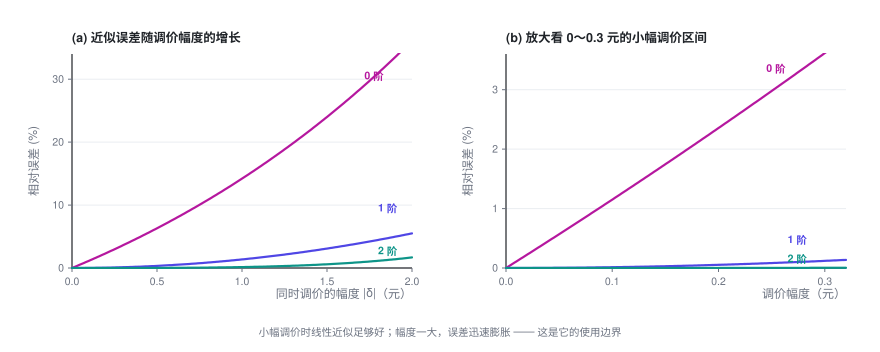

# 大规模定价优化

> 规模一上来，闭式解就不管用了。这一篇用一点精度换来可解：把需求模型线性化，交给求解器；同时讲清楚，这个近似在什么情况下会悄悄失准。

> **定价专题 · 第 4 篇 / 共 4 篇** · 阅读约 10 分钟
>
> [← 替代品的定价优化](3-substitution.md)　·　[**专题目录**](index.md)　·　已是最后一篇 →


**前情提要**：上一篇给出了替代效应下最优解的显式形式，但它只在「一个用户群 × 一张清单」的规模上成立。这一篇处理真实规模，并老实交代整个专题没讲的东西。

<details>
<summary>本篇会用到的符号</summary>

| 符号 | 含义 |
|---|---|
| $\boldsymbol\delta$ | 调价量向量，$\delta_j$ 是候选项 $j$ 的调价幅度 |
| $Q(\mathbf p)$ | 总转化率（至少买一个），$= 1 - q_0$ |
| $H$ | 海森矩阵，$H_{ij} = \partial^2 Q/\partial p_i\partial p_j$ |
| $\delta_{ij}$ | Kronecker 符号：$i=j$ 时为 1，否则为 0 |

完整符号表见[专题目录](index.md)。

</details>

---

## 1. 泰勒展开做线性化

上一篇那个显式解看着很美，但它成立有前提：**一个用户群 × 一张清单**，而且只有量约束这种简单约束。

真实问题通常是：$M$ 个用户群 × $N$ 个候选项，决策变量 $M \times N$ 个，外加一堆跨行、跨列、跨品类的约束。这时候显式解不再适用，得上运筹求解器。而求解器擅长线性、二次这类问题，不擅长 Logit 这种「指数套分式」的结构。

**标准做法：在当前价格点做泰勒展开，把转化率线性化。**

设当前价格 $\mathbf{p}^{(0)}$，调价量为 $\boldsymbol\delta$。总转化率（至少买一个）：

$$Q(\mathbf{p}) = 1 - q_0(\mathbf{p}) = 1 - \frac{1}{1+\sum_m e^{\,b_m - k_mp_m}}$$

展开：

$$Q(\mathbf{p}^{(0)} + \boldsymbol\delta) \;=\; \underbrace{Q^{(0)}}_{\text{零阶}} \;+\; \underbrace{\nabla Q^{\top}\boldsymbol\delta}_{\text{一阶}} \;+\; \underbrace{\tfrac12\,\boldsymbol\delta^{\top}H\,\boldsymbol\delta}_{\text{二阶}} \;+\; O(\lVert\boldsymbol\delta\rVert^3)$$

**零阶项**（当前值）：

$$Q^{(0)} = 1 - \frac{1}{1 + \sum_m e^{\,b_m - k_m p_m^{(0)}}}$$

**一阶项（梯度）**：由上一篇第 3 节，$\frac{\partial Q}{\partial p_j} = -\frac{\partial q_0}{\partial p_j}$，而

$$\frac{\partial q_0}{\partial p_j} = \frac{\partial}{\partial p_j}\left(\frac{1}{D}\right) = -\frac{1}{D^2}\cdot\frac{\partial D}{\partial p_j} = -\frac{1}{D^2}(-k_je_j) = k_j\,q_j\,q_0$$

所以

$$\boxed{\ \nabla Q^{\top}\boldsymbol\delta \;=\; -\sum_j k_j\,q_j\,q_0\,\delta_j\ }$$

**二阶项（海森）**：从 $\frac{\partial Q}{\partial p_i} = -k_i\frac{e_i}{D^2}$ 出发，对 $p_j$ 再求一次导：

$$H_{ij} = \frac{\partial}{\partial p_j}\left(-k_i\frac{e_i}{D^2}\right) = -k_i\left[\frac{\partial e_i/\partial p_j}{D^2} - \frac{2e_i\,(\partial D/\partial p_j)}{D^3}\right]$$

代入 $\frac{\partial e_i}{\partial p_j} = -k_ie_i\delta_{ij}$（$\delta_{ij}$ 是 Kronecker 符号，$i=j$ 时为 1，否则为 0）和 $\frac{\partial D}{\partial p_j} = -k_je_j$：

$$= -k_i\left[\frac{-k_ie_i\delta_{ij}}{D^2} + \frac{2k_je_ie_j}{D^3}\right] = \frac{k_i^2e_i\delta_{ij}}{D^2} - \frac{2k_ik_je_ie_j}{D^3}$$

再用 $q_i = e_i/D$、$q_0 = 1/D$ 整理：

$$\boxed{\ H_{ij} = \bigl(k_i^2\,q_i\,\delta_{ij} \;-\; 2\,k_i k_j\, q_i q_j\bigr)\,q_0\ }$$

于是二阶项写成

$$\tfrac12\boldsymbol\delta^{\top}H\boldsymbol\delta = \frac{q_0}{2}\sum_{i,j}\bigl(k_i^2q_i\delta_{ij} - 2k_ik_jq_iq_j\bigr)\delta_i\delta_j$$

**这两个式子的结构值得看一眼**：$\delta_{ij}$ 那一项是「自己影响自己」，$-2k_ik_jq_iq_j$ 那一项是「互相影响」。替代效应就藏在后一项里。

> 我用有限差分对上面的梯度和海森做了数值验证：梯度吻合到 $10^{-11}$，海森吻合到 $10^{-5}$（后者受限于差分精度本身）。

**只保留到一阶**，转化率就成了 $\boldsymbol\delta$ 的线性函数，和量有关的约束随之都是线性的；目标函数也只保留一阶项的话，整个问题就化成一个线性规划（LP），可以直接交给成熟的求解器，第二篇那一堆跨单元约束也能直接加进去。这是工业界处理大规模定价最常见的做法。

## 2. 线性化能用到什么程度：必须知道它的边界

线性近似不是免费的。**调价幅度一大，误差会迅速膨胀。**



上图来自一个三候选项的算例（所有价格同方向调整）。层次很清楚：0 阶（完全不考虑价格变化，直接用当前转化率）误差最大；一阶近似在小幅调价时相当准；二阶的误差再低一个量级。

**请务必用你自己的数据重画这张图**，不要直接信任何人给的经验值 —— 误差大小完全取决于你的 $k$ 有多大、清单有多长、份额分布多集中。做法很简单：

1. 取一批真实的调价样本（最好来自随机调价实验，理由见第 4 节）
2. 对每个样本，分别用 0 / 1 / 2 阶近似算出预测转化率
3. 和真实转化率对比，按调价幅度分桶，统计 **ME**（平均误差，看有没有系统性偏差）、**MAE**（平均绝对误差，看整体准度）、**RMSE**（看长尾）
4. 定出一个「可信调价区间」：误差可接受的最大幅度

**然后用信任域迭代**，把线性化用在它该用的地方：

```
Δ ← 初始步长
重复：
    在当前价格 p 处展开，得到线性模型
    解 LP，但额外限制 |δ| ≤ Δ           # 只在可信范围内走
    用【真实模型】评估这一步的实际收益
    如果实际有改善：  p ← p + δ；适当放大 Δ
    否则：            缩小 Δ，重来
直到 Δ 足够小
```

这样既享受了 LP 的求解效率，又不会因为一步迈太大而掉进近似失效的坑里。

## 3. 落地时会踩的坑

- **IIA 假设。** MNL 有个著名的性质叫「无关选项独立性」：两个候选项的份额之比，与第三个候选项的存在与否无关。现实中这经常不成立（两个几乎一样的选项，本该主要互相抢量，而不是按份额比例从所有对手那里抢）。如果你的清单里有大量高度相似的候选，考虑 Nested Logit 或 Mixed Logit。
- **清单是动态的。** 上面假设候选集固定。真实场景里排序、召回、库存都在变，清单本身就是个变量。定价和排序其实是耦合的，整个专题都没有处理这一层。
- **$q_0$ 极难估准。** 「什么都没买」这件事通常没有明确的标签 —— 用户只是划走了。而 $q_0$ 恰恰出现在几乎所有公式里，它估偏了，整套结论都会偏。这是这类模型在实践中最大的不确定性来源，务必单独做敏感性分析。
- **别拿一个用户群的最优解直接上线。** 上面推的是一个用户群面对一张清单。真实系统要对海量用户群同时定价，还要考虑一个候选项在不同用户群清单里的价格是否需要一致（往往需要，出于公平性和舆情考虑）。这会引入跨用户群的一致性约束，是个更难的问题。

---

## 4. 整个专题没有覆盖的东西

整个专题反复说「假设你已经有了价格—需求关系」。这里把这些被跳过的部分老实列出来，免得读者以为照着推导就能直接上线。

### 4.1 怎么得到那条曲线（整个专题都没讲，而它是最难的）

这是整个链路里最容易翻车的一环。核心难点叫 **内生性（endogeneity）**：

> 历史数据里的价格**不是随机的**。它是人（或上一版策略）根据当时的需求情况定出来的。

举个典型的例子：需求旺盛时你涨价，需求疲软时你降价。那么在数据里，你会看到「价格高的时候成交量也高」。直接拿这批数据回归，会得出**「价格越高，买的人越多」**的荒谬结论（估出来的 $k$ 是负的）——模型会告诉你「涨价能增量」。

常见的应对手段（每一个都值得单独一篇）：

- **随机调价实验**：最干净，但有真金白银的成本，且需要业务方同意
- **工具变量（IV）**：找一个只影响价格、不直接影响需求的变量（比如上游成本冲击）
- **断点回归（RDD）**：利用规则造成的价格跳变
- **双重差分（DID）**：利用分批上线造成的自然对照

另外还有：曲线用什么形式（Logit / 线性 / 半参数）、在多细的粒度上估（太细样本不够，太粗会抹平差异）、能外推多远（历史上从没定过的价格，模型说了不算）。

### 4.2 大规模求解的工程实现

这个专题里的算法都只是「原理上可行」。真到百万级决策变量：列生成、拉格朗日分解、ADMM、分布式求解、warm start、数值稳定性 —— 都是硬工程。

### 4.3 动态与博弈

整个专题讨论的都是**静态、单期**的问题：定完价、看结果，就结束了。真实世界里：

- 今天降价会改变用户对明天价格的预期（跨期效应）
- 竞争对手会跟进（博弈）
- 用户会学会等促销（策略性行为）

### 4.4 不确定性

这个专题把 $q(p)$ 当作**已知的确定函数**。实际上它是估出来的，带着置信区间。在估计误差比较大的地方，最优解可能非常脆弱。稳健优化、贝叶斯定价，以及探索—利用（bandit）方法，都是为解决这个问题而生的。

### 4.5 多目标与合规

这个专题只优化利润。真实目标往往是「利润 + 份额 + 体验」的加权，而权重本身是个业务决策。差异化定价还有明确的法律和伦理边界，不同地区规则不同，这部分完全在专题范围之外。

---

## 专题小结

把四篇串起来：

1. **一个价格**：最优价 = 成本 + 加价项，加价项 = 转化率 ÷ 转化率下降速度。倒 U 曲线的顶点。
2. **两个价格**：只要不耦合，就是各算各的。对价格越敏感的，定价越低。
3. **N 个价格**：无耦合时完全分解，$N$ 再大也不难 —— 但这个解通常不能直接上线。
4. **加约束**：跨单元约束会把所有价格绑在一起，此时出现一个**标量旋钮** $\lambda$（影子价格）。二分它，就能拿到最优解；而且它本身是个可以拿去做业务决策的数。
5. **有替代效应**：旋钮有了显式形式 —— **所有候选项的 mUE（多卖一单的净收益）$= (p_j - c_j) - 1/k_j$ 必须被拉平到同一条水位线上**。最优定价 = 统一水位 + 各自的天然加价空间 + 各自的成本。

如果只带走一句话，我希望是这句：

> **定价优化的本质，不是给每个对象单独找一个「好价格」，而是找到那条正确的水位线，然后让所有对象一起站上去。**

---

**定价专题 · 第 4 篇 / 共 4 篇**

[← 替代品的定价优化](3-substitution.md)　·　[**专题目录**](index.md)　·　已是最后一篇 →
