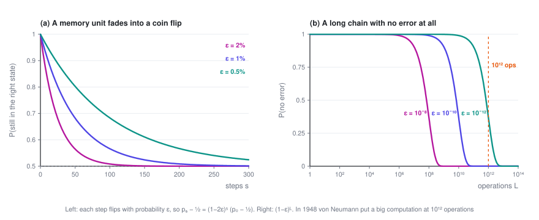
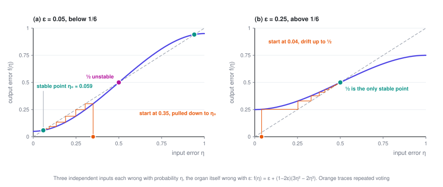
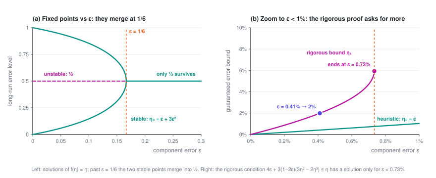
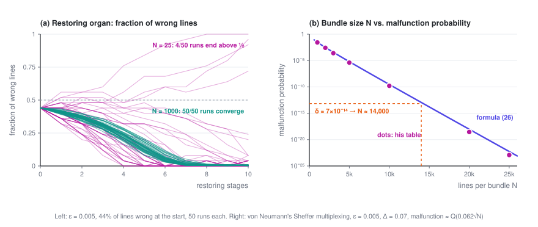

# Von Neumann, 1952: Majority Voting, Thresholds, and Multiplexing

> Can you build a machine that almost never fails out of parts that fail all the time? Von Neumann's answer was yes, on two conditions: each part's error rate has to stay below a threshold, and failures in different places have to be independent. This post follows his 1952 lectures and works through that answer from the beginning.

> **Reliability · Part 1 of 2** · 18 min read
>
> ← First part　·　[**Series index**](index.en.md)　·　[Why More Checks Stop Helping →](2-verifier-cascades.en.md)

This is the first post in *Reliable Systems from Unreliable Models*. There are no language models in it; the cast is vacuum tubes, relays and neurons. All you need is basic probability: multiplying independent events, and the binomial distribution.

Symbols used in this post

| Symbol | Meaning |
|---|---|
| $\varepsilon$ | Probability that a single component fails on one operation |
| $p_s$ | Probability that a memory unit is still in the right state after $s$ steps |
| $\eta$ | Upper bound on the probability that a line carries the wrong signal |
| $f_\varepsilon(\eta)$ | Error map of a majority organ: how often the output is wrong when each input is wrong with probability $\eta$ |
| $\eta_0$ | The error level that repeated voting settles at |
| $\mu$ | Logical depth: the longest chain of components from input to output |
| $N,\ \Delta$ | Number of lines in a bundle; the threshold used to read a bundle |
| $\delta$ | The probability of a wrong final result that we're willing to accept |

The overview of the series is in the [series index](index.en.md).

---

## 1. Where the question came from

In September 1948, von Neumann gave a talk at the Hixon Symposium in Pasadena, a meeting about the brain and behavior. He opened by admitting he was an outsider to most of the fields in the room, then spoke about automata, holding computing machines up against the nervous system.

Partway through, he did some arithmetic. Every component has a small but non-zero chance of failing each time it operates. Make the chain of operations long enough and those small chances add up to something near certainty, which amounts to what he called "complete unreliability". A fast computer working a typical problem might carry out $10^{12}$ operations, so the error rate per operation has to be well below $10^{-12}$. For comparison, a telephone relay back then was considered acceptable at about $10^{-8}$ and excellent at $10^{-9}$.

The logic of automata, he concluded, would have to reckon with "the actual length of 'chains of reasoning'", and allow every operation to fail with some small probability. "An exhaustive study and a nontrivial theory will, therefore, certainly be called for."

A little over three years later he supplied the theory himself. In January 1952 he gave five lectures at Caltech, with notes taken by R. S. Pierce, and in 1956 they appeared as *Probabilistic Logics and the Synthesis of Reliable Organisms from Unreliable Components* in *Automata Studies*, edited by Claude Shannon and John McCarthy.

The introduction sets the tone. Error, he writes, should be viewed "not as an extraneous and misdirected or misdirecting accident, but as an essential part of the process under consideration", as important to the design of automata as the intended logical structure itself.

The question he set out to answer fits in one sentence:

> Given a component that fails with probability ε on each operation, can you build a machine whose final result is wrong with probability no more than any δ you name? And how small can δ be?

Show: timeline of the sources

| When | What |
|---|---|
| September 20, 1948 | Talk at the Hixon Symposium in Pasadena, *The General and Logical Theory of Automata*, published in the proceedings in 1951. The question is raised for the first time |
| 1951 | Discussions at the University of Illinois with K. A. Brueckner and M. Gell-Mann, which the paper's introduction credits with "some important stimuli" |
| January 4–15, 1952 | Five lectures at Caltech, notes by R. S. Pierce |
| 1956 | Published in *Automata Studies* (Annals of Mathematics Studies 34), pp. 43–98 |

The original typescript is held at Caltech. In 2010 Michael Godfrey re-typeset it and listed several figure errors that crept into the published version. Section numbers in this post refer to the paper.

## 2. What happens if you do nothing

Start with his error model (§7.1): each component fails on each operation with probability ε, independently of the state of the network and of every other failure. We can assume $\varepsilon < 1/2$, because a component that's wrong most of the time becomes a good one if you invert its output.

The simplest example is a memory unit, which is supposed to stay excited once it has been triggered. Say it flips with probability ε at every step, and let $p_s$ be the probability that it's still in the right state after $s$ steps. Then

$$p_{s+1} = (1-\varepsilon)\,p_s + \varepsilon\,(1-p_s)$$

Subtracting ½ from both sides gives

$$p_s - \tfrac12 = (1-2\varepsilon)^s\,\bigl(p_0 - \tfrac12\bigr) \approx e^{-2\varepsilon s}\,\bigl(p_0 - \tfrac12\bigr)$$

The gap $p_s - \tfrac12$ measures how much the unit still remembers. It shrinks exponentially and $p_s$ drifts to ½, so whatever was stored ends up as a coin flip. At ε = 0.5%, half of it is gone in about 70 steps.

Von Neumann was precise about what the damage is. The problem with error "is not so much that incorrect information will be obtained, but rather that irrelevant results will be produced." The output simply stops depending on the input.

He also pointed out what looks like a hard limit (§7.3). Every output of a machine comes out of one final component, and the machine can't be more reliable than that component. So as long as signals travel on single lines, the final error δ can never be smaller than ε.

As we'll see, there is a way around this. First, though, we need a part that corrects errors.

## 3. Majority voting, and when it works

The part he chose is the majority organ: it takes three inputs and outputs whichever value most of them carry. It's built from the same unreliable components, so it also fails with probability ε.

Suppose the three inputs are wrong with probability at most $\eta_1, \eta_2, \eta_3$. There are two ways to bound how often the output is wrong (§8.2).

**The general case.** With no further assumptions, all you can do is add up everything that could go wrong:

$$P(\text{wrong output}) \le \varepsilon + \eta_1 + \eta_2 + \eta_3$$

If each $\eta_i$ is at most η, the bound is $\varepsilon + 3\eta$, which is larger than η. Every component a signal passes through makes the error worse, and a deep enough machine has no accuracy left.

**The special case.** Now suppose two things are true:

1. the three inputs fail independently of one another, and
2. when everything is working, the three inputs should agree.

Then the vote is wrong only when at least two inputs are wrong at the same time. With each input wrong with probability at most η, that happens with probability $3\eta^2(1-\eta) + \eta^3 = 3\eta^2 - 2\eta^3$. Add the chance ε that the organ itself flips the result, and the output is wrong with probability

$$\boxed{\ f_\varepsilon(\eta) = \varepsilon + (1-2\varepsilon)\,(3\eta^2 - 2\eta^3)\ }$$

When η is small this is about $\varepsilon + 3\eta^2$, which can be smaller than η. **Voting does correct errors, but only when both conditions hold.** Everything von Neumann builds from here on is a way of keeping every majority organ in this special case.

The most direct way is triplication: make three copies of a network, give them the same inputs, and put a majority organ on each of their outputs. The copies fail independently and ought to agree, so both conditions are met, and the bound on the output error drops from η to $f_\varepsilon(\eta)$.

## 4. One-sixth: a dividing line

Triplication can be nested, one layer inside another. So the real question is where the error ends up if you apply $\eta \to f_\varepsilon(\eta)$ over and over.

Start with the fixed points, where $f_\varepsilon(\eta) = \eta$. One of them is always $\eta = \tfrac12$. Factoring out $\eta - \tfrac12$ leaves

$$(1-2\varepsilon)\,\eta^2 - (1-2\varepsilon)\,\eta + \varepsilon = 0
\quad\Longrightarrow\quad
\eta = \frac12\left(1 \pm \sqrt{\frac{1-6\varepsilon}{1-2\varepsilon}}\right)$$

The square root is real exactly when $\varepsilon \le 1/6$, and that splits the picture in two.

**When $\varepsilon < 1/6$**, there are three fixed points, $\eta_0 < \tfrac12 < 1-\eta_0$. As long as the error starts below ½, repeated voting pulls it down to

$$\eta_0 = \frac12\left(1 - \sqrt{\frac{1-6\varepsilon}{1-2\varepsilon}}\right) = \varepsilon + 3\varepsilon^2 + \cdots$$

**When $\varepsilon \ge 1/6$**, ½ is the only fixed point left. However small the error starts, repeated voting pushes it toward ½, and all the information is lost, just as with the memory unit in Section 2.

You can also see where the dividing line falls in a single step. At ½, the map has slope $f_\varepsilon'(\tfrac12) = \tfrac32(1-2\varepsilon)$. If the slope is greater than 1, ½ repels, and errors move away from it toward $\eta_0$; if it's less than 1, ½ pulls everything in. The slope is exactly 1 at $\varepsilon = 1/6$.

Two things follow:

- **There's a floor.** The stable level is $\eta_0 \approx \varepsilon$: voting can bring the error down to roughly the component's own error rate and no further, which is the δ ≥ ε limit from Section 2. What voting does buy you is protection from the $(1-\varepsilon)^L$ avalanche, since the error no longer grows with depth.
- **There's a threshold.** If the components are too unreliable (ε ≥ 1/6, about 16.7%), no amount of voting helps. The two sides of the line behave completely differently: on one, the error holds steady; on the other, everything dissolves into noise.

## 5. The price of rigor: 0.73% and $3^\mu$

So far the argument has been heuristic. To make it rigorous (§8.3.2), von Neumann used induction on the logical depth μ. The catch is that his construction always contains some majority organs whose inputs are not in the special case, and for those only the general bound $\varepsilon + 3\eta$ applies.

Once those are accounted for, the induction works only if, for some η below ½,

$$\varepsilon + 3 f_\varepsilon(\eta) \le \eta
\quad\Longleftrightarrow\quad
4\varepsilon + 3(1-2\varepsilon)(3\eta^2 - 2\eta^3) \le \eta$$

Working it out, the inequality has a solution only when $\varepsilon < 0.0073$, and the smallest error it can guarantee is about $4\varepsilon + 152\varepsilon^2$. To guarantee a final error of 2%, for example, components must fail less than 0.41% of the time.

Von Neumann noted that the 0.73% figure "has no absolute significance" and could be relaxed with a better construction. The 1/6, on the other hand, is essential: above it, even a majority organ in the most favorable situation can't bring the error down.

What really kills this approach is the cost. Each extra level of depth triples the number of components, so the machine needs $3^\mu$ times as many as before. He ran the numbers. A logical depth of 160 is not excessive for an ordinary calculation, yet $3^{160} \approx 2 \times 10^{76}$, "somewhat above the putative order of the number of electrons in the universe". Going to depth 200, only 25% more, multiplies that by another $1.2 \times 10^{19}$. His comment: "in view of the above this requires no comment."

Single-line error control shows that reliable machines are possible, but not in any form you could actually build.

## 6. Multiplexing: not every line has to be right

The way out is what §7.4 calls the multiple line trick: carry every signal on a bundle of N lines at once, instead of on a single line. Then choose a threshold Δ between 0 and ½. If at least $(1-\Delta)N$ lines in a bundle are firing, the bundle reads as 1; if at most $\Delta N$ are, it reads as 0; anything in between counts as a malfunction.

With bundles, the δ ≥ ε limit no longer applies. Any individual line is still wrong about ε of the time, but a bundle is wrong only when more than ΔN of its lines are.

Computing with bundles takes two kinds of parts.

**Executive organs** carry out the logic, for instance by matching up the lines of three bundles one by one and feeding them into N majority organs. The trouble comes when two bundles outvote a third. The output bundle's share of wrong lines can then come out close to the sum of the two deciding bundles' shares, and after enough operations a bundle drifts into the undecided zone.

**Restoring organs** pull a degraded bundle back into shape. The construction (§9.2.3) splits every line of the bundle into three, shuffles all of them with a random permutation U, and feeds them three at a time into N majority organs. If a fraction α of the incoming lines are firing, a given majority organ sees at least two firing inputs with probability

$$\alpha^* = 3\alpha^2 - 2\alpha^3$$

This is the same cubic as in Section 3, now applied to the fraction of lines in a bundle. It pushes α toward whichever end, 0 or 1, is closer, and it pushes hardest when the level sits 21.2% from an end, where a single pass moves it 9.6 percentage points back. Once the majority organs' own failures are included, the fraction of wrong lines follows $f_\varepsilon$.

**The random permutation is what makes the whole thing work.** Before the shuffle, every three lines come from splitting one line, so they're always in the same state. But the formula $3\alpha^2 - 2\alpha^3$ requires the three lines entering each majority organ to be independent. Von Neumann is blunt: this randomness "must then be maintained at all times". In §11.2 he adds a cautionary case. In a network with feedback and no shuffling, pulses return to the very organ they came from, errors become strongly correlated, and "the machine remembers its mistakes, so to speak, and thereafter perpetuates them."

So how does a bundle get past δ ≥ ε? Consider the fraction of wrong lines in a bundle. If the N lines fail more or less independently, that fraction fluctuates by roughly $1/\sqrt N$. For the bundle to fail, the fraction has to climb above Δ by chance. That's a large deviation, and its probability falls exponentially with N.

Von Neumann worked out concrete numbers for a complete design built entirely from Sheffer strokes, better known today as NAND gates (§10.5). With Δ = 0.07, components must fail less than 1.07% of the time; otherwise the malfunction probability stays above some fixed positive level no matter how large the bundles are. With ε = 0.005, a bundle malfunctions with probability about

$$\varrho(N) \approx \frac{1}{\sqrt{2\pi}}\int_\kappa^\infty e^{-x^2/2}\,dx, \qquad \kappa = 0.062\sqrt{N}$$

From this you can work out that $\varrho \sim e^{-0.0019N}$: every 1,200 or so extra lines cut the malfunction probability tenfold. His table puts it at about 2.7% for N = 1,000, $1.6 \times 10^{-10}$ for N = 10,000, and $2.8 \times 10^{-19}$ for N = 20,000.

He then gave two examples (§10.5.3).

**A vacuum-tube computer.** Take 2,500 tubes, each switching on average once every 5 microseconds, and ask for 8 hours between errors on average. That's about $1.4 \times 10^{13}$ switching events, so each one may fail with probability δ ≈ $7 \times 10^{-14}$, and the table calls for N ≈ 14,000. Making N 25% larger improves reliability roughly 1,600-fold.

**The human nervous system.** Assume $10^{13}$ basic units, each firing 10 times a second, and one serious error allowed every 10,000 years. Depending on the exact assumptions, N comes out between 19,000 and 28,000.

His conclusion: as long as the requirements are demanding, N hardly depends on the details, and lands at around 20,000 in every case.

The price is N times as many lines and about 3N times as many components. A factor of 20,000 was out of the question for vacuum tubes, though not absurd for components as small as neurons. What matters more is how the cost grows. N increases only slowly with the size of the machine and the accuracy required, while the single-line scheme cost a factor of $3^\mu$.

## 7. The assumption he set aside

Go back to the error model from Section 2. Right after assuming that failures are independent, von Neumann mentions a second possibility, which he calls "a good deal more realistic": malfunctions that depend on the state of the network and on each other. Then he says he'll use the first, "narrower and simpler" assumption instead.

He comes back to this in §11.3. Treating each component's failure probability as a constant ε, unaffected by time or by earlier inputs, "is an unrealistic assumption." The failure rate might depend on which inputs are active, drift over time, and differ from one component to the next. Analyzing that situation "will not be attempted here."

Look at the paper as a whole and independence turns out to be the foundation everything rests on:

- In Section 3, majority voting shrinks η to something of order $3\eta^2$ only if the three inputs fail independently.
- In Section 6, the restoring organ needs a random permutation to manufacture that independence.
- A bundle's malfunction probability falls exponentially with N only because its lines fail more or less independently.

With independence, redundancy buys as much reliability as you want for a constant factor in components. Without it, none of these results hold.

More than seventy years on, people building AI systems are facing the same problem. Any call to a model can be wrong, and we want systems that almost never are. Sampling several answers and taking a vote is a majority organ. Having another call check the answer is a restoring organ. An agent carrying out a task step by step is von Neumann's chain of reasoning. The difference is that a model tends to get a given question wrong in the same way, time after time. **Its errors aren't independent.**

That is precisely the case he set aside. The [series index](index.en.md) lays out the full comparison, and [Part 2](2-verifier-cascades.en.md), based on a 2026 paper of mine (reference 3), looks at why adding more checks stops being enough once errors are correlated.

---

## References

1. John von Neumann. [Probabilistic Logics and the Synthesis of Reliable Organisms from Unreliable Components](https://static.ias.edu/pitp/archive/2012files/Probabilistic_Logics.pdf). In C. E. Shannon, J. McCarthy (eds.), *Automata Studies*, Annals of Mathematics Studies 34, pp. 43–98. Princeton University Press, 1956. (The link is a re-typeset edition of the 1952 Caltech lecture notes.)
2. John von Neumann. The General and Logical Theory of Automata. In L. A. Jeffress (ed.), *Cerebral Mechanisms in Behavior: The Hixon Symposium*, pp. 1–41. Wiley, 1951.
3. Jiangang Han. [Partially Correlated Verifier Cascades in LLM Harnesses: Concave Log-Odds, Polynomial Reliability, and Blind-Spot Ceilings](https://arxiv.org/abs/2607.13918). arXiv:2607.13918, 2026.

---

**Reliability · Part 1 of 2**

← First part　·　[**Series index**](index.en.md)　·　[Why More Checks Stop Helping →](2-verifier-cascades.en.md)
