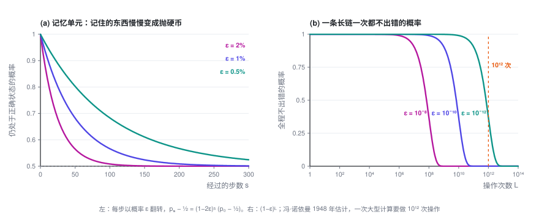
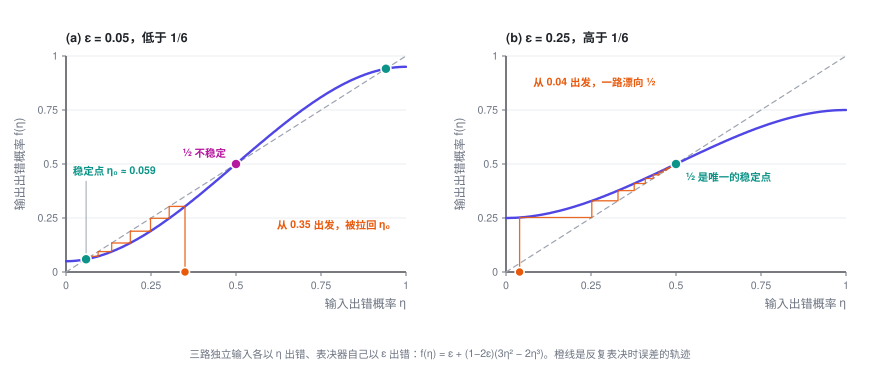
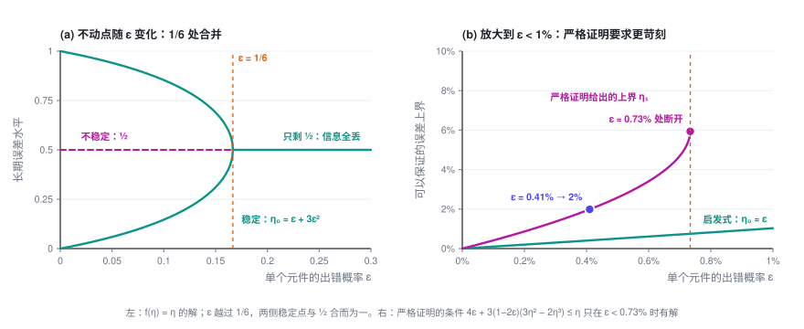
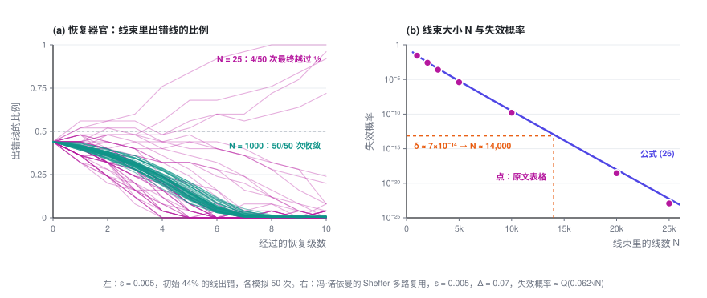

# 冯·诺依曼 1952：多数表决、阈值与多路复用

> 每个元件都会出错，能不能用它们搭出一台几乎不出错的机器？冯·诺依曼的回答是：能，但有两个前提。单个元件的出错率要低于一道门槛，各处的错误还要互相独立。这一篇沿着他 1952 年的讲稿，把这个回答从头推一遍。

> **可靠性专题 · 第 1 篇 / 共 2 篇** · 阅读约 18 分钟
>
> ← 已是第一篇　·　[**专题目录**](index.md)　·　[多加几道检查，为什么不够 →](2-verifier-cascades.md)

这是「用不可靠的模型，搭可靠的系统」的第一篇。这一篇里没有大模型，主角是电子管、继电器和神经元。只需要一点概率基础：独立事件的乘法，和二项分布。

本篇会用到的符号

| 符号 | 含义 |
|---|---|
| $\varepsilon$ | 单个元件每次操作出错的概率 |
| $p_s$ | 记忆单元经过 $s$ 步后仍处于正确状态的概率 |
| $\eta$ | 一条线上信号出错概率的上界 |
| $f_\varepsilon(\eta)$ | 多数表决器的误差映射：输入出错 $\eta$ 时，输出出错多少 |
| $\eta_0$ | 反复表决之后，误差稳定下来的水平 |
| $\mu$ | 逻辑深度：从输入到输出，最长的一串元件有多少个 |
| $N,\ \Delta$ | 一束线里有多少根线；读一束线时用的判定阈值 |
| $\delta$ | 允许整台机器最终出错的概率 |

专题的整体介绍见[专题目录](index.md)。

---

## 1. 问题从哪来

1948 年 9 月，冯·诺依曼在帕萨迪纳的 Hixon 研讨会上作了一场报告。那是一次讨论大脑与行为的会议，他开场就说自己对在座多数领域是个外行，然后讲起了自动机，把计算机和神经系统放在一起对照。

报告中间，他算了一笔账。元件每做一次操作，失败的概率很小，但不是零；操作链一长，这些小概率累积起来就会接近 1，机器等于完全不可靠。一台高速计算机解一道典型的题，可能要做 $10^{12}$ 次操作，所以单次操作的出错率必须远低于 $10^{-12}$。而在当时，一只电话继电器出错率 $10^{-8}$ 算合格，$10^{-9}$ 就算优秀了。

他由此断言，自动机的逻辑必须把「推理链」（chains of reasoning）的实际长度考虑进去，还要允许每一步以很小的概率出错。这件事「需要一个不平凡的理论」。

三年多以后，他自己给出了这个理论。1952 年 1 月，他在加州理工连讲五次，R. S. Pierce 做了笔记；1956 年，讲稿以 *Probabilistic Logics and the Synthesis of Reliable Organisms from Unreliable Components* 为题，收进香农（C. E. Shannon）和麦卡锡（J. McCarthy）主编的《Automata Studies》。

前言里有一句话，定下了全文的基调：错误不该被看成过程之外的偶然事故，它就是过程本身的一部分；在自动机的设计里，它和「正确的逻辑结构」同样重要。

他要回答的问题，可以写成一句话：

> 给定一种每次操作以概率 ε 出错的元件，能不能搭出一台机器，让它最终出错的概率不超过任意指定的 δ？δ 最小能到多少？

展开：出处的时间线

| 时间 | 事件 |
|---|---|
| 1948 年 9 月 20 日 | 在 Hixon 研讨会（帕萨迪纳）报告 *The General and Logical Theory of Automata*，1951 年收入会议文集。问题第一次被提出 |
| 1951 年 | 在伊利诺伊大学与 K. A. Brueckner、M. Gell-Mann 讨论，论文前言致谢说这些讨论给了他重要的启发 |
| 1952 年 1 月 4–15 日 | 加州理工五次讲座，R. S. Pierce 记笔记 |
| 1956 年 | 正式发表于《Automata Studies》（Annals of Mathematics Studies 第 34 册），第 43–98 页 |

讲稿的原始打字稿存于加州理工。2010 年 Michael Godfrey 据此重新排印了一版，并指出正式出版的版本在插图上有几处错误。下文提到的节号，都是原文的节号。

## 2. 放着不管，会怎样

先写下他的错误模型（§7.1）：每个元件每次操作以概率 ε 出错，而且与网络所处的状态、与别处的故障都统计独立。不妨设 $\varepsilon < 1/2$，因为一个多数时候都出错的元件，把输出取反就是一个好元件。

最简单的例子是记忆单元：它被触发一次之后，应当一直保持激发。设它每一步以概率 ε 翻转，$p_s$ 是 $s$ 步之后仍处于正确状态的概率，那么

$$p_{s+1} = (1-\varepsilon)\,p_s + \varepsilon\,(1-p_s)$$

两边同时减去 ½，得到

$$p_s - \tfrac12 = (1-2\varepsilon)^s\,\bigl(p_0 - \tfrac12\bigr) \approx e^{-2\varepsilon s}\,\bigl(p_0 - \tfrac12\bigr)$$

$p_s - \tfrac12$ 衡量的是这个单元还记得多少。它按指数衰减，$p_s$ 最终趋于 ½：存进去的东西变成了抛硬币。ε = 0.5% 时，大约 70 步就忘掉一半。

冯·诺依曼特别强调，错误的麻烦不在于得到错误的结果，而在于得到无关的结果：输出和输入不再有任何关系。

他还指出了一个看上去绕不过去的限制（§7.3）：机器的每个输出，都出自最后那一个元件，整台机器不可能比这个元件更可靠。所以，只要信号是在单根线上传的，最终出错率 δ 就不可能低于 ε。

这个限制后来被绕过去了。不过在那之前，得先有一个能纠错的部件。

## 3. 多数表决：什么时候能纠错

他选的纠错部件是多数表决器（majority organ）：三个输入，输出其中占多数的那个值。它也是用同样的元件做的，自己也以概率 ε 出错。

设三路输入出错的概率分别不超过 $\eta_1, \eta_2, \eta_3$。输出出错的概率，有两种估计（§8.2）。

**一般情形。** 什么都不假设，就只能把各种出错的可能加起来：

$$P(\text{输出出错}) \le \varepsilon + \eta_1 + \eta_2 + \eta_3$$

每一路都不超过 η 时，这个界是 $\varepsilon + 3\eta$，比 η 还大。也就是说，信号每经过一个元件，误差只会变大，机器一深就谈不上精度。

**特殊情形。** 如果下面两个条件同时成立：

1. 三路输入各自独立地出错；
2. 正常工作时，三路输入本该相同。

那么只有至少两路同时出错，表决才会出错。每路出错概率不超过 η 时，这件事的概率是 $3\eta^2(1-\eta) + \eta^3 = 3\eta^2 - 2\eta^3$。再算上表决器自己以 ε 把结果弄反，输出出错的概率为

$$\boxed{\ f_\varepsilon(\eta) = \varepsilon + (1-2\varepsilon)\,(3\eta^2 - 2\eta^3)\ }$$

η 小的时候，它约等于 $\varepsilon + 3\eta^2$，可以比 η 小。**表决确实能纠错，但前提是这两个条件都成立。** 冯·诺依曼接下来的所有构造，都是在想办法让每一个表决器都处在这个特殊情形里。

最直接的办法是三重化：把原来的网络复制三份，喂给它们同样的输入，每个输出后面接一个多数表决器。三份副本各自独立地出错，结果又本该一致，两个条件正好满足。于是输出出错概率的上界，从 η 变成了 $f_\varepsilon(\eta)$。

## 4. 1/6：一条分界线

三重化可以一层套一层地做。所以真正要问的是：反复作用 $\eta \to f_\varepsilon(\eta)$，误差最后会停在哪里？

先找不动点，也就是 $f_\varepsilon(\eta) = \eta$ 的解。$\eta = \tfrac12$ 总是一个。把因子 $\eta - \tfrac12$ 提出来，剩下的部分是

$$(1-2\varepsilon)\,\eta^2 - (1-2\varepsilon)\,\eta + \varepsilon = 0
\quad\Longrightarrow\quad
\eta = \frac12\left(1 \pm \sqrt{\frac{1-6\varepsilon}{1-2\varepsilon}}\right)$$

根号里的数非负，当且仅当 $\varepsilon \le 1/6$。于是分成两种情况。

**$\varepsilon < 1/6$ 时**，有三个不动点 $\eta_0 < \tfrac12 < 1-\eta_0$。只要初始误差低于 ½，反复表决就会把它拉到

$$\eta_0 = \frac12\left(1 - \sqrt{\frac{1-6\varepsilon}{1-2\varepsilon}}\right) = \varepsilon + 3\varepsilon^2 + \cdots$$

**$\varepsilon \ge 1/6$ 时**，只剩 ½ 这一个不动点。不管初始误差多小，反复表决都会把它推向 ½，信息全部丢失，和上一节的记忆单元一样。

分界点也可以一行算出来。在 ½ 处，映射的斜率是 $f_\varepsilon'(\tfrac12) = \tfrac32(1-2\varepsilon)$。斜率大于 1，½ 就是个排斥点，误差会离开它，跑向 $\eta_0$；斜率小于 1，½ 就把一切都吸过去。斜率恰好等于 1 的地方，正是 $\varepsilon = 1/6$。

这个结果有两层意思：

- **误差有底。** 稳定点 $\eta_0 \approx \varepsilon$，表决最多把误差压到和元件本身差不多的水平，不会更低，这就是第 2 节 δ ≥ ε 的限制。但它挡住了 $(1-\varepsilon)^L$ 那样的雪崩，误差不再随深度增长。
- **有一道门槛。** 元件太差（ε ≥ 1/6，约 16.7%）时，叠多少层表决都没用。门槛两边是截然不同的两种局面：一边误差能稳住，另一边一切归于噪声。

## 5. 严格证明的代价：0.73% 与 $3^\mu$

上面的推理是启发式的。要严格证明（§8.3.2），冯·诺依曼对网络的逻辑深度 μ 做归纳。麻烦在于，他的构造里总有一部分表决器，输入并不处在特殊情形，只能用一般情形的界 $\varepsilon + 3\eta$。

把这部分也算进去，归纳要成立，就需要对某个小于 ½ 的 η 满足

$$\varepsilon + 3 f_\varepsilon(\eta) \le \eta
\quad\Longleftrightarrow\quad
4\varepsilon + 3(1-2\varepsilon)(3\eta^2 - 2\eta^3) \le \eta$$

算下来，这个不等式只在 $\varepsilon < 0.0073$ 时有解，能保证的最小误差约为 $4\varepsilon + 152\varepsilon^2$。比如要把最终误差控制在 2%，元件的出错率就得低于 0.41%。

冯·诺依曼说，0.73% 这个数没有绝对的意义，构造改进一下还可以放宽；1/6 却是硬的，一旦超过它，哪怕在最有利的情形下，表决也改善不了误差。

真正要命的是成本。深度每加一层，元件数就乘以 3，整台机器需要原来 $3^\mu$ 倍的元件。他算了一下：逻辑深度 160 对一次普通计算来说并不算深，可 $3^{160} \approx 2 \times 10^{76}$，已经超过了人们估计的宇宙电子总数；深度再加 25% 到 200，还要再乘上 $1.2 \times 10^{19}$。他对此只写了一句：无需多言。

单线的方案回答了「能不能」，却造不出来。

## 6. 多路复用：不要求每根线都对

出路在 §7.4 的「多线技巧」：每个信号不再用一根线传，而是用一束 N 根线同时传。再取一个判定阈值 Δ（0 < Δ < ½）：一束里至少有 $(1-\Delta)N$ 根被激发，就读作 1；至多 $\Delta N$ 根被激发，就读作 0；介于两者之间，算作机器出了故障。

这样一来，δ ≥ ε 的限制就不成立了。单根线仍然以 ε 左右的概率出错，但一束线只有在出错的线超过 ΔN 根时才算错。

在线束上做运算，需要两类部件。

**执行器官**（executive organ）负责逻辑运算本身，比如把三束线逐根配对，送进 N 个多数表决器。问题出在「二对一」的时候，也就是两束输入压过第三束：输出束里出错线的比例，可能接近这两束的出错比例之和。运算一级级做下去，线束就会滑进中间的故障区。

**恢复器官**（restoring organ）负责把退化的线束拉回来。做法是（§9.2.3）：把一束线的每根都一分为三，经过一个随机置换 U 打乱，再每三根送进一个多数表决器。如果输入束里有比例为 α 的线被激发，那么一个表决器收到至少两根激发线的概率是

$$\alpha^* = 3\alpha^2 - 2\alpha^3$$

这和第 3 节是同一个三次式，只不过现在作用在一束线的比例上。它把 α 往离它更近的 0 或 1 推：比例离两端 21.2% 时推得最狠，一次能拉回 9.6 个百分点。再算上表决器自身的出错，出错线比例的变化就服从 $f_\varepsilon$。

**随机置换是整个构造的关键。** 置换之前，每三根线都是同一根线分出来的，状态完全一样；而 $3\alpha^2 - 2\alpha^3$ 这个公式，要求进入同一个表决器的三根线相互独立。冯·诺依曼说得很直接：这种随机性必须始终保持。他在 §11.2 又补了一个反面例子：网络有反馈时，如果不打乱，脉冲会回到它出发的那个器官，错误之间出现强相关，机器会「记住自己的错误，并一直延续下去」。

那么，线束为什么能突破 δ ≥ ε？看一束线里出错线的比例。N 根线大致独立地出错，这个比例的涨落约为 $1/\sqrt N$。线束失效，要求这个比例偶然涨过 Δ，这是个大偏差事件，概率随 N 指数下降。

冯·诺依曼为一套完全用 Sheffer 元件（与非门）搭的方案算了具体数字（§10.5）。判定阈值取 Δ = 0.07 时，元件出错率必须低于 1.07%，否则线束再粗，失效概率也降不到某个正数以下。取 ε = 0.005，一束线失效的概率约为

$$\varrho(N) \approx \frac{1}{\sqrt{2\pi}}\int_\kappa^\infty e^{-x^2/2}\,dx, \qquad \kappa = 0.062\sqrt{N}$$

由此可以算出 $\varrho \sim e^{-0.0019N}$：N 每多约 1,200 根，失效概率就降一个数量级。他的表里，N = 1,000 时失效概率约 2.7%，N = 10,000 时约 $1.6 \times 10^{-10}$，N = 20,000 时约 $2.8 \times 10^{-19}$。

接着他举了两个例子（§10.5.3）。

**一台电子管计算机。** 2,500 只电子管，平均每 5 微秒动作一次，要求平均 8 小时才出一次错。8 小时里共有约 $1.4 \times 10^{13}$ 次动作，所以每次动作允许的出错概率 δ ≈ $7 \times 10^{-14}$，查表得 N ≈ 14,000。N 再加 25%，可靠性提高约 1,600 倍。

**人的神经系统。** 按 $10^{13}$ 个基本单元、每秒动作 10 次、一万年才允许出一次严重错误来估，N 在 19,000 到 28,000 之间，取决于具体的假设。

他的结论是：只要要求足够严，N 对具体要求很不敏感，大约都在两万上下。

代价是线数乘以 N，元件数乘以约 3N。N ≈ 20,000 对当时的电子管技术不现实，但对神经元这样微小的元件并不离谱。更要紧的是增长方式：N 只随机器规模和精度要求缓慢增长，而单线方案要乘的是 $3^\mu$。

## 7. 他搁置的那个假设

回到第 2 节的错误模型。冯·诺依曼写下「各处的错误相互独立」之后，紧接着提到另一种假设：故障与网络的状态有关，彼此之间也相关，他说这种假设「要现实得多」。然后他写道，这里先采用前一种，更窄、也更简单的假设。

到了 §11.3，他又回到这个问题：把每个元件的出错概率当成一个与时间、与此前输入都无关的常数 ε，「是不现实的」。出错率可能随输入组合而变，随历史漂移，也因元件而异。对这种情况的分析，「这里不做尝试」。

把全文连起来看，独立性是整座建筑的地基：

- 第 3 节的多数表决，只有在三路输入各自独立地出错时，才能把 η 压成 $3\eta^2$ 量级；
- 第 6 节的恢复器官，要靠随机置换去制造独立性；
- 线束的失效概率随 N 指数下降，同样依赖 N 根线大致独立地出错。

有独立性，冗余就能换来任意高的可靠性，代价只是常数倍的元件。没有独立性，这些结论一个也拿不到。

七十多年后，搭 AI 系统的人面对的是同一个问题：每次调用模型都可能出错，而我们想要一个几乎不出错的系统。多采样几次再投票，就是多数表决；让另一次调用来检查结果，就是恢复器官；agent 一步接一步地执行，就是冯·诺依曼说的推理链。不同的是，同一个模型面对同一道题，常常错在同一个地方。**错误并不独立。**

这恰好是他搁置的那种情况。[专题目录](index.md)里有一张完整的对照表；[第 2 篇](2-verifier-cascades.md)讨论，错误相关时，为什么多加几道检查就不够了，内容基于我 2026 年的一篇论文（参考文献 3）。

---

## 参考文献

1. John von Neumann. [Probabilistic Logics and the Synthesis of Reliable Organisms from Unreliable Components](https://static.ias.edu/pitp/archive/2012files/Probabilistic_Logics.pdf). In C. E. Shannon, J. McCarthy (eds.), *Automata Studies*, Annals of Mathematics Studies 34, pp. 43–98. Princeton University Press, 1956.（链接为据 1952 年加州理工讲稿重新排印的版本）
2. John von Neumann. The General and Logical Theory of Automata. In L. A. Jeffress (ed.), *Cerebral Mechanisms in Behavior: The Hixon Symposium*, pp. 1–41. Wiley, 1951.
3. Jiangang Han. [Partially Correlated Verifier Cascades in LLM Harnesses: Concave Log-Odds, Polynomial Reliability, and Blind-Spot Ceilings](https://arxiv.org/abs/2607.13918). arXiv:2607.13918, 2026.

---

**可靠性专题 · 第 1 篇 / 共 2 篇**

← 已是第一篇　·　[**专题目录**](index.md)　·　[多加几道检查，为什么不够 →](2-verifier-cascades.md)
