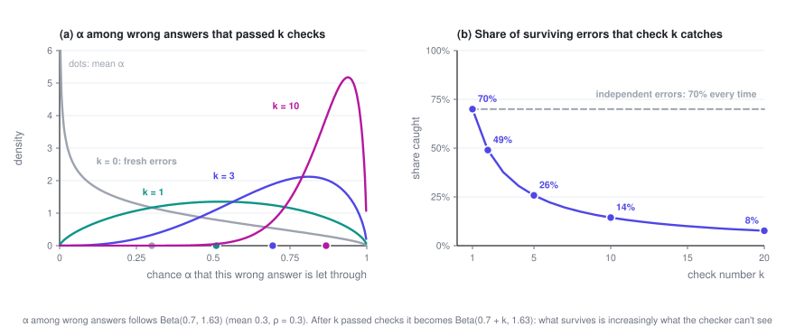
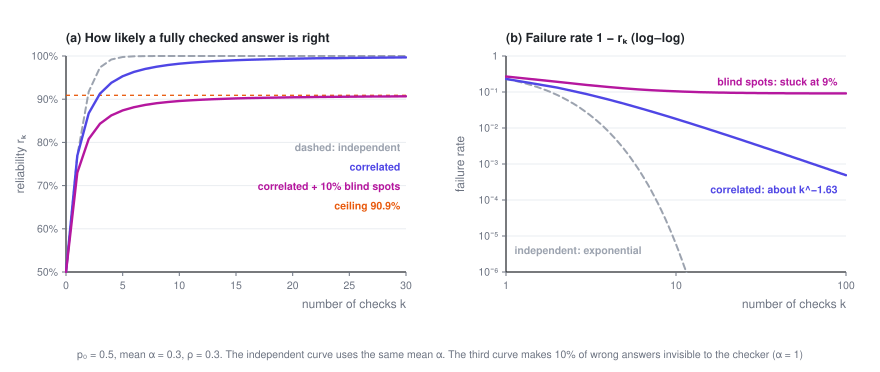
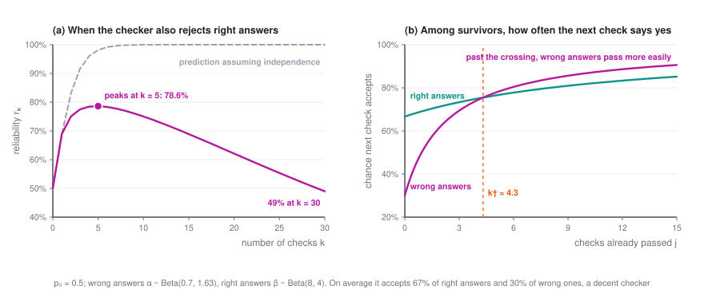
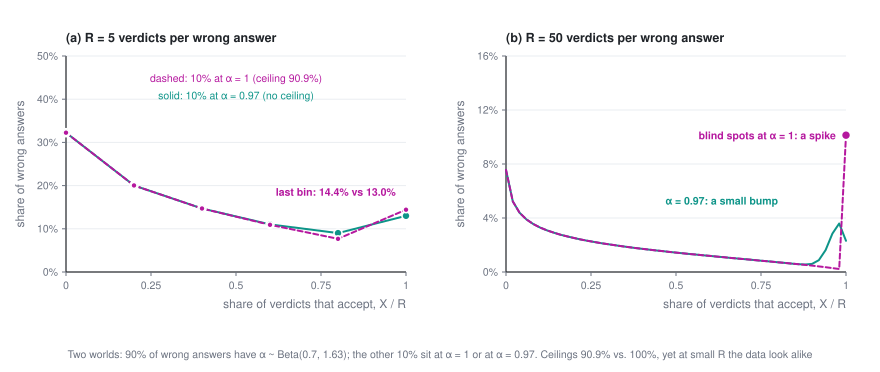

# Why More Checks Stop Helping: Correlated Verifiers and the Reliability Ceiling

> Have a model generate an answer, have a model check it, and start over if it fails: that loop is one of the most common patterns in AI systems today. The instinct is that if one check isn't enough, you add more. This post shows where that instinct breaks down when the checker shares blind spots with the generator, how badly it breaks, and how to measure the problem before it bites.

> **Reliability · Part 2 of 2** · 20 min read
>
> [← Von Neumann, 1952: Majority Voting, Thresholds, and Multiplexing](1-von-neumann.en.md)　·　[**Series index**](index.en.md)　·　Last part →

This is the second post in *Reliable Systems from Unreliable Models*, and a plain-language version of my paper [arXiv:2607.13918](https://arxiv.org/abs/2607.13918). Part 1 helps but isn't required. The math is conditional probability and expected values, nothing more.

Symbols used in this post

| Symbol | Meaning |
|---|---|
| $p_0$ | Probability that the generator produces a correct answer |
| $k$ | Number of checks in the chain |
| $r_k$ | Reliability: probability that an answer passing all $k$ checks is correct |
| $o$ | Odds: probability of being right divided by probability of being wrong |
| $\alpha$ | Probability that one check lets a given wrong answer through; varies from answer to answer |
| $G$ | Distribution of $\alpha$ across all of the generator's wrong answers |
| $m_k$ | $\mathbb E[\alpha^k]$, the probability that a wrong answer gets through $k$ checks |
| $\bar\alpha$ | Mean of $\alpha$ |
| $\rho_v$ | Correlation between two verdicts on the same wrong answer |
| $b$ | How thin $G$ is near 1: the smaller $b$, the more wrong answers that almost always fool the checker |
| $1-\pi$ | Blind spot: the share of wrong answers the checker never catches |
| $\beta$ | Probability that one check accepts a given correct answer (used from Section 7) |
| $R$ | Number of repeated verdicts per wrong answer when measuring |

The overview of the series is in the [series index](index.en.md).

---

## 1. The setup: one check after another

Picture a common pipeline. A model produces an answer, which then goes through $k$ checks. The answer is used only if all $k$ checks accept it; otherwise it's thrown away and the model tries again. Each check might be another call to the same verifier, or a different prompt, or a different model.

The question is: if an answer has passed all $k$ checks, how likely is it to be right? Call that $r_k$. Whatever the pipeline finally hands over has passed every check, so $r_k$ is the accuracy of what users actually get.

Two simplifying assumptions to start:

- The generator produces a correct answer with probability $p_0$.
- The checker never rejects a correct answer: right answers pass every check. That's an idealization, and Section 7 drops it.

That leaves the question of whether the checker lets wrong answers through. Call the probability that one check accepts a wrong answer α.

In Part 1's terms, each check is a restoring organ. Von Neumann's results needed the errors of those organs to be independent. This post asks what happens when they aren't.

## 2. Independent errors: every check multiplies the odds

Odds make the arithmetic cleanest: $o = P(\text{right}) / P(\text{wrong})$, which starts out as $o_0 = p_0/(1-p_0)$.

Suppose an answer passes one check. A right answer always passes, and a wrong one passes with probability α, so by Bayes' rule the odds become

$$o_1 = \frac{p_0 \cdot 1}{(1-p_0)\cdot \alpha} = \frac{o_0}{\alpha}$$

If every wrong answer gets through every check with the same probability α, and the checks are independent, a wrong answer survives $k$ checks with probability $\alpha^k$. Then

$$o_k = \frac{o_0}{\alpha^k}, \qquad \ln o_k = \ln o_0 + k \ln\frac1\alpha$$

Every check adds the same $\ln(1/\alpha)$ to the log-odds, and the failure rate $1 - r_k$ falls exponentially. Aksu's Odds Law (2026) states this rule in general form, and notes explicitly that working out cascades of partially correlated checks is still an open problem.

Some numbers: $p_0 = 0.5$ and α = 0.3, so each check catches 70% of wrong answers. After one check, reliability is 76.9%; after five, 99.8%; after ten, 99.9994%. By this arithmetic, any level of reliability is just a few more checks away.

## 3. But checkers keep missing the same mistakes

The weak spot is the assumption that every wrong answer is equally likely to slip through.

If a checker misses a mistake once, looking at it again usually won't help. The reason is simple: checkers and generators tend to come from the same kinds of models trained on the same kinds of data, so the mistakes a generator likes to make are often exactly the ones its checker overlooks. This has been measured. One study placed the same error either in the user's message or in the model's own output, with everything else identical. Across 14 open-source models, the models tended to fix the error when it came from the user and miss the identical error when it was their own, a "self-correction blind spot" averaging 64.5% (Tsui, 2025). Another study found that without external feedback, asking models to correct their own reasoning sometimes made accuracy worse, not better (Huang et al., 2024).

A more realistic picture, then: **α isn't a fixed property of the checker. It's a property of each wrong answer.** Some mistakes are obvious, with α near 0; others this particular checker will never spot, with α near 1. Across all of the generator's wrong answers, α has some distribution, which we'll call G.

With that picture, the model needs just one assumption: for a given wrong answer, each of the $k$ checks accepts it independently with probability α. Think of the same verifier called $k$ times at a nonzero temperature, or several checkers that share the same blind spots. The correlation doesn't come from checks influencing one another. It comes from all of them facing the same α.

One number sums up that correlation, the correlation between two verdicts on the same wrong answer:

$$\rho_v = \frac{\operatorname{Var}(\alpha)}{\bar\alpha\,(1-\bar\alpha)}$$

With $\rho_v = 0$, every wrong answer is equally hard to catch, which is the independent case from Section 2. With $\rho_v = 1$, there are only two kinds of wrong answer: those caught by the first check and those never caught at all.

## 4. The exact formula fits on one line

The probability that a wrong answer passes $k$ checks is $\alpha^k$ for each individual answer, averaged over all of them:

$$m_k = \mathbb E\left[\alpha^k\right]$$

Right answers always pass, so the odds work out just as in Section 2:

$$\boxed{\ o_k = \frac{o_0}{m_k}, \qquad r_k = \frac{p_0}{p_0 + (1-p_0)\,m_k}\ }$$

Everything else follows from this. Compared with the independent case, the only change is that $\bar\alpha^k$ becomes $\mathbb E[\alpha^k]$, but that change is large. Whenever α varies, $\mathbb E[\alpha^k]$ is bigger than $\bar\alpha^k$, and the gap widens as $k$ grows. The wrong answers with α near 1 barely shrink when raised to the $k$-th power, and they hold the average up.

For examples, it's convenient to let α follow a Beta distribution, whose moments have simple closed forms. If $\alpha \sim \text{Beta}(a, b)$, then

$$m_k = \prod_{j=0}^{k-1} \frac{a+j}{a+b+j}, \qquad \bar\alpha = \frac{a}{a+b}, \qquad \rho_v = \frac{1}{a+b+1}$$

All the examples below use $\bar\alpha = 0.3$ and $\rho_v = 0.3$, which means $a = 0.7$ and $b \approx 1.63$. That's a reasonable checker, catching 70% of wrong answers on average.

## 5. Survivorship: why later checks do less and less

Why does $\mathbb E[\alpha^k]$ shrink so slowly? Look at the wrong answers that have already survived $j$ checks.

A wrong answer survives $j$ checks with probability $\alpha^j$. So among the survivors, the distribution of α gets reweighted by $\alpha^j$: answers with high α are more likely to still be around, and those with low α were caught early. For a Beta distribution this reweighting gives exactly $\text{Beta}(a+j,\,b)$, and the survivors' average α, $(a+j)/(a+b+j)$, keeps climbing as $j$ grows.

Check number $j+1$ doesn't see fresh wrong answers. It sees these survivors, and it catches a fraction $1 - (a+j)/(a+b+j)$ of them:

| Check number | 1 | 2 | 3 | 5 | 10 | 20 |
|---|---|---|---|---|---|---|
| Share of surviving wrong answers it catches | 70% | 49% | 38% | 26% | 14% | 8% |

The checker hasn't gotten any worse; what's changed is the population in front of it. **The wrong answers that make it through several checks are precisely the ones the checker can't see.**

In terms of log-odds, check $j+1$ contributes evidence $\ln(m_j / m_{j+1})$, which is minus the log of the survivors' average α, and that shrinks with every check. So $\ln o_k$ is a concave function of $k$. The straight line from the independence assumption passes through the curve's first two points, $k = 0$ and $k = 1$, and from then on sits above it. Assuming independence doesn't overstate what the first check is worth. It overstates every check after that. This holds for any distribution of α that isn't a single fixed value, Beta or not.

How big is the gap? Same numbers again, $p_0 = 0.5$, $\bar\alpha = 0.3$, $\rho_v = 0.3$:

| Checks $k$ | Reliability assuming independence | Actual reliability | Failure rate understated by |
|---|---|---|---|
| 1 | 76.9% | 76.9% | 1× |
| 2 | 91.7% | 86.7% | 1.6× |
| 3 | 97.4% | 91.3% | 3.3× |
| 5 | 99.8% | 95.3% | about 20× |
| 10 | 99.9994% | 98.2% | about 3000× |

Someone sizing a pipeline by the independence formula thinks they've bought five nines. They've bought 98%. Or turn it around: to reach 99% reliability, independence says 4 checks will do, but it actually takes 15. For 99.9%, it's 6 versus 65.

## 6. From exponential to polynomial, and then a ceiling

When $k$ is large, $m_k$ depends on what the distribution of α looks like near 1. If its density behaves like $(1-\alpha)^{b-1}$ there, then

$$m_k \sim C\,k^{-b}, \qquad 1 - r_k \sim \frac{1-p_0}{p_0}\,C\,k^{-b}$$

where C is a constant ($C = \Gamma(a+b)/\Gamma(a)$ for a Beta distribution). The failure rate no longer falls exponentially. It falls polynomially. The exponent $b$ measures how many wrong answers come close to always fooling the checker: the smaller $b$ is, the more of them there are, and the slower the decline.

In our example $b \approx 1.63$, so doubling the number of checks only cuts the failure rate to about a third ($2^{1.63} \approx 3.1$). Under independence, going from 5 checks to 10 would cut it by a factor of more than 400.

It gets worse if some wrong answers are ones this checker will never catch, meaning α = 1. Say they make up a fraction $1-\pi$ of all wrong answers. No number of checks removes them, so $m_k \to 1 - \pi$, and reliability hits a ceiling:

$$r_\infty = \frac{p_0}{p_0 + (1-p_0)(1-\pi)} < 1$$

If 10% of the wrong answers in our example are blind spots, $r_\infty = 0.5/(0.5 + 0.05) \approx 90.9\%$. **However many checks you add, you won't get past 91%.** Put in terms of evidence, a chain of checkers from the same correlated family can supply at most $-\ln(1-\pi)$ in total. That cap depends only on the size of the blind spot, not on how good each check is or how many there are.

Voting has a close cousin of this. Sample the same model as many times as you like and take a majority vote: accuracy still tops out, because more votes only secure the questions the model already gets right more than half the time. Ladha worked through this kind of correlated voting back in 1993, and Aksu's paper proves this cap as well (Theorem 7.2). The difference is that every vote faces the same question, while a chain of checks adds a filter, so each later check faces whatever the earlier ones let through. The concave curve in the previous section comes from that filtering, and voting has nothing like it.

## 7. When checks start to hurt

Now drop the assumption from Section 1 and let the checker reject correct answers too. Some answers are right but unusual, written in an odd style or using an uncommon coding pattern, and the checker turns them down again and again. So correct answers also have an acceptance probability β that varies from answer to answer, with distribution H.

The same derivation gives

$$\ln o_k = \ln o_0 + \ln \mathbb E\left[\beta^k\right] - \ln \mathbb E\left[\alpha^k\right]$$

This is a race. The last term is the benefit of filtering out wrong answers, which keeps shrinking. The middle term is the cost of throwing away right answers, which keeps adding up.

Which side wins depends on how thick each distribution is near 1. If the densities of α and β near 1 behave like $(1-x)^{b_\alpha - 1}$ and $(1-x)^{b_\beta - 1}$, then for large $k$

$$\ln o_k \approx \text{constant} + (b_\alpha - b_\beta)\ln k$$

That leaves exactly three possible outcomes:

- $b_\alpha > b_\beta$: more checks always help eventually, and reliability approaches 1, though only at a polynomial rate.
- $b_\alpha = b_\beta$: reliability levels off somewhere below 1.
- $b_\alpha < b_\beta$: past some point, more checks make things worse, and reliability heads to 0.

In plain terms: **whichever side runs out of answers that almost always pass loses.** If right answers that get accepted every time are scarcer than wrong answers that fool the checker every time, then the longer the chain, the faster right answers get weeded out relative to wrong ones.

Here's a concrete case, Table 2 from the paper. α ~ Beta(0.7, 1.63), the same as before, and β ~ Beta(8, 4), so correct answers are accepted 67% of the time on average. By the averages this checker looks decent: it accepts right answers 2.2 times as often as wrong ones, and the first check really does help. But $b_\alpha = 1.63 < b_\beta = 4$, which puts it in the third outcome. Reliability peaks at the fifth check, at about 79%, then slides: 62% at the twentieth check, and below half by the thirtieth. Running the same averages through the independence formula predicts reliability climbing all the way to five nines.

Where's the turning point? Check $j+1$ helps exactly when, among answers that survived the first $j$ checks, right answers are still more likely to be accepted than wrong ones:

$$\frac{a_\beta + j}{a_\beta + b_\beta + j} > \frac{a_\alpha + j}{a_\alpha + b_\alpha + j}$$

This simplifies to a linear inequality in $j$, and the crossover is at

$$k^\dagger = \frac{a_\alpha b_\beta - a_\beta b_\alpha}{b_\alpha - b_\beta}$$

In the example $k^\dagger \approx 4.3$, so every check beyond the fifth does net harm. Note that this optimum has nothing to do with cost. Even if checks were free, you wouldn't want more than this.

One more thing worth keeping in mind. Under independence, deciding whether adding checks helps only takes asking whether the average likelihood ratio is above 1. With correlation, that's not enough. A good average guarantees only that the first check helps; where things end up is decided by the tails of the two distributions near 1, and the tails aren't tied to the averages in any fixed way.

## 8. Measuring it: judge the same answer twice

Everything so far depends only on G, the distribution of α, and G can be estimated from checker logs. Here's how:

1. Take a set of questions with known answers, have the generator answer them, and keep only the ones it got wrong. Measuring with synthetic mistakes or another model's mistakes gives you a different G.
2. Have the checker (at nonzero temperature) judge each wrong answer $R$ times, and record how many times it accepts, $X_i$.
3. Estimate the moments of G from those counts. Averaging $\binom{X_i}{k} / \binom{R}{k}$ over the wrong answers gives an unbiased estimate of $\mathbb E[\alpha^k]$, for every $k$ up to $R$.

Two verdicts per wrong answer are enough to estimate $\rho_v$. With $R = 2$, let $q_2$ be the share of wrong answers accepted both times and $q_1$ the share accepted exactly once. Then

$$\hat m_1 = q_2 + \tfrac12 q_1, \qquad \hat m_2 = q_2, \qquad \hat\rho_v = \frac{\hat m_2 - \hat m_1^2}{\hat m_1(1-\hat m_1)}$$

For example, take 1,000 wrong answers, each judged twice:

| | Accepted both times | Accepted once | Rejected both times |
|---|---|---|---|
| Observed | 153 | 294 | 553 |
| If errors were independent (same 30% acceptance rate) | 90 | 420 | 490 |

That gives $\hat m_1 = 0.30$, $\hat m_2 = 0.153$, and $\hat\rho_v = (0.153 - 0.09)/(0.3 \times 0.7) = 0.30$. The number accepted both times is 70% higher than independence would predict, and that excess is the correlation.

This suggests a practical rule. Measure $\rho_v$ with $R = 2$ first. **If it's small, extra checks are cheap reliability. If it's large, stop adding checks of the same kind and spend the effort on decorrelation instead.**

The ceiling is much harder to pin down. It depends on whether any wrong answers have α exactly equal to 1, and $R$ verdicts can only resolve α to within about $1/R$: an answer with α = 1 and one with α = 0.97 will both usually be accepted five times out of five. The figure below shows two worlds. In both, 90% of wrong answers follow the same Beta distribution. The remaining 10% have α = 1 in one world (a ceiling of 90.9%) and α = 0.97 in the other (no ceiling). At $R = 5$ the data from the two worlds look almost identical; only at $R = 50$ do they separate. $\rho_v$ is cheap to measure. The ceiling is expensive.

The paper tests this pipeline on synthetic data. With true $\rho_v$ of 0.05, 0.30 and 0.50, it recovers 0.050, 0.291 and 0.502. Fitting on data from $R = 8$ alone and extrapolating to the fifth check, it predicts 95.4% reliability against a true 95.3%, while the independence formula says 99.8%. Measuring real generator–checker pairs from actual logs is the next step.

## 9. What to do about it

The conclusion is simple: **when $\rho_v$ is large, you don't buy reliability with more checks. You buy it by making the checker less correlated with the generator.**

- Check with a model from a different family, rather than having the same model look again.
- Change the modality or representation: turn the reasoning into code and run it, instead of rereading the text.
- Bring in tools and outside evidence: unit tests, execution results, retrieved sources, calculations that can be verified.
- Even small changes help a lot if they break the shared blind spot. Tsui found that simply appending "Wait" to a model's own output shrank its self-correction blind spot by nearly 90%.

In this post's model, swapping in a less correlated checker thins out the distribution of α near 1: $b$ goes up, the blind spot $1-\pi$ shrinks, and the ceiling rises.

The model has its limits. It squeezes everything the checks have in common into a single number α, much as von Neumann squeezed every component's failure rate into a single ε. Checkers from genuinely different families need a vector to describe them. And the Beta distribution is only there for closed forms; the large-$k$ results depend only on the shape of the tail.

Back to von Neumann, then. He built a random permutation into his restoring organ, whose only job was to shuffle the bundle so that the errors reaching each majority organ were independent. We can't shuffle a model's blind spots. What we can do is bring in a checker whose blind spots are different.

---

## References

1. Jiangang Han. [Partially Correlated Verifier Cascades in LLM Harnesses: Concave Log-Odds, Polynomial Reliability, and Blind-Spot Ceilings](https://arxiv.org/abs/2607.13918). arXiv:2607.13918, 2026. Code and synthetic-recovery experiments: [github.com/jianganghan/harness-verifier-cascades](https://github.com/jianganghan/harness-verifier-cascades).
2. John von Neumann. [Probabilistic Logics and the Synthesis of Reliable Organisms from Unreliable Components](https://static.ias.edu/pitp/archive/2012files/Probabilistic_Logics.pdf). In C. E. Shannon, J. McCarthy (eds.), *Automata Studies*, Annals of Mathematics Studies 34, pp. 43–98. Princeton University Press, 1956.
3. Hidayet Aksu. [Odds Law: The Decomposition Algebra on How Intelligence Organizes Itself to Solve Difficult Problems Reliably](https://arxiv.org/abs/2606.15712). arXiv:2606.15712, 2026.
4. Ken Tsui. [Self-Correction Bench: Uncovering and Addressing the Self-Correction Blind Spot in Large Language Models](https://arxiv.org/abs/2507.02778). arXiv:2507.02778, 2025.
5. Jie Huang, Xinyun Chen, Swaroop Mishra, Huaixiu Steven Zheng, Adams Wei Yu, Xinying Song, Denny Zhou. [Large Language Models Cannot Self-Correct Reasoning Yet](https://arxiv.org/abs/2310.01798). ICLR 2024.
6. Krishna K. Ladha. Condorcet's Jury Theorem in Light of de Finetti's Theorem: Majority-Rule Voting with Correlated Votes. *Social Choice and Welfare*, 10(1):69–85, 1993.

---

**Reliability · Part 2 of 2**

[← Von Neumann, 1952: Majority Voting, Thresholds, and Multiplexing](1-von-neumann.en.md)　·　[**Series index**](index.en.md)　·　Last part →
