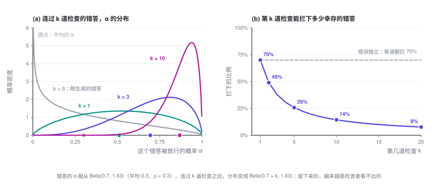
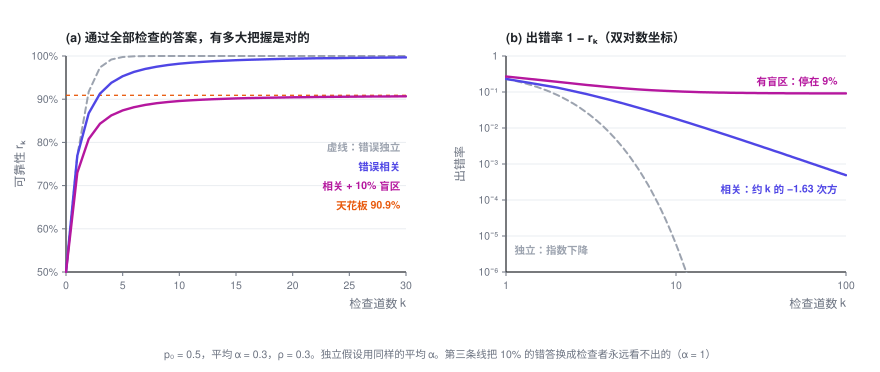
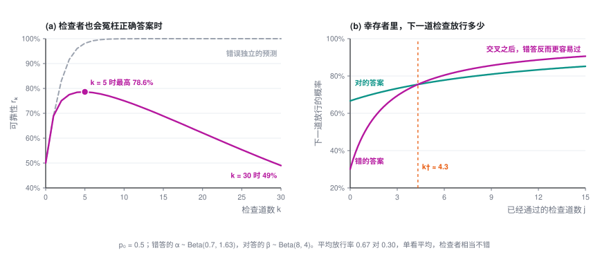
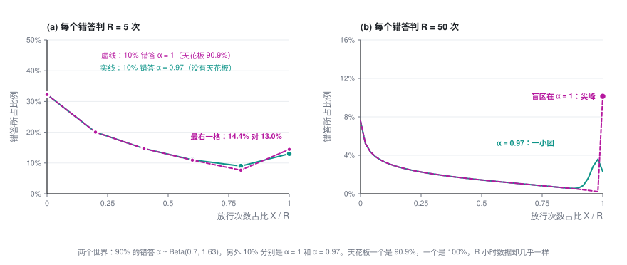

# 多加几道检查，为什么不够：相关错误与验证天花板

> 让模型生成答案，再让模型检查，不过关就重来，这是今天搭 AI 系统最常见的做法之一。直觉是：一道检查不够，就多加几道。这一篇说明，当检查者和生成者有共同的盲区时，这个直觉会在哪里失灵、失灵到什么程度，以及怎样事先把它测出来。

> **可靠性专题 · 第 2 篇 / 共 2 篇** · 阅读约 20 分钟
>
> [← 冯·诺依曼 1952：多数表决、阈值与多路复用](1-von-neumann.md)　·　[**专题目录**](index.md)　·　已是最后一篇 →

这是「用不可靠的模型，搭可靠的系统」的第二篇，也是我的论文 [arXiv:2607.13918](https://arxiv.org/abs/2607.13918) 的通俗版。读过第 1 篇更好，但不是必须。用到的数学只有条件概率和期望。

本篇会用到的符号

| 符号 | 含义 |
|---|---|
| $p_0$ | 生成器一次给出正确答案的概率 |
| $k$ | 串联的检查道数 |
| $r_k$ | 通过全部 $k$ 道检查的答案是对的概率，即可靠性 |
| $o$ | 几率（odds）：答对的概率 ÷ 答错的概率 |
| $\alpha$ | 一道检查放行某个错答的概率，因错答而异 |
| $G$ | 生成器的全部错答上，$\alpha$ 的分布 |
| $m_k$ | $\mathbb E[\alpha^k]$，一个错答连过 $k$ 道检查的概率 |
| $\bar\alpha$ | $\alpha$ 的平均值 |
| $\rho_v$ | 同一个错答的两次判决之间的相关系数 |
| $b$ | $\alpha$ 的分布在 1 附近有多厚：越小，几乎骗得过检查者的错答越多 |
| $1-\pi$ | 盲区：检查者永远看不出的错答所占的比例 |
| $\beta$ | 一道检查放行某个正确答案的概率，第 7 节才用到 |
| $R$ | 测量时，每个错答重复判决的次数 |

专题的整体介绍见[专题目录](index.md)。

---

## 1. 问题：一道检查接一道检查

设想一个很常见的流程：模型给出一个答案，交给 $k$ 道检查，只有 $k$ 道全部放行，答案才会被采用，否则丢掉重来。每道检查可以是同一个检查模型再调用一次，也可以换一个提示词或换一个模型。

我们关心的是：通过了全部 $k$ 道检查的答案，有多大把握是对的？记作 $r_k$。这个流程最后交出去的，一定是某个通过了全部检查的答案，所以 $r_k$ 就是用户拿到的答案的正确率。

先做两个约定：

- 生成器一次给出正确答案的概率是 $p_0$。
- 检查者从不冤枉正确答案：对的答案，每道检查都放行。这当然是理想化，第 7 节再放开。

剩下要考虑的，就是检查者会不会放过错答。一道检查放行一个错答的概率，记作 α。

用第 1 篇的话说，每道检查都是一个恢复器官。冯·诺依曼的结论要求它们的错误彼此独立，这一篇要问的就是：不独立时会怎样。

## 2. 错误独立时：每道检查乘上一个固定倍数

用几率来算最干净：$o = P(\text{对}) / P(\text{错})$，检查之前是 $o_0 = p_0/(1-p_0)$。

一个答案通过了一道检查。对的答案一定通过，错的答案以概率 α 通过。按贝叶斯公式，几率变成

$$o_1 = \frac{p_0 \cdot 1}{(1-p_0)\cdot \alpha} = \frac{o_0}{\alpha}$$

如果每个错答被每道检查放行的概率都是同一个 α，各道检查又互相独立，那么错答连过 $k$ 道的概率就是 $\alpha^k$，于是

$$o_k = \frac{o_0}{\alpha^k}, \qquad \ln o_k = \ln o_0 + k \ln\frac1\alpha$$

每多一道检查，对数几率就加上同样一份 $\ln(1/\alpha)$，出错率 $1 - r_k$ 按指数下降。Aksu 2026 年提出的 Odds Law 把这条规律写成了一般形式，同时明确说，检查之间部分相关时该怎么算，仍是一个没有解决的问题。

代入具体的数：$p_0 = 0.5$，α = 0.3，也就是每道检查能拦下 70% 的错答。一道检查之后可靠性是 76.9%，五道之后 99.8%，十道之后 99.9994%。照这个算法，想要多高的可靠性，多加几道检查就行。

## 3. 但检查者往往一再看走眼

问题出在「每个错答被放行的概率都一样」这个假设上。

同一个错答，检查者看一次没发现，再看一次，多半还是发现不了。原因很朴素：检查者和生成者往往出自同一类模型、同一类数据，生成器容易犯的错，恰恰也是检查者容易看漏的。有实验专门测过：把同一个错误分别写进用户的话里、或写进模型自己的输出里，其余上下文完全相同。14 个开源模型普遍是前一种能改出来，后一种改不了，论文测得的「自我纠错盲区」平均为 64.5%（Tsui，2025）。另一项研究发现，没有外部反馈时让模型自我纠错，推理题的准确率有时不升反降（Huang 等，2024）。

所以更贴近实际的看法是：**α 不是检查者的一个固定参数，而是每个错答自己的属性。** 有的错一眼就能看出来，α 接近 0；有的错这个检查者怎么也看不出，α 接近 1。在生成器的全部错答上，α 有一个分布，记作 G。

有了这个看法，模型只需要一条假设：给定某个错答，$k$ 道检查各自独立地以概率 α 放行它。比如同一个检查模型在温度大于 0 时调用 $k$ 次，或者几个盲区相同的检查者各看一次。相关性并不是来自检查之间互相影响，而是来自它们面对的是同一个 α。

这种相关可以用一个数概括，即同一个错答两次判决之间的相关系数：

$$\rho_v = \frac{\operatorname{Var}(\alpha)}{\bar\alpha\,(1-\bar\alpha)}$$

$\rho_v = 0$ 表示所有错答一样难查，回到第 2 节的独立情形；$\rho_v = 1$ 表示错答只有两种，要么第一道就被拦下，要么永远拦不下。

## 4. 精确的公式只有一行

一个错答连过 $k$ 道检查的概率，是先对每个错答算 $\alpha^k$，再对所有错答取平均：

$$m_k = \mathbb E\left[\alpha^k\right]$$

对的答案一定通过，于是和第 2 节一样算几率，得到

$$\boxed{\ o_k = \frac{o_0}{m_k}, \qquad r_k = \frac{p_0}{p_0 + (1-p_0)\,m_k}\ }$$

整套理论就从这里出发。和独立情形相比，只是把 $\bar\alpha^k$ 换成了 $\mathbb E[\alpha^k]$，但两者差得很远：α 有高有低时，$\mathbb E[\alpha^k]$ 总比 $\bar\alpha^k$ 大，而且 $k$ 越大差得越多。α 接近 1 的那部分错答，$\alpha^k$ 几乎不衰减，平均值被它们撑住了。

举例时，取 α 服从 Beta 分布，因为它的各阶矩有简单的闭式。若 $\alpha \sim \text{Beta}(a, b)$，则

$$m_k = \prod_{j=0}^{k-1} \frac{a+j}{a+b+j}, \qquad \bar\alpha = \frac{a}{a+b}, \qquad \rho_v = \frac{1}{a+b+1}$$

下文的例子都取 $\bar\alpha = 0.3$、$\rho_v = 0.3$，对应 $a = 0.7$、$b \approx 1.63$。这是一个不算差的检查者，平均能拦下 70% 的错答。

## 5. 幸存者偏差：后面的检查越来越没用

$\mathbb E[\alpha^k]$ 为什么衰减得慢？看看已经连过 $j$ 道检查的错答是什么样子。

一个错答能连过 $j$ 道，概率是 $\alpha^j$。所以在幸存下来的错答里，α 的分布相当于乘上 $\alpha^j$ 再重新归一：α 大的错答活下来的机会多，α 小的早被拦掉了。对 Beta 分布，这一步恰好得到 $\text{Beta}(a+j,\,b)$，幸存者的平均 α 是 $(a+j)/(a+b+j)$，随 $j$ 一路升高。

第 $j+1$ 道检查面对的不是新鲜的错答，而是这些幸存者，它能拦下的比例是 $1 - (a+j)/(a+b+j)$：

| 第几道检查 | 1 | 2 | 3 | 5 | 10 | 20 |
|---|---|---|---|---|---|---|
| 拦下幸存错答的比例 | 70% | 49% | 38% | 26% | 14% | 8% |

检查者本身没有变差，变的是它面对的错答。**能连过好几道检查的错答，恰恰是检查者看不出的那些。**

换成对数几率来说，第 $j+1$ 道检查带来的证据是 $\ln(m_j / m_{j+1})$，也就是负的「幸存者平均 α 的对数」，一道比一道少。所以 $\ln o_k$ 随 $k$ 是一条凹曲线。独立假设给出的直线，正好穿过这条曲线的前两个点（$k = 0$ 和 $k = 1$），之后处处在曲线上方。独立假设没有高估第一道检查，它高估的是之后的每一道。这对任何有高有低的 α 分布都成立，并不依赖 Beta。

差距有多大？还是 $p_0 = 0.5$、$\bar\alpha = 0.3$、$\rho_v = 0.3$：

| 检查道数 $k$ | 独立假设算出的可靠性 | 实际可靠性 | 出错率被低估了多少倍 |
|---|---|---|---|
| 1 | 76.9% | 76.9% | 1 |
| 2 | 91.7% | 86.7% | 1.6 |
| 3 | 97.4% | 91.3% | 3.3 |
| 5 | 99.8% | 95.3% | 约 20 |
| 10 | 99.9994% | 98.2% | 约 3000 |

按独立假设来配检查的人，以为买到了五个 9，实际买到的是 98%。反过来算，要让可靠性达到 99%，独立假设说 4 道检查就够，实际要 15 道；要达到 99.9%，是 6 道对 65 道。

## 6. 从指数到多项式，再到天花板

$k$ 很大时，$m_k$ 取决于 α 的分布在 1 附近长什么样。如果 α 的密度在 1 附近像 $(1-\alpha)^{b-1}$，那么

$$m_k \sim C\,k^{-b}, \qquad 1 - r_k \sim \frac{1-p_0}{p_0}\,C\,k^{-b}$$

C 是一个常数，Beta 分布时 $C = \Gamma(a+b)/\Gamma(a)$。出错率不再按指数下降，而是按多项式下降。$b$ 衡量的是「几乎骗得过检查者」的错答有多少：$b$ 越小，这样的错答越多，下降越慢。

例子里 $b \approx 1.63$，检查道数翻一倍，出错率只降到三分之一左右（$2^{1.63} \approx 3.1$）。而在独立假设下，从 5 道加到 10 道，出错率要降 400 多倍。

更糟的情况是，有一部分错答这个检查者永远看不出来，也就是 α = 1。设这部分占全部错答的 $1-\pi$。它们过多少道检查都不会被拦下，所以 $m_k \to 1 - \pi$，可靠性有一道天花板：

$$r_\infty = \frac{p_0}{p_0 + (1-p_0)(1-\pi)} < 1$$

例子里若有 10% 的错答属于盲区，$r_\infty = 0.5/(0.5 + 0.05) \approx 90.9\%$。**无论加多少道检查，都过不了 91%。** 换成证据的说法：同一类检查者串得再多，能提供的全部证据也只有 $-\ln(1-\pi)$。这个上限只由盲区的大小决定，和单道检查有多好、串了多少道都无关。

投票那一侧也有类似的现象。同一个模型采样再多次、再怎么投票，准确率也有上限：票数再多，也只能答对那些「单次答对率本来就过半」的题。相关投票的这类结论，Ladha 在 1993 年就讨论过，Aksu 的论文也证明了这个上限（定理 7.2）。区别在于，投票时每一票面对的都是同一道题；串联检查却多了一层筛选，后面的检查面对的是前面筛剩下的。上一节的凹曲线正是这层筛选造成的，投票里没有对应的东西。

## 7. 检查太严，还会帮倒忙

现在放开第 1 节的约定：检查者也会冤枉正确答案。有的答案明明是对的，只是写法少见、代码风格不常见，检查者就一再拒绝。于是正确答案也有一个因题而异的放行概率 β，分布记作 H。

同样的推导，几率变成

$$\ln o_k = \ln o_0 + \ln \mathbb E\left[\beta^k\right] - \ln \mathbb E\left[\alpha^k\right]$$

这是一场赛跑：最后一项是拦下错答的收益，越往后越少；中间一项是错杀正确答案的代价，会一直累积。

谁跑赢，取决于两个分布在 1 附近的厚薄。设 α 和 β 的密度在 1 附近分别像 $(1-x)^{b_\alpha - 1}$ 和 $(1-x)^{b_\beta - 1}$，那么 $k$ 很大时

$$\ln o_k \approx \text{常数} + (b_\alpha - b_\beta)\ln k$$

所以只有三种结局：

- $b_\alpha > b_\beta$：检查越多越好，可靠性趋于 1，但只是按多项式的速度；
- $b_\alpha = b_\beta$：可靠性停在某个小于 1 的水平；
- $b_\alpha < b_\beta$：检查加到后来会帮倒忙，可靠性趋于 0。

说成大白话：**对的答案和错的答案，哪一边「几乎总能通过」的先耗尽，哪一边就输。** 如果「每次都会被放行的正确答案」比「每次都能蒙混过关的错答」还稀少，检查串得越长，正确答案就比错答淘汰得更快。

看一个具体例子（论文中的表 2）。α ~ Beta(0.7, 1.63)，和前面一样；β ~ Beta(8, 4)，平均放行 67% 的正确答案。单看平均，这个检查者不差：放行正确答案的概率是放行错答的 2.2 倍，第一道检查也确实有用。但 $b_\alpha = 1.63 < b_\beta = 4$，属于第三种结局：可靠性在第 5 道检查时最高，约 79%，之后一路下滑，第 20 道时是 62%，第 30 道时已不到一半。而用同样的平均值按独立假设去算，可靠性会一路涨到五个 9。

拐点在哪里？第 $j+1$ 道检查有用，当且仅当在前 $j$ 道的幸存者里，正确答案仍比错答更容易被放行：

$$\frac{a_\beta + j}{a_\beta + b_\beta + j} > \frac{a_\alpha + j}{a_\alpha + b_\alpha + j}$$

化简后是 $j$ 的一次不等式，交叉点为

$$k^\dagger = \frac{a_\alpha b_\beta - a_\beta b_\alpha}{b_\alpha - b_\beta}$$

例子里 $k^\dagger \approx 4.3$，所以过了第 5 道，再加检查就是负收益。注意这个最优道数和成本无关：哪怕检查不花钱，也不该超过它。

还有一点值得记住。在独立假设下，判断「加检查有没有用」只需看平均的似然比是否大于 1；相关时这就不够了。平均值只保证第一道检查有用，最终的方向由两个分布在 1 附近的尾巴决定，而尾巴和平均值之间没有必然联系。

## 8. 怎么测：同一个答案判两次

上面的结论都只依赖 α 的分布 G，而 G 可以从检查日志里估计出来。做法是：

1. 准备一批有标准答案的题，让生成器作答，只留下它自己答错的那些。用人为构造的错答或别的模型的错答来测，测到的是另一个 G。
2. 对每个错答，让检查者（温度大于 0）重复判 $R$ 次，记下放行的次数 $X_i$。
3. 用放行次数估计 G 的各阶矩：把 $\binom{X_i}{k} / \binom{R}{k}$ 对所有错答取平均，就是 $\mathbb E[\alpha^k]$ 的无偏估计，最多能估到第 $R$ 阶。

估计 $\rho_v$，每个错答判两次就够。$R = 2$ 时，设两次都放行的错答占 $q_2$，只放行一次的占 $q_1$，那么

$$\hat m_1 = q_2 + \tfrac12 q_1, \qquad \hat m_2 = q_2, \qquad \hat\rho_v = \frac{\hat m_2 - \hat m_1^2}{\hat m_1(1-\hat m_1)}$$

举个例子。1,000 个错答，每个判两次：

| | 两次都放行 | 放行一次 | 两次都拦下 |
|---|---|---|---|
| 实测 | 153 | 294 | 553 |
| 假如错误独立（平均放行率同为 30%） | 90 | 420 | 490 |

算出来 $\hat m_1 = 0.30$，$\hat m_2 = 0.153$，$\hat\rho_v = (0.153 - 0.09)/(0.3 \times 0.7) = 0.30$。两次都放行的错答，比独立时多了七成，多出来的这部分就是相关性。

由此得到一条很实用的规则：先用 $R = 2$ 测出 $\rho_v$。**$\rho_v$ 很小，加检查就是便宜的可靠性；$\rho_v$ 很大，就别再加同一类检查，把钱花在去相关上。**

天花板却很难测：它取决于有没有 α 恰好等于 1 的错答，而判 $R$ 次只能分辨到 $1/R$ 左右：α = 1 的错答和 α = 0.97 的错答，判 5 次多半都是全部放行。下图是两个世界：都有 90% 的错答服从同一个 Beta 分布，剩下 10% 在一个世界里 α = 1（天花板 90.9%），在另一个世界里 α = 0.97（没有天花板）。$R = 5$ 时，两者的数据几乎一样；$R = 50$ 时才分得开。$\rho_v$ 测起来便宜，天花板测起来昂贵。

论文在合成数据上验证了这套流程：真实的 $\rho_v$ 为 0.05、0.30、0.50 时，估计值分别是 0.050、0.291、0.502。只用 $R = 8$ 的数据拟合，再外推到第 5 道检查，预测的可靠性是 95.4%，真实值 95.3%，而独立假设给出 99.8%。在真实模型的检查日志上做测量，是下一步的工作。

## 9. 该怎么办

结论很直接：**$\rho_v$ 大的时候，可靠性不是靠多加检查买来的，而是靠让检查者和生成者去相关。**

- 换一个模型家族来检查，不要让同一个模型再看一遍；
- 换一种模态或表示，比如把推理过程写成代码跑一遍，而不是把文字再读一遍；
- 引入工具和外部证据：单元测试、执行结果、检索到的原文、能核对的计算；
- 哪怕是很小的改动，只要能打破共同的盲区，也会有明显效果。Tsui 发现，只是在模型自己的输出后面接上一个「Wait」，自我纠错的盲区就缩小了近九成。

放到这一篇的模型里，换上一个相关性更低的检查者，作用就是让 α 的分布在 1 附近变薄：$b$ 变大，盲区 $1-\pi$ 变小，天花板随之抬高。

这个模型也有边界。它把检查之间所有的共同结构压成一个标量 α，就像冯·诺依曼把所有元件的出错概率压成一个 ε；真正来自不同家族的检查者，需要用一个向量来描述。Beta 分布只是为了得到闭式，渐近结论只依赖尾部的形状。

最后回到冯·诺依曼。他在恢复器官里放了一个随机置换，专门用来打乱线束，让进入同一个表决器的错误互相独立。今天我们没法打乱一个模型的盲区，能做的，是换一个盲区不同的检查者。

---

## 参考文献

1. Jiangang Han. [Partially Correlated Verifier Cascades in LLM Harnesses: Concave Log-Odds, Polynomial Reliability, and Blind-Spot Ceilings](https://arxiv.org/abs/2607.13918). arXiv:2607.13918, 2026. 代码与合成数据实验：[github.com/jianganghan/harness-verifier-cascades](https://github.com/jianganghan/harness-verifier-cascades)。
2. John von Neumann. [Probabilistic Logics and the Synthesis of Reliable Organisms from Unreliable Components](https://static.ias.edu/pitp/archive/2012files/Probabilistic_Logics.pdf). In C. E. Shannon, J. McCarthy (eds.), *Automata Studies*, Annals of Mathematics Studies 34, pp. 43–98. Princeton University Press, 1956.
3. Hidayet Aksu. [Odds Law: The Decomposition Algebra on How Intelligence Organizes Itself to Solve Difficult Problems Reliably](https://arxiv.org/abs/2606.15712). arXiv:2606.15712, 2026.
4. Ken Tsui. [Self-Correction Bench: Uncovering and Addressing the Self-Correction Blind Spot in Large Language Models](https://arxiv.org/abs/2507.02778). arXiv:2507.02778, 2025.
5. Jie Huang, Xinyun Chen, Swaroop Mishra, Huaixiu Steven Zheng, Adams Wei Yu, Xinying Song, Denny Zhou. [Large Language Models Cannot Self-Correct Reasoning Yet](https://arxiv.org/abs/2310.01798). ICLR 2024.
6. Krishna K. Ladha. Condorcet's Jury Theorem in Light of de Finetti's Theorem: Majority-Rule Voting with Correlated Votes. *Social Choice and Welfare*, 10(1):69–85, 1993.

---

**可靠性专题 · 第 2 篇 / 共 2 篇**

[← 冯·诺依曼 1952：多数表决、阈值与多路复用](1-von-neumann.md)　·　[**专题目录**](index.md)　·　已是最后一篇 →
